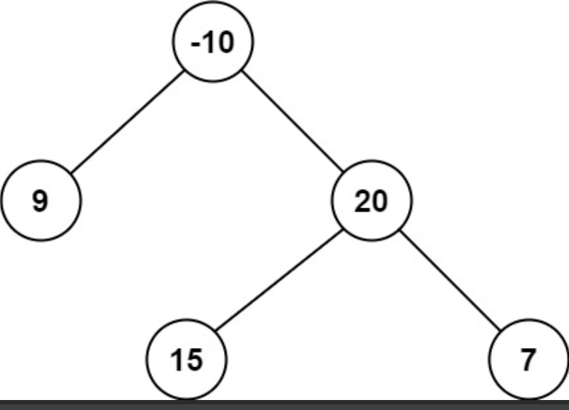

tags:: 二叉树, leetcode

- 题目
	- 路径 被定义为一条从树中任意节点出发，沿父节点-子节点连接，达到任意节点的序列。同一个节点在一条路径序列中 至多出现一次 。该路径 至少包含一个 节点，且不一定经过根节点。
	- 路径和 是路径中各节点值的总和。
	- 给你一个二叉树的根节点 root ，返回其 最大路径和 。
	- {:height 220, :width 416}
- 解题思路：
	- 如果想要连接一条路径的话，首先定义一个全局的变量，来记录最大值。
	  如果要组成路径，那肯定是左分支+右分支+中间节点来组成。如果左或者右分支是负数，那加上反而让路径的数值变小，这时候，将left的数值和0取最大值。
	  当return的时候，因为要继续往上迭代的话，那肯定只能取左边+中间节点 或者 右边加中间节点，要做一个取舍。
- 题解:
	- ``` java
	  class Solution {
	    int result = Integer.*MIN_VALUE*;
	    public int maxPathSum(TreeNode root) {
	        if(root == null) {
	            return 0;
	        }
	        maxPath(root);
	        return result;
	    }
	  - int maxPath(TreeNode root) {
	        if(root == null) {
	            return 0;
	        }
	        int left = Math.*max*(0, maxPath(root.left));
	        int right = Math.*max*(0, maxPath(root.right));
	        result = Math.*max*(result, left + right + root.val);
	        return Math.*max*(left, right) + root.val;
	    }
	  }
	  ```