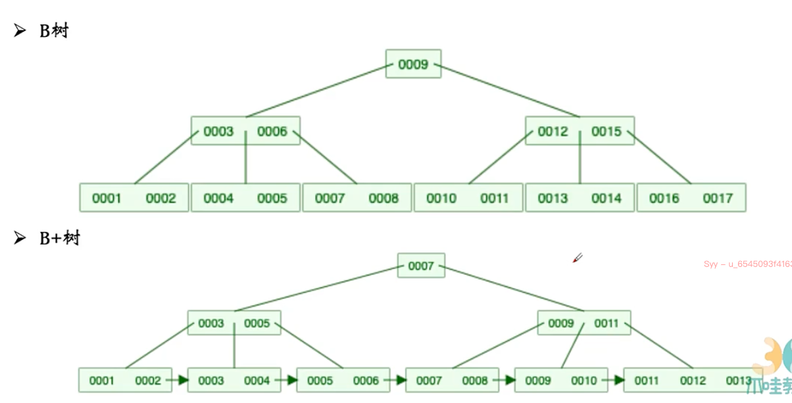
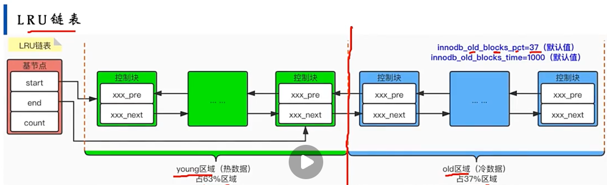
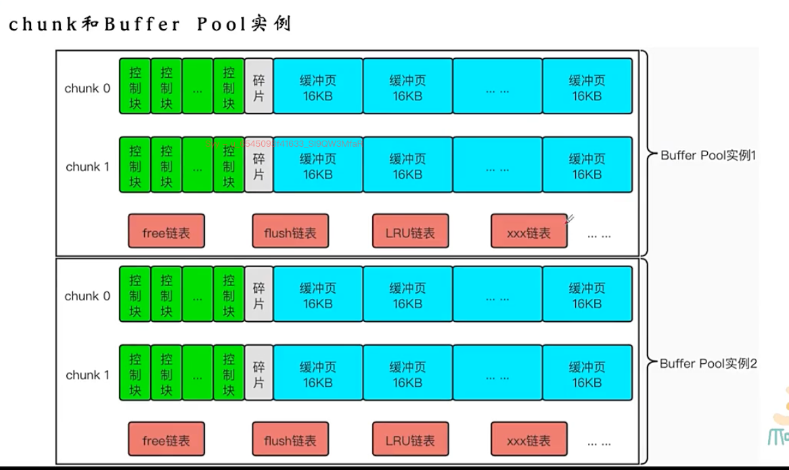

- 页
	- 查询id=4的一条记录，这条记录可能才30byte，但是现在返回的最小单位是一页，16kb，这时候id=5-7的大概率都在返回的这一页当中的， 这样一次io就能解决问题。就是避免一条一条磁盘数据
	- 有很多种不同类型的页
		- 存放表空间头部信息的页
		- 存放undo日志信息的页
		- 存放表中数据记录的页  索引页或者数据页   innodb 索引就是数据，数据就是索引
		- 
			- file header 存储页的通用信息
			- page header 存储数据页专用的信息
			- infimum + supermum 正无穷和负无穷 这个和页种具体的记录毫无关系，只是单独拉出来记录的，每个页里都是这两个值
			- 存储页种记录的相对位置，这样就能快速进行定位
	- 
	  id:: 665c8a1d-24cf-4aa0-9836-a91a802d4cc4
	- 分为记录额外信息和真实数据
		- 额外信息
			- 逻辑删除标记，当删除了之后，其实不会立马清空，会记录到删除记录的一个链表中，其他要新插入或修改的记录可以放到这条记录的位置上，不需要重新开辟空间（但是按照id分配的话，不就会有跨页的问题？？？
			- min_rec_flag 后续会将
			- n_owned 后续会讲，分成多组之后，如果你是这个组里id最大的，就会在这里保存这个组里的记录的条数
			- heap_no 相对位置
			- record_type记录类型，普通的就是0， 如果是b+树非叶子节点的目录项记录是1， 2是最小值，3是最大值
			- next_record 会有逻辑顺序，比如1后面是2，2后面是3，链表存储，会记录到下一个逻辑位置的距离，可能有正有负。物理位置是随机的，逻辑位置就是靠这个next_record来维护的
		- 真实数据
			- 各个列的值
			- row_id 排序的时候先依靠主键，如果没有主键，去找不重复且不为空的，还没有，会有个row_id来标注顺序
			- trx_id 事务的id，版本控制
			- roll_pinter，如果对一条记录多次修改，就是有版本4指向版本3指向版本2指向版本1的这个
- 
	- 指针指向的是最大的，寻找的时候会找到pageDirectory的上一条，然后进行搜索
- B树和B+树的区别
	- 
- 索引！！！
	- 
	- 采用的是b+树的模式，在叶子节点里，通过遍历可以遍历所有的数据，在上层会有他的目录项，通过把上层的索引页看做记录，一个页里就能存储好多条了
	- 上面的2003，指的是记录的头信息，recordType，如果为1的话，代表的是，b+树非叶子节点的目录项记录
	- 一般来说，一个页存储一千条数据，在索引里存储的内容会变少，不会所有的列都存储进去，所以会存储的记录条数会更多，一般来说不会超过三层
	- 在页的内部，记录和记录之间是单指针，页和页之间是双指针双指针
	- 主键的索引是天然就有的，聚簇索引，里面有全部数据
	- 非主键索引要自己去创建，里面只有自己和主键的值，查到了之后要去回表查询，通过主键去 聚簇索引里去查找。
	- 只想查询c1的话，就不需要回表了，所以不要写select *，如果是*肯定得回表，但是一个个把想要的写出来可能就不需要回表了
	- 联合索引，先排c2，c2重复的时候，根据c3来排序。最左匹配原则，c2=4，其实是可以的，因为他就是按照c2来的，匹配最左侧
- buffer pool 缓冲池  缓存 把页的内容放到缓冲池里，先从缓冲池里取
	- 
	- 128M不包括控制块的大小的
	- free链表
		- 
		- 在磁盘里取出来一个page之后，会先去free链表里看count是否为0，如果不为0，说明还有空闲的控制块，这个时候就可以放到他对应的缓冲页里，然后要把控制块删掉
		- 如果没有空位呢？？
	- flush链表
		- 
		- LRU链表，最新读的在最前面，淘汰的时候就是最后的
			- 
			- 预读 猜测你大概率要做什么事情，就提前给你做了
				- 线性预读  一个区里默认有64个页，顺序访问区的页面超过了56，会触发异步读取下一个区的全部的页到buffer pool 中的请求。
					- 读了这么多，是不是要全部扫描我这个区了，异步先把下一个区的页都放到缓冲区里，这样就可以直接在缓冲区里去读了
				- 随机预读
					- 需要手动开启，某个区有13个连续的页面被加载到buffer pool，无论这些页面是不是顺序读取的，都会触发一次异步读取本区全部页到buffer pool的请求
				- show variables like '字段的值'
				- 这种预读，会导致lru链表的问题
					- 预读了之后直接加到头结点，但是只是预判，却占据了最热的位置，这样不好
					- 如果是全表读，可能一次全表读就把整个lru链表或者说是缓冲区全部占满了
					- 优化
						- 预读：磁盘里的页第一次加载（只是加载，没有读取），这个时候会放在old区域的头部，这样预读页就只会在old区域，不会影响young区域中使用比较频繁的缓冲页
						- 全表扫描：因为是全表扫描，他加载进去之后是回去读取的，读取的时候又会拉到young区域了，还是会有问题，但是一般全表扫描的特点是，对某个页的访问很频繁，且总耗时很短，所以规则：如果对处于old区域的缓冲页进行第一次访问，就把时间记上，后续访问时间和第一次访问时间在1000ms以内，就不会移动到young的头部，否则会移动
			- 刷新的方式
				- 从flush链表中刷新一部分页面到磁盘
					- 后台线程定时刷，刷新频率取决于系统是否繁忙
					- 如果系统一直很繁忙，没时间刷新的磁盘里去，导致想要加载到磁盘页却没有可用的，这个时候必须要刷新咋办，尝试看看lru链表尾部有没有没有修改过的页可以直接释放，如果没有，就需要把lru链表尾部的脏页同步刷新到磁盘里了，一般不要，因为和磁盘的交互很慢
				- 从lru链表冷数据刷新去
					- 后台线程定时从LRU链表尾部扫描页面，扫描数量通过系统变量指定，如果发现脏页，就刷新到磁盘里
					- 控制块里会存储缓冲页是否被修改，扫描lru的时候，能知道这个页是不是脏页
			- 并发的话，如果锁一大块内存空间，效率很低的
				- 
				- 允许有多个buffer pool的实例
				- chunk  bufferpool扩容的时候，为了扩展的好，chunk各自为政，就可以消耗小一点
-