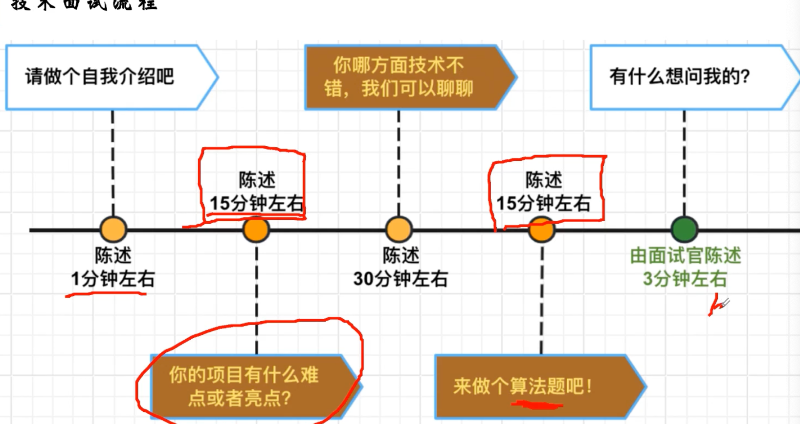
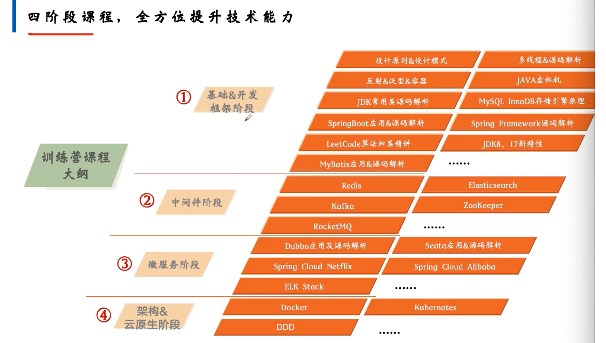
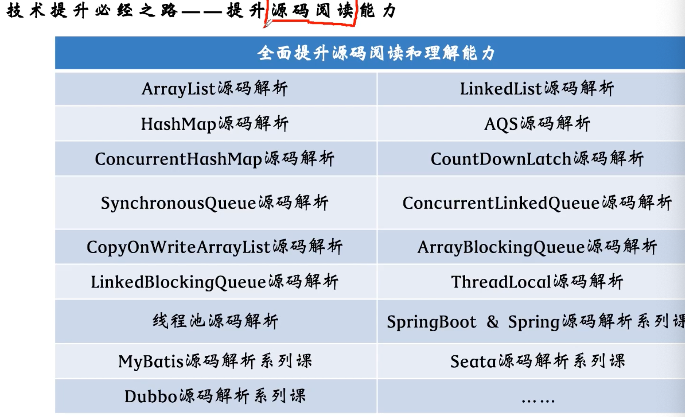
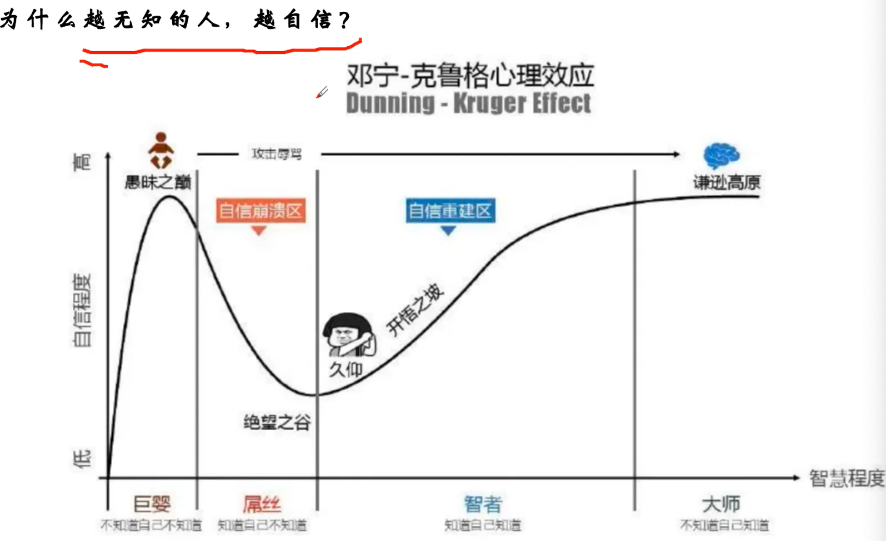
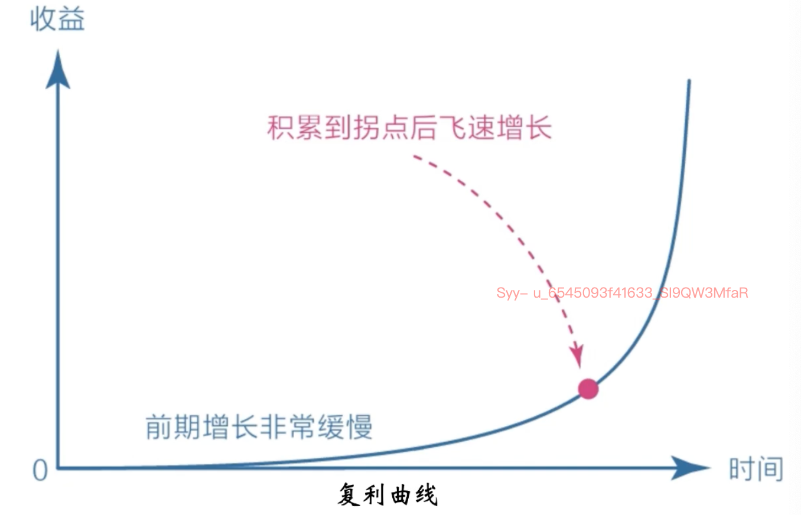
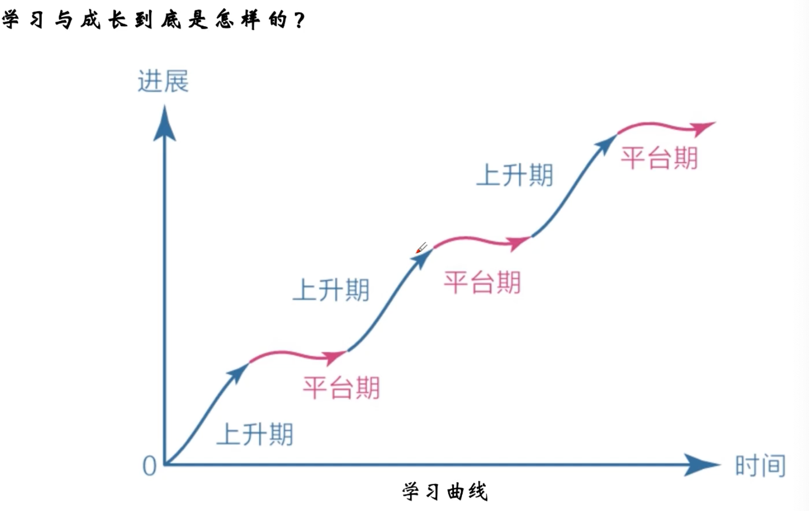
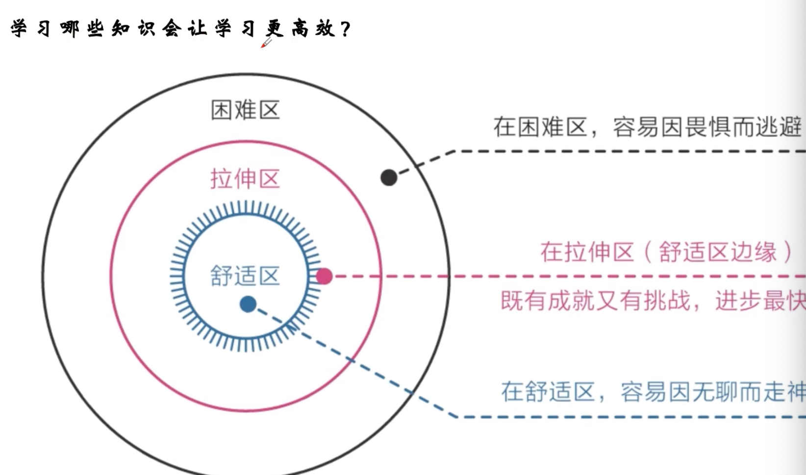
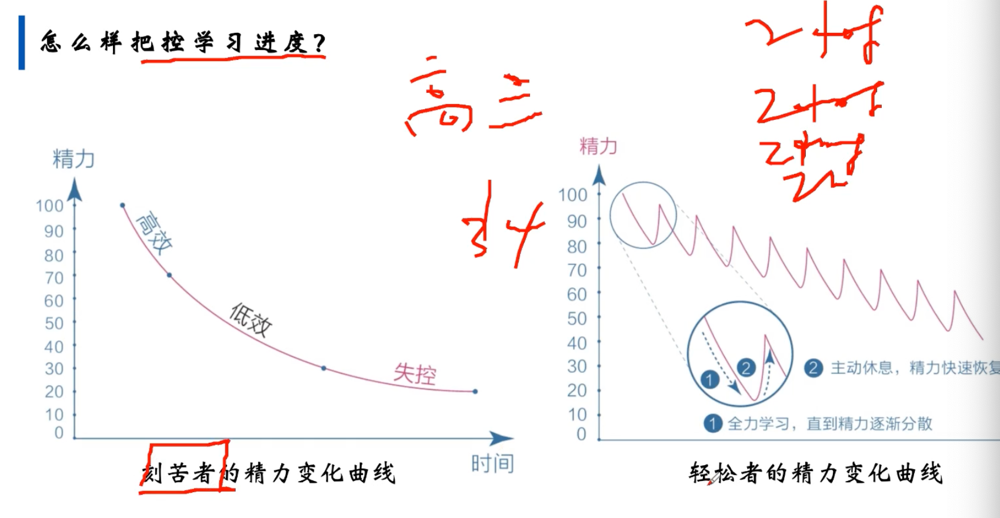
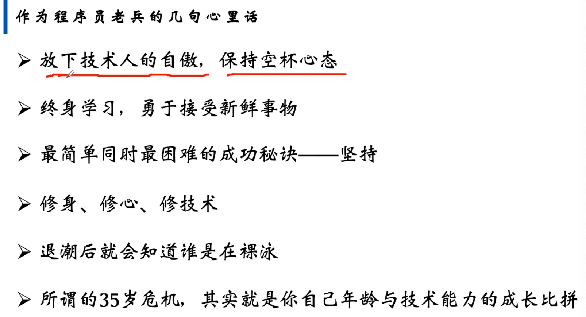

- 
- 
- java基础。线程+集合 源码
- jvm mybatis mysql 持久层关系型数据库
- springboot，spring framework
- 中间件
	- redis缓存
	- mq kafka
- 微服务
	- spring cloud
	- seata分布式事务
- 架构
	- docker
	- ddd
	- kubernates
- 源码能力
	- 
- 高效学习
	- 认知觉醒
	- 
	- 
	- 
	- 
	-
- 
- 番茄工作法 30min 休息5min
- 
-
-
-
- 日常学英语 看论文啥的！