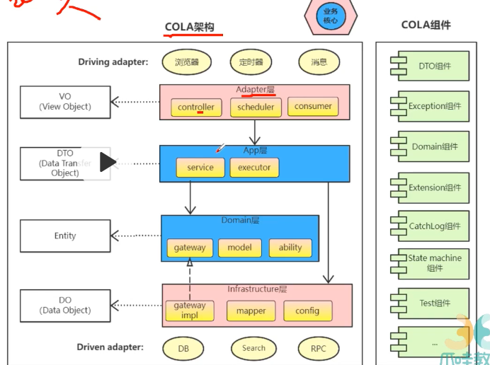

- 
- 
- java基础。线程+集合 源码
- jvm mybatis mysql 持久层关系型数据库
- springboot，spring framework
- 中间件
	- redis缓存
	- mq kafka
- 微服务
	- spring cloud
	- seata分布式事务
- 架构
	- docker
	- ddd
	- kubernates
- 源码能力
	- 
- 高效学习
	- 认知觉醒
	- 
	- 
	- 
	- 
	-
- 
- 番茄工作法 30min 休息5min
- 
-
- 设计原则
	- 单一原则。一个类只有一个作用，不要都有
		- single reposibility principle。 srp
		- 做月饼，有五个操作，扩大规模的时候要招收人，如果招收的人五个技能都会，会很累，也混杂，离职损失率也高，所以就一个人只学一项操作，这样学习成本低，离职成本低很好
		- 一个类或模块只完成一个职责
		- 为了达成。可替换性  凤凰架构，如果有一部分坏了，可以直接替换。微服务的架构也是这个思想，拆解的部分越多，就越健壮
		- 组装机，坏了啥就换啥，一体机，只能重新换不太好
	- 里氏替换原则。
		- 用父类的地方可以使用字类的对象，字类扩展父类的功能，不能替换父类的功能
		- 子类对象必须可以替换父类对象，但是要保证程序行为不变
			- 可以扩展父类的功能
			- 但是不能改变父类的行为契约，不能改变父类方法的预期行为
			- 例子
				- 一个鸭子类，之前定义了鸭子会叫，但是橡皮鸭不会叫，如果在叫这个方法里抛出异常就不对，因为他无法兼容这个叫
				- 所以把叫这个抽取一个借口，普通鸭子就继承这个接口，其他的鸭子的特性就可以用父类的就行
			- 例子2
				- 车子的型号，getLogo 如果返回保时捷而不是宝马，即使你买的宝马的车也不能停在宝马的停车场
				-
			- 子类重写的方法不能比父类方法有更严格的前置条件（preconditions），但可以有更宽松的前置条件。相似地，子类重写的方法不能有比父类方法更宽松的后置条件（postconditions），但可以有更严格的后置条件。
			- ### 前置条件（Preconditions）
			  
			  前置条件是指在调用一个方法之前必须满足的条件。如果前置条件不满足，方法可能无法正常执行。
			- ### 后置条件（Postconditions）
			  
			  后置条件是指在方法执行完成后，必须满足的条件。它描述了方法执行后的结果状态。
			- ### 理解前置条件和后置条件的约束
			- **前置条件的约束**：
				- **子类不能有比父类更严格的前置条件**：这意味着子类方法在调用前要求的条件不能比父类方法更多或更严格。否则，子类对象就不能在所有父类对象可以使用的地方使用，因为它可能会拒绝处理一些父类能够处理的输入。
				- **子类可以有更宽松的前置条件**：这意味着子类方法可以接受比父类方法更多的输入情况。这不会破坏替换原则，因为子类能够处理所有父类能够处理的情况，甚至更多。
			- **后置条件的约束**：
				- **子类不能有比父类更宽松的后置条件**：这意味着子类方法在执行后必须至少满足父类方法的后置条件。否则，子类对象可能会导致程序在期望父类行为的地方出现不一致的结果。
				- **子类可以有更严格的后置条件**：这意味着子类方法可以在执行后提供比父类方法更严格或更具体的保证。这不会破坏替换原则，因为父类期望的结果仍然会被满足，甚至可能得到更好的结果。
		- 含义：
			- 里氏替换原则是针对继承而言的，如果继承是为了实现代码重用，也就是为了共享方法，那么共享的父类方法就应该保持不变，不能被子类重新定义。子类只能通过新添加方法来扩展功能，父类和子类都可以实例化，而子类继承的方法和父类是一样的，父类调用方法的地方，子类也可以调用同一个继承得来的，逻辑和父类一致的方法，这时用子类对象将父类对象替换掉时，当然逻辑一致，相安无事。
			- 如果继承的目的是为了多态，而多态的前提就是子类覆盖并重新定义父类的方法，为了符合LSP，我们应该将父类定义为抽象类，并定义抽象方法，让子类重新定义这些方法，当父类是抽象类时，父类就是不能实例化，所以也不存在可实例化的父类对象在程序里。也就不存在子类替换父类实例（根本不存在父类实例了）时逻辑不一致的可能
	- 依赖倒置 dip dependence inversion principle
		- 下层模块引入上层模块的依赖，改变原有自上而下的依赖方向
		- 
		- vo调用dto的时候，其实是dto提供了方法，vo去调用，但是底层可能有各种不同的设计，我在上层要实现这个功能的时候，我就要这些操作，定义好了之后，下面的infrastructure层去实现我的定义就行了，所以是do的pom文件依赖entity，这种底层依赖上层就是依赖倒置
		- 其实就是接口实现的，在entity层定义接口，do依赖去实现，dto调用的时候就调用entity的接口就可以了
		-
	- 接口隔离
	-
	- 迪米特法则？中间人那个吗
	-
	- 针对接口编程，少继承多组合 合成复用
	- 不要直接调用别人，用个中间人
	-
	-
-
-
-
- 日常学英语 看论文啥的！