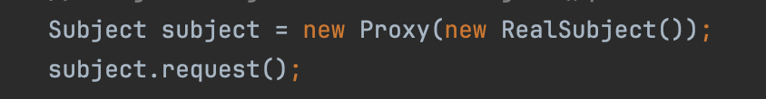
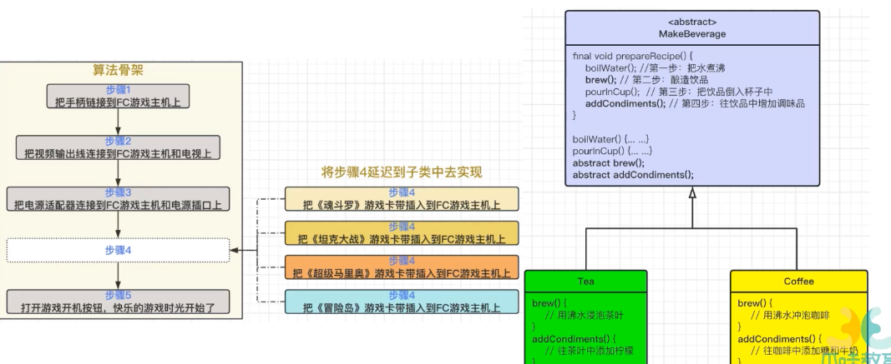
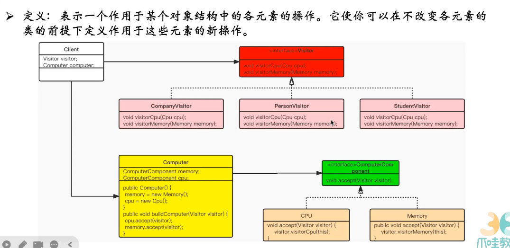

- 设计原则
	- 接口隔离
		- 接口细化，接口方法尽可能小一些
		- 高内聚
			- 提高接口、类、模块的处理能力，减少对外交互
		- 定制服务
			- 通过高质量接口组装，实现一些， 但是你不想要，也可以重写这个方法
		- 例子：
			- 当一个rapper，要会写词写曲，唱功，帅 太多了也不行，可以拆分成rapper，single，handsome，看你需要多少就实现多少接口
	- 迪米特法则-最少知识原则
		- 只和密友谈话
		- 对自己要耦合或者调用的类知道的越少越好，调用的类多复杂我不关心，提供这么多public方法，我只调用这些，其他的我不关心
		- ddd领域
		- 例子
			- 买了个咖啡机，只需要知道怎么做咖啡，不需要懂咖啡机的运行原理和组装知识
	- 开闭原则
		- 对扩展开放，对修改关闭
		- 添加一个功能在已有代码基础上进行扩展，而不是修改已有代码
		-
	- 单一职责
	- 里氏替换原则
	- 依赖倒置
- 设计模式-创建型设计模式
	- 单例 ***
		- 当某个类只能生成一个实例的时候，只提供一个全局访问点来让外部获取实例
		- 类图
			- 
		- 恶汉式
			- private static SingletonDemo1 instance = new SingletonDemo1();
			- 线程安全，调用效率高，不能延时加载
			- 是静态变量，静态变量和静态初始化块在类加载的时候就会被初始化，无论类的实例有没有被创建，这些是属于类本身的，会按照出现的顺序依次执行和初始化
			- 类的加载过程
				- 加载。把类的字节码文件.class文件放到内存里
				- 链接
					- 验证 确保字节码文件正确和安全性
					- 准备 给静态变量分配内存，将其初始化为默认值
					- 解析  把常量池的符号引用替换成直接引用
				- 初始化 将静态初始化块和静态变量初始化 构造方法初始化
		- 懒汉式
			- 在用的时候才会去创建，判断instance为null ，去new，方法要线程安全的话，要在方法上加上Synchronized，同时只有一个线程能进来
			- 但是即使初始化完成了，每次进来也要加锁，效率不高
		- 双重校验
			- 锁粒度变小 当对象为null还没有初始化的时候才会加锁
			- 但是有个问题，就是对象的初始化有三个部分，会重排序。
				- 三个部分   在内存里找个地方，初始化这个值，把地址对应到值上
				- 可能t1进来了，已经初始化了，但是还没有对应到值，t2看见是null也进来了，又初始化一次
			- 所以要加volatile，防止指令重排序
		- 静态内部类
			- ```apl
			      private SingletonDemo4(){
			          System.out.println("SingletonDemo4");
			      }
			  
			      /** 静态内部类 */
			      private static class SingletonClassInstance {
			          private static final SingletonDemo4 instance = new SingletonDemo4();
			      }
			  
			      /** 只有在第一次调用时，才会被创建，可以认为是懒加载的升级版本 */
			      public static SingletonDemo4 getInstance(){
			          return SingletonClassInstance.instance;
			      }
			  ```
			- 类的加载时机
				- **创建类的实例**：通过`new`关键字创建类的实例。
				- **访问类的静态变量或静态方法**：直接访问类的静态变量或静态方法。
				- **反射**：通过反射机制访问类。
				- **初始化子类**：初始化一个类的子类时，父类会首先被加载。
			- 所以在饿汉式里面，只要类呗加载了，实例就会被创建，但是静态内部类，因为没有人加载，只有在getInstance里调用了才会被加载
			- 在spring里，如果没有被显式引用或配置成spring bean 也不会在项目启动的时候就被加载的
		- 枚举  了解就行了，不常用
	- 原型
		- 讲某个对象作为原型，通过对其复制来克隆出多个和原型类型的新的实例
		- 通过对象复制来创建对象，java中的clone或者反序列化
		- 在内存二进制流的拷贝，性能比new好很多，一般是循环内产生大量对象，且比较复杂的时候
		- clone的时候 object.clone()不需要执行构造函数
		- 浅拷贝
			- 用object.clone()
		- 深拷贝
			- 浅拷贝，只是拷贝基本数据数据类型，对象数组集合会直接复制地址，这样别人修改的时候，自己也会被修改
			- 需要重新声明个对象，断开和原始对象的关系
	- 工厂方法
		- 定义一个创建产品的接口，重点是让子类决定生产什么产品
		- 简单工厂
			- 像是一个编程习惯
			- 披萨工厂来生产
			- 
		- 工厂方法
			- 
			- 简单工厂的话，就是只是定义了一个create对象的类，然后又很多披萨的制作实现，各个口味各不相同，等我们实际要去创建一个披萨的时候，就传入对应的类型，就会调用对应的类去创建一个就可以了
			- 工厂方法的话，是在简单工厂的情况下，如果我有不同的地区的披萨，每个披萨店都有五种口味，但是五种口味又各不相同，定义一个abstract类作为工厂的抽象类，里面有不同的地区的工厂，然后传入这个店的类型，在创建披萨的时候再传入想要制作哪种具体的披萨即可
			- 
	- 抽象工厂 - 针对于接口
		- 提供一个创建产品族的接口，让每个子类可以生产一系列相关的产品
		- 
		- cheese也有各种，更加细
		- 工厂传入进来，
		- 将一个复杂对象分解成多个相对简单的部分，根据不同的需要分别创建它们，构建成一个复杂的对象
		- 奶酪，蛤蜊都是接口，有不同的实现
		- 披萨的prepare里有不同的配料，奶酪，蛤蜊啥的，但是具体要哪种，也是工厂传入进来的（工厂里有这些对象
		- 主要角色有 抽象工厂，具体工厂，抽象产品，具体产品，客户端
		- 抽象工厂  用来创建一族产品的方法
		- 抽象产品 为一类产品声明一个接口
		- 客户端，用抽象工厂和抽象产品来创建具体的产品对象
		- 缺点：难以支持新种类的产品，要添加新的产品种类，要修改抽象工厂接口及所有具体工厂的实现
		- 不太常用
	- 建造者 ***
		- 将复杂对象的创建过程封装起来，允许按步骤去构造产品，影藏产品内部的表现，产品的实现可以被替换，因为客户只看到一个抽象接口
		- 经常被用来创建组合结构，底层要熟悉
		- 
		- @Builder就是这个，可以在new的时候一直设置属性的取值逻辑
- 设计模式-结构型设计模式
	- 按照某种布局组成更大的结构。 类结构型 用继承来组织。  对象结构型 通过组合或聚合来组建
	- 代理
		- 为某对象提供一种代理来控制对象的访问。客户端通过代理间接访问对象，限制、增强、修改该对象的一些特征
		- 对业务类进行横切性的增强，如增加请求与响应日志，增加权限校验，增加远程请求对象封装。来控制对对象的访问，被代理的对象可以是远程对象，创建开销大的对象或者需要安全控制的对象。
		- AOP用的JDK动态代理，就是这个
			- 
			- 
			- 在代理里会组合上这个realSubject，要用到被代理对象的一些行为的时候，还是调用被代理对象的方法来做的
			- 动态代理
				- 在内存中自动生成一个代理类
	- 适配器
		- 将类的接口转换成客户希望的另外一个接口，原来接口不兼容的可以一起工作
		- 
		- 就封装一层，让他可以调用不一样的输入
	- 桥接
		- 将抽象和实现分离，让它们可以独立变化，用组合关系代替继承关系，降低了抽象和实现这两个可变唯独的耦合度
		- 
		- 
		- 画这个画，不同的笔其实是通过继承来的，但是笔又有很多其他的属性，比如颜色等，这种就可以用组合，就不用写 2*3个笔的实现类，而是通过组合 2+3
	- 装饰
		- 动态给对象增加一些职责，增加额外功能
		- 使用组合
		- 
		- 
	- 门面
		- 多个复杂子系统提供一个一致接口，让子系统更加容易被访问
		- 
		-
	- 享元 蝇量
		- 共享技术有效支持大量细粒度对象的复用
		- 池化技术
		- 例子
			- 流感疫苗接种处 录入疫苗信息，会有很多重复信息，姓名和居住地址是个性化的，但是检测医院或网点，疫苗品牌是固定的，通过唯一标识的引用，在池子里进行获取
		- 
	- 组合
		- 将对象组合成树状层次结构来标识部分-整体的层次结构，让用户对单个对象和组合对象有一致的访问性
		- 
		-
- 设计模式-行为型设计模式
	- 复杂流程的控制，让多个类和对象相互协作来完成一个大的任务
	- 类行为模式，用继承。 对象行为模式 用组合或聚合。对象好点，符合合成复用原则
	- 模板方法
		- 定义一个算法骨架，将算法的一些步骤延迟到子类中（变化的部分），让子类在不改变算法结构的情况下重新定义算法的某些特定步骤
		- 
		-
	- 策略
		- 定义一系列算法，将算法封装起来，可以互相替换，且算法改变不会影响使用算法的客户
		- 
		- 对行为定义了一个算法族，鸭子不同的种类外貌都不一样，但是飞的方式或者叫声只有几种，那就把飞行方式或叫声抽象出来，组合的方式赋值给鸭子，这样就不用500个鸭子种类都要写一遍飞的方式活着叫声，就直接引用对应的行为就行
		- 而且可以随意修改它的行为，只要引入对应的实现类的
	- 命令
		- 将一个请求封装成一个对象，让发出请求的责任和执行请求的责任分开。遥控器？对
		- 
		- 点菜，点完了之后自己就可以干别的事情了
		- 
		-
	- 责任链
		- 请求从链中的对象传到另外一个对象中，直到请求被响应，去除对象之间的耦合
		- 硬编码或者在db里存储
		- 多个对象都有机会处理请求，避免请求发送者和接受者的耦合关系，将对象连成一条链，沿着链处理
		- 水过滤，12层可以获取可以喝的水，过滤器里比较多
		- 
		- 当前处理的processor类里就可以找到下一个处理的processor
		- 链式的处理方式
	- 状态
		- 允许一个对象在内部状态改变时改变其行为能力，对象看起来好像修改了它的类
		- 
		- 用户的行为，根据糖果机现在的状态，会输出对口香糖机的流转状态
	- 观察者
		- 多个对象存在一对多关系，当一个对象改变，通知到多个对象，来影响其他对象的行为
		- 
		-
	- 中介者
		- 定义一个中介对象简化原有对象的交互关系，降低系统中对象的耦合度，让原有的对象不必互相了解（迪米特法则？
		- ** 
		- 
		- 涉及多个部门操作的，就在中介者这个类里去做
		-
	- 迭代器
		- 提供一个方法顺序访问聚合对象中的一系列数据，不暴露聚合对象的内部表示。 iterator
	- 访问者
		- 不改变集合元素前提下，为一个集合中的每个元素提供多种访问方式，每个元素有多个访问者对象访问
		- 
		- 针对不同消费者可以有不同的优惠
		- visiter传入进来，然后底层不同的visitor有cpu的价格
		- 
		- 不同的人
	- 备忘录
		- 不破坏封装性前提下，获取保存对象的内部状态，以便恢复它
		- 
		- 用stack或者双向队列来进行存储
	- 解释器
		- 提供如何定义语言的文法，对语言句子的解释方法，
- 单例
- 工厂模式  面试很少问，
- 建造者
- 代理  cglib jdk
- 适配器
- 装饰
- 门面可能涉及到一点点
- 模板！
- 命令
- 责任链一半一半
- 观察者
- 中介者
- 访问者 一般不会问
-
- 工作中用过哪些 业务场景，用哪种
- 看过某些框架  源码里怎么用
- 直接问怎么实现