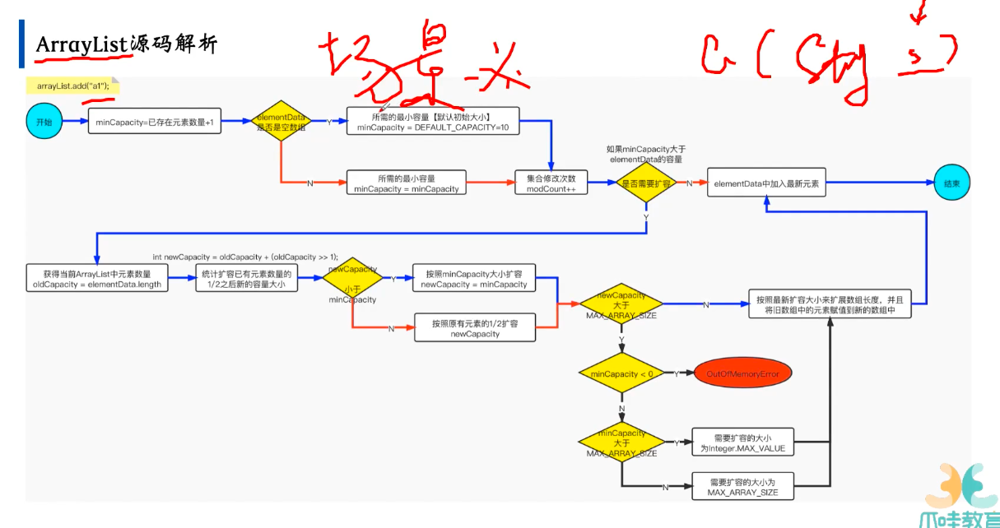
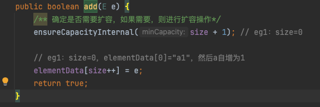
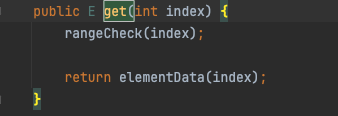
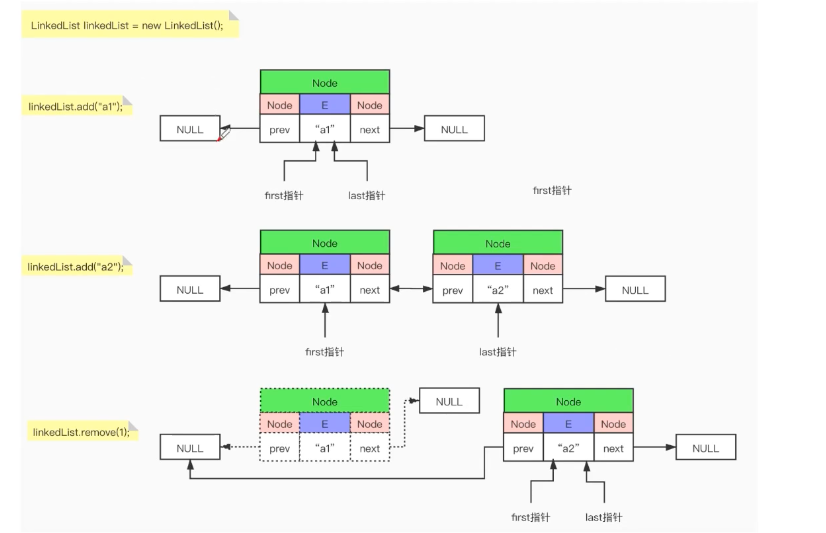

- arrayList源码解析
	- 
	- 先看构造函数
		- ```
		  elementData 就放在这个数组里
		  开始就是一个空的数组
		  ```
	- add方法
		- 
		- size+1 是我本来就要加一个原始，所以我所需的数组的长度为 当前数组的长度加上我现在要添加的一个元素
		- 如果当前是第一次，数组是空的，就返回10，默认是10
		- 如果所需的【最小容量】大于**elementData**数组的容量，则进行扩容操作
		- grow(minCapacity)
			- 扩容的逻辑，1.5倍进行扩容
			- 最大值是 integer最大值-8，如果超过最大值就取最大值
			- Array.copyOf(elementData,newCapacity); 数组的copy过程
	- get方法
		- 
		- 判断是否越界，越界抛出异常，不越界就返回这个数组对应的下标的元素
- LinkedList源码
	- 
- HashMap
	- 2-3树
	- 红黑树
		- 节点要么是红的要么是黑的
		- 红色的子节点都是黑色
		- 子节点都是黑色
		- 根节点是黑色的
		- 排除掉红色的节点，根节点到所有的节点距离都一样的
	- 源码
		- 构造函数  负载因子 0.75
		- put
			- putVal
				- onlyIfAbsent  如果是true，则不改变已存在的value值  如果是false或者旧值为null才更新新的值
				- evict驱逐，赶出
				- 当table数组为空， resize
				- 尾插法
				- 当某个节点的链表长度 >= 8， 要插入第九个节点的时候，则会将链表转为树形结构
					- 当表的长度小于64的时候，会进行resize的扩容，也不会转换成红黑树，等于64之后就会转成红黑树
					- 红黑树也会退化成链表 节点数小于6，就会退化成链表
					- 链表加入特别方便，查的时候效率低。树加元素比较复杂，但是查询效率高，跳跃式的查询方式
				- balanceInsertion
					- 红黑树自平衡
					-
			- 扰动函数 hash的值
				- key==null 则为0
				- 如果key的hashCode高位16位没值，就不变，高16位有值，高16位不变，低16位会和高16位执行亦或操作
			- resize
				- 两部分，一部分确定如果没有表呢，就创建表，确定容量，第二部分进行数据的迁移
				- 默认的长度16，阈值为12，创建新的tablek'k
				- 数据迁移
					- 某个位置不为空，先将oldTab[j]置为空
					- 如果这个位置链表只有一个数据，就直接在newtable里插入一个
					- new的里面，因为变成2倍了，直接& oldCap如果为1，就分配在高位上，如果为0的话，就分配在低位上
- 为什么arrayList是半倍扩容
	- 因为后续数据大了，可能浪费的空间也大
	- 而且他不像hashmap有这种复杂的数据结构，只要复制过去，扩容的时候消耗也不是很大
	- hashmap是计算这种的时候，倍数，算高位低位比较方便