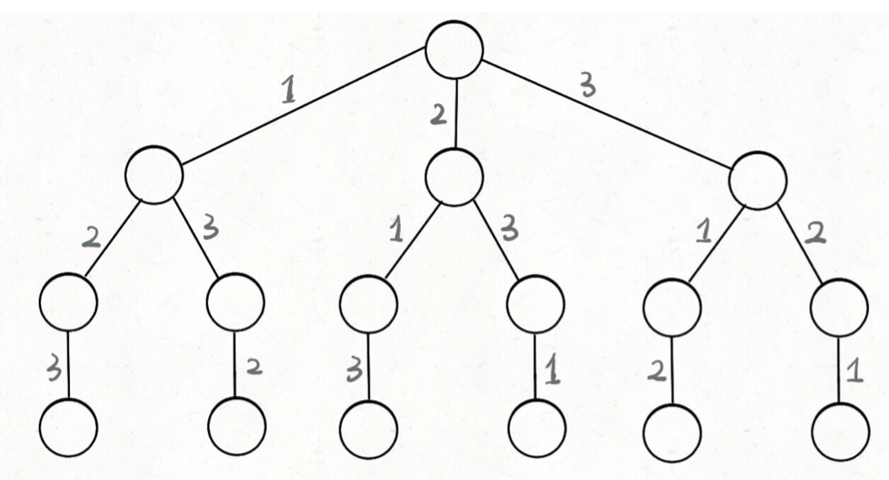

tags:: dfs，回溯

- 基本框架
	- ```
	  result=[]
	  def backtrack(路径，选择列表):
	  	if 满足结束条件：
	      	result.add(路径)
	          return
	      for 选择 in 选择列表：
	      	做选择
	          backtrack(路径，选择列表)
	          撤销选择
	  ```
- 需要思考的问题：
	- 路径：已经做出的选择
	- 选择列表：当前可以做的选择
	- 结束条件：到达决策树底层，无法再做选择的条件
- 
- ```
  import java.util.LinkedList;
  import java.util.List;
  
  // @solution-sync:begin
  class Solution {
      List<List<Integer>> res = new LinkedList<>();
      public List<List<Integer>> permute(int[] nums) {
          List<Integer> temp = new LinkedList<>();
          backtrack(nums, temp);
          return res;
      }
  
      void backtrack(int[] nums, List<Integer> temp) {
          if(nums.length == temp.size()){
              res.add(new LinkedList<>(temp));
              return;
          }
  
          for(int i = 0; i < nums.length; i++) {
              if(temp.contains(nums[i])) {
                  continue;
              }
              temp.add(nums[i]);
              backtrack(nums,  temp);
              temp.remove(temp.size() - 1);
          }
      }
  }
  ```
- N皇后问题
- ```
  class Solution {
  
      List<List<String>> res = new ArrayList<>();
  
      /* 输入棋盘的边长n，返回所有合法的放置 */
      public List<List<String>> solveNQueens(int n) {
          // "." 表示空，"Q"表示皇后，初始化棋盘
          char[][] board = new char[n][n];
          for (char[] c : board) {
              Arrays.fill(c, '.');
          }
          backtrack(board, 0);
          return res;
      }
  
      public void backtrack(char[][] board, int row) {
          // 每一行都成功放置了皇后，记录结果
          if (row == board.length) {
              res.add(charToList(board));  
              return;
          }
  
          int n = board[row].length;
          // 在当前行的每一列都可能放置皇后
          for (int col = 0; col < n; col++) {
              // 排除可以相互攻击的格子
              if (!isValid(board, row, col)) {
                  continue;
              }
              // 做选择
              board[row][col] = 'Q';
              // 进入下一行放皇后
              backtrack(board, row + 1);
              // 撤销选择
              board[row][col] = '.';
          }
      }
  
      /* 判断是否可以在 board[row][col] 放置皇后 */
      public boolean isValid(char[][] board, int row, int col) {
          int n = board.length;
          // 检查列是否有皇后冲突
          for (int i = 0; i < n; i++) {
              if (board[i][col] == 'Q') {
                  return false;
              }
          }
  
          // 检查右上方是否有皇后冲突
          for (int i = row - 1, j = col + 1; i >=0 && j < n; i--, j++) {
              if (board[i][j] == 'Q') {
                  return false;
              }
          }
  
          // 检查左上方是否有皇后冲突
          for (int i = row - 1, j = col - 1; i >= 0 && j >= 0; i--, j--) {
              if (board[i][j] == 'Q') {
                  return false;
              }
          }
          return true;
      }
  
      public List charToList(char[][] board) {
          List<String> list = new ArrayList<>();
  
          for (char[] c : board) {
              list.add(String.copyValueOf(c));
          }
          return list;
      }
  
  }
  
  ```