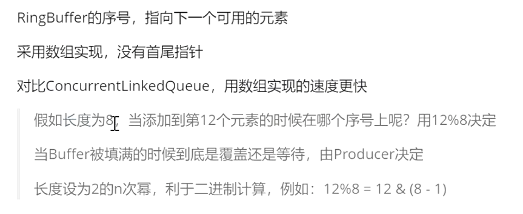

- disrutor 分裂瓦解
- 一个线程中每秒处理600万订单
- 单机速度最快的MQ
- 性能很高，无锁cas，单机支持高并发
- 内存里的用于存放数据的高效率的队列
-
- 特点
	- 无锁，高并发，使用环形buffer
	- 用数组实现的
	- 直接覆盖旧的数据，降低
	- 环形的只维护一个位置 sequence 下一个有效的元素指在哪个位置上
- RingBuffer
	- 
	-