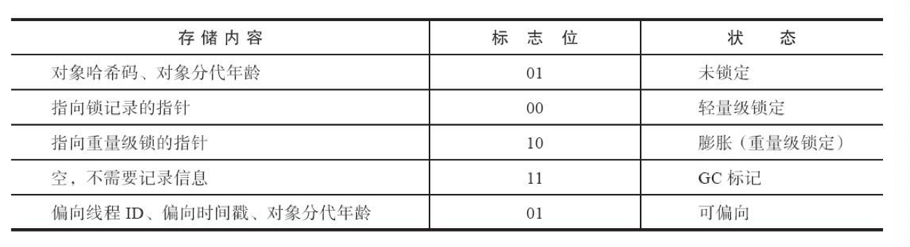
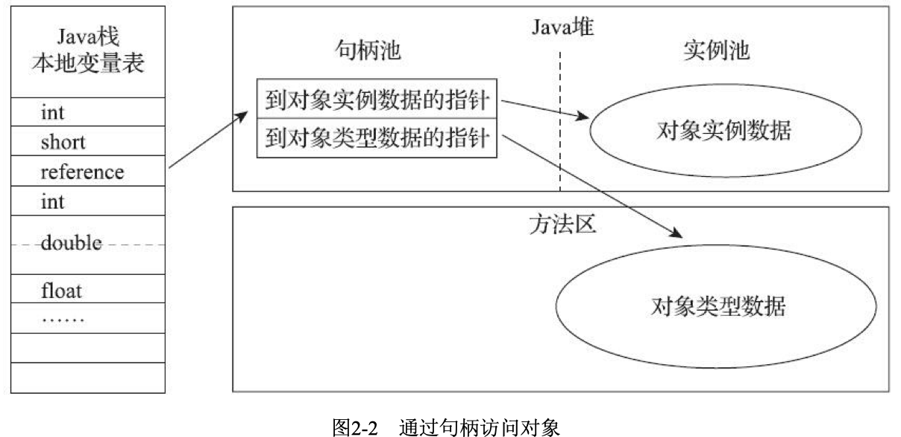
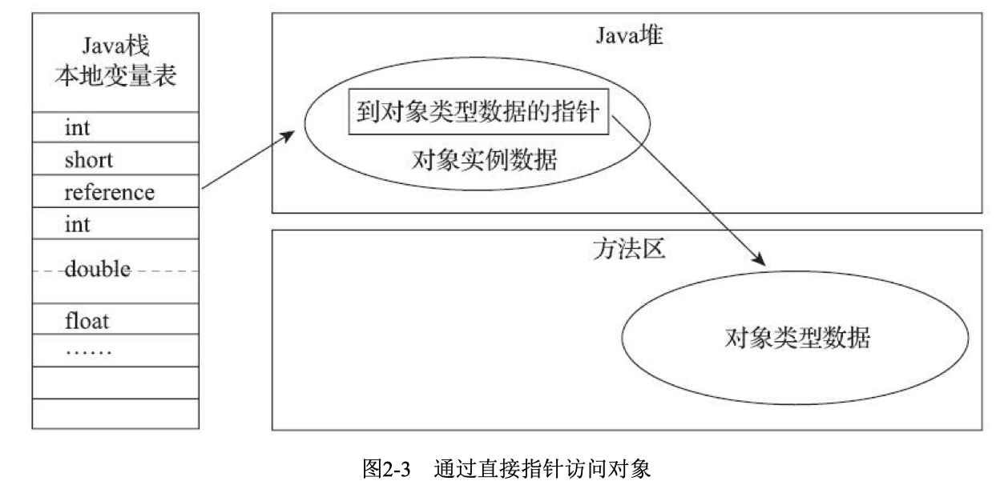

tags:: jvm，虚拟机对象

- 对象如何创建，如何布局，如何访问的
- 这里讲的是hotSpot虚拟机中的java堆为例
- 对象的创建
	- 普通的java对象，不包括数组和class对象
	- 遇到一条字节码new指令的时候
		- 1. 检查指令的参数是否能在常量池中定位到一个类的符号引用，检查这个符号引用代表的类是否已经被加载，解析初始化过。
		  2. 如果没有，就去执行类加载过程
		  3. 如果类已经加载了，虚拟机为新生对象分配内存。对象需要多少内存在类加载的时候就能确定。
			- 分配方式
				- 当堆内存边缘规整，用过的在一边，没用过的在一边，就把指针往空闲的方向挪一段，分配给这个对象（指针碰撞法
				- 当堆内存不规整，维护了一个列表记录了哪些内存块是可用的，在分配的时候就从这个列表里找一块足够容纳分配的对象的空间划分给对象实例，同时更新列表的记录（空闲列表法）
				- 用哪种分配方式由是否规整决定，是否规整由垃圾收集器是否有空间压缩整理的能力决定。serial，parnew就推荐用指针碰撞，cms这种基于sweep算法的收集器，推荐用空闲列表法
			- 分配可能产生的并发问题，同时修改指针位置
				- 1. 分配内存空间的对象采用同步处理，CAS配上失败重试来保证更新操作的原子性
				  2. 内存分配的动作按照线程放在不同空间中，每个线程在java堆里预先分配一小块内存，叫本地线程分配缓冲区。优先在线程分配的本地缓冲区里分配，缓冲区用完了，需要分配新的缓冲区的时候再进行同步锁定。通过-XX:+/-UseTLAB参数设定
			- 4. 分配了空间，将分配的内存空间初始化为零值，保证对象实例字段可以不用初始值就能使用
			  5. java虚拟机对对象进行必要设置，对象是哪个类的实例，如何找到类的元数据信息，对象哈希码，对象的GC分代年龄这些信息，放到对象头里。
			  6. new指令之后会执行构造方法进行初始化，对象真正被构造出来
	- CMS中，为了能在多数情况下分配得更快，设计了一个叫作Linear Allocation Buffer的分配缓冲区，通过空闲列表拿到一大块分配缓冲区之后，在它里面仍然可以使用指 针碰撞方式来分配。
- 对象的内存布局
	- 对象头，实例数据，对齐填充
	- 对象头
		- 存储对象自身的运行时数据。哈希码25byte，对象分代年龄4byte，锁状态标志2byte，一个byte固定位0.根据锁状态标志，又存储了一些线程持有的锁，偏向线程ID，偏向时间戳等。
		- 
		- 类型指针，对象指向它的类型元数据的指针，通过这个确定对象是哪个类的实例。
		- 如果是java数组，对象头中要有一块用来记录数组长度的数据，来方便推断出数组的大小。
	- 实例数据：对象真正存储的有效信息。代码里定义的各种类型的字段内容。
		- HotSpot虚拟机默认的分配顺序为longs/doubles、ints、shorts/chars、bytes/booleans、oops（Ordinary Object Pointers，OOPs），相同宽度的字段总是被分配到一起存放
		- 在父类中定义的变量会出现在子类之前。
		- 如果HotSpot虚拟机的 +XX：CompactFields参数值为true（默认就为true），那子类之中较窄的变量也允许插入父类变量的空 隙之中，以节省出一点点空间。
	- 对齐填充
		- 因为对象起始地址必须是8字节的整数倍，所以如果不满足条件就对齐填充
- 对象的访问定位
	- 通过栈上的reference数据来操作堆上的具体对象
	- reference类型只规定了是一个指向对象的引用，具体的对象访问方式是虚拟机实现的
		- 句柄：java堆中划分一块内存作为句柄池，reference里存的对象的句柄地址，句柄中包含对象实例数据和类型数据各自具体的地址信息。好处：存储的是句柄地址，对象被移动时，只需要改句柄的实例数据指针，reference本身不用修改
		- 
		- 直接指针，在堆中对象的内存布局要考虑如何放置访问类型数据的相关信息，存储的是对象的地址。速度快，节省一次指针定位的时间开销。hotspot主要用这种进行对象访问。
		- 
		-