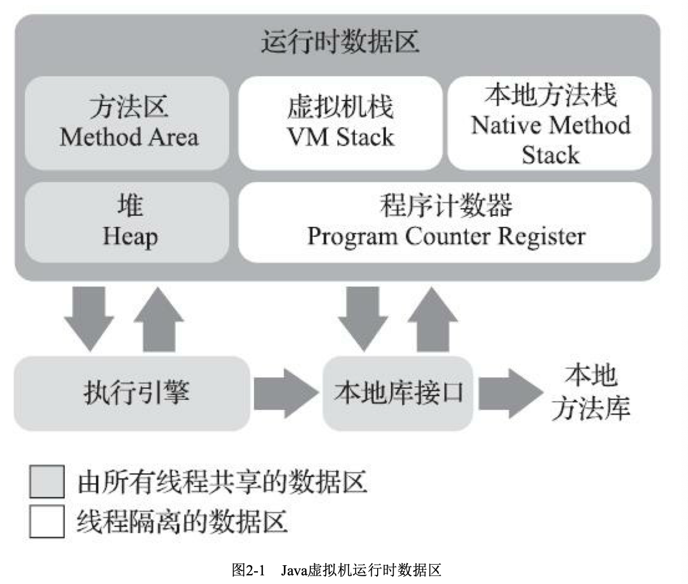

tags:: jvm， java内存区域,运行时数据区域

- 介绍java虚拟机内存区域，区域的作用，服务的对象，可能产生的问题
- 运行时数据区域
	- 
	- 程序计数器
		- 空间很小，是当前线程所执行的字节码的行号指示器。通过它来选取下一条需要执行的字节码指令。
		- 线程私有。因为在多线程中，一个核一个时间只能运行一个线程的指令，时间片流转完了就会切到下一个线程，那咋知道上次这个线程运转到哪里呢，就去看线程对应的程序计数器中记录的虚拟机字节码指令的地址！
		- 如果当前线程正在执行native方法，那计数器的值是空的
		- 唯一一个没有规定有outOfMemoryError情况的区域
	- 虚拟机栈
		- 线程私有，线程没了对应的这个栈也就没了
		- 方法执行的时候，会创建个栈帧来存储局部变量表，操作数栈，动态连接，方法出口等信息。调用就进栈，结束了就出栈。
		- 局部变量表里存的是 编译期可知的基本数据类型，对象引用(引用类型，并不是对象本身，可能是一个指向对象起始地址的引用指针，也可能是一个代表对象的句柄或其他和这个对象相关的位置)和returnAddress(指向字节码指令的地址)
		- 数据类型在局部变量表的存储空间用局部变量槽定义，long和double占用2个槽，其他是1个。编译期间，这个局部变量表需要多大空间就分配好了，不会改变了。
		- 会有俩异常，如果线程请求的栈深度超过定义的最大允许的深度了，就stackOverFlow。如果无法申请足够内存就OutOfMemoryError异常
		- 只要线程申请成功了，因为局部变量表大小已经固定了，就不会发生OOM
	- 本地方法栈
		- 和虚拟机栈作用相似，但是是存储native方法
	- 堆
		- 所有线程共享的区域
		- 存放对象实例，被垃圾收集器管理
		- 垃圾收集器的分代收集理论是垃圾收集器的定义和设计风格，不是java虚拟机实现的固有内存布局。
		- 所有线程共享的java堆中可以划分出多个  线程私有的分配缓冲区   来提升对象分配时候的效率。防止竞争把可能？？
		- java堆可以处于物理上不连续的内存空间里，逻辑上应该是连续的。大对象的话，多数虚拟机出于实现简单存储高效的考虑，可能还会要求连续的内存空间
		- 现在主流是按照堆可扩展来实现的，但是如果堆没法扩展了，就会报错OutOfMemoryError
	- 方法区
		- 各个线程共享，存储已被虚拟机加载的类型信息，常量，静态变量，即时编译器编译后的代码缓存等数据
		- 永久代：之前用永久代来实现方法区，导致会出现OOM的问题，因为永久代要设置最大内存上限。7 的时候完全从永久代移除了字符串常量池和静态变量
		  到 JDK 8 的时候完全废除了永久代，把7中剩余的永久代的内容，包括类型信息，都移到了元空间中
		- 针对方法区的回收，一般是对常量池的回收和对类型的卸载。条件很苛刻，但是有时又很有必要，一直不回收可能会导致内存泄露
	- 运行时常量池
		- 方法区的一部分。
		- class文件中除了类版本，字段，方法，接口的描述信息，还有常量池表，常量池表里放编译期间生成的各种字面量和符号引用，类加载之后，这部分内容就放到运行时常量池里
		- 具备动态性，运行期间也会产生新的常量放到池中，比较多的string类的intern方法
		- 常量池收到方法区内存的限制，申请不到内存的时候抛异常OutOfMemoryError
	- 直接内存
		- 不是虚拟机运行时数据区的一部分，但是也会导致OutOfMemoryError
		- NIO，基于通道channel与缓冲区buffer的IO方式，用native函数库直接分配堆外内存，通过一个存储在java堆里的directByteBuffer对象作为这块内存的引用进行操作。可以避免java堆和native堆中来回复制数据
		- 这个直接内存的分配不会受到java堆大小的限制，配置虚拟机大小的时候会忽略直接内存，使得各个内存区域总和大于物理内存的限制，导致动态扩展的时候出现OutOfMemoryError异常
		- 计算 Xmx 等信息的时候，要从物理内存中减掉可能要使用的的直接内存的大小
-
-
- question:
	- 句柄是啥
	- 逃逸分析，标量替换
	- string类的intern方法