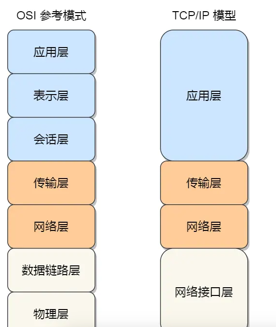
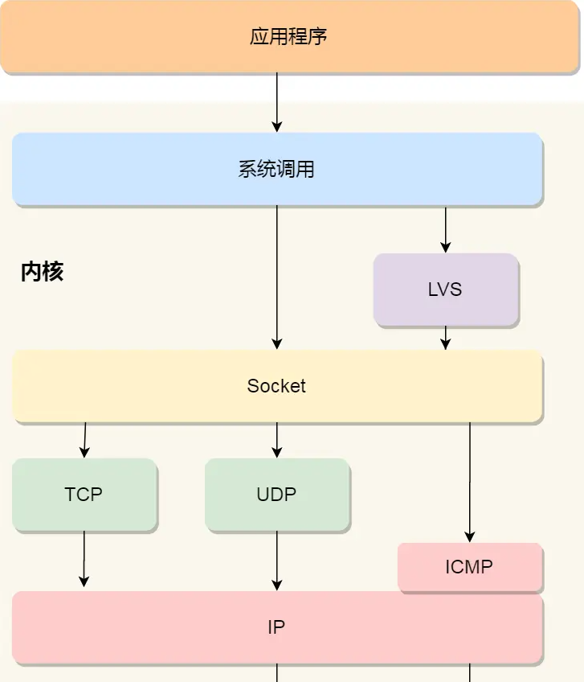
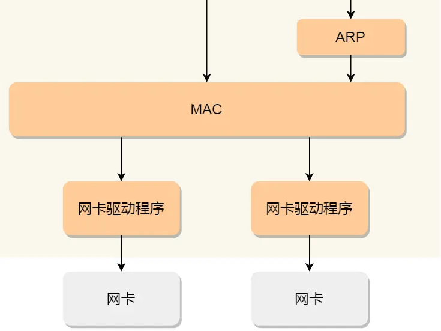
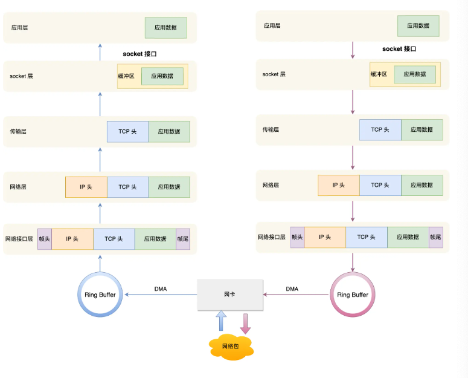
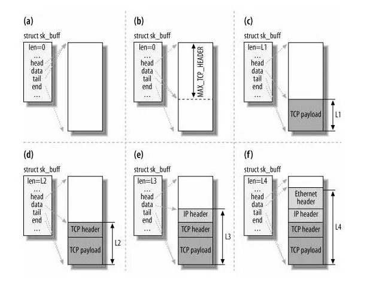

tags:: 小林网络

- 网络模型
	- 七层网络模型
		- 应用层
		- 表示层
		- 会话层
		- 传输层
		- 网络层
		- 数据链路层
		- 物理层
	- 
- 网络协议栈
	- 
	- 
- Linux接受网络包的流程
	- 网卡接收和发送网络包,收到网络包之后,会通过DMA技术,将网络包写到指定内存地址,ringBuffer中,通知操作系统网络包到达
	- 怎么通知操作系统
		- NAPI机制，不采用中断方式读取数据，而是中断唤醒数据接收的服务程序，然后poll方法来轮询数据
			- 之前是采取没收到一个数据包都会产生一个中断,让CPU去处理这些中断并将数据包传到网络栈中,这种模式在网络流量低的时候工作的不错,但是如果有突发高流量,会导致CPU中断过多,影响系统性能
			- NAPI机制工作原理
				- 中断模式,刚开始接收数据包的时候,正常产生中断,cpu响应中断处理包
				- 高负载检测,如果网络接口检测数据包达到速度过快,将自己切换到NAPI轮询模式
				- 轮询模式 网络接口不发送中断，将接收到的数据包放到一个队列里，内核周期性检查队列，处理队列里的数据包
				- 处理数据包 内核一次性取出多个包，减少cpu处理次数
				- 退出轮询模式 流量减到一定阈值时，退出轮询模式，恢复正常中断
		- 网络包到达，通过DMA技术把包写到指定内存地址里，网卡向CPU发起硬件中断，CPU执行中断处理函数
			- 暂时屏蔽中断，
			- 发起软中断，恢复刚才屏蔽的中断
			- 软中断
				- 从ring buffer里获取一个数据帧为sk_buff，将网络包交给网络协议栈逐层处理
		- 网络协议栈
			- 经过网络接口层，校验合法性，找到上层协议类型，去掉帧头，帧尾，交给网络层
			- 判断ip是否正确，看是tcp还是udp，去掉ip头，给传输层
			- 取出tcp头，根据ip地址和端口，找到socket，把数据放到socket接收缓冲区
			- 应用程序调用socket，将内核socket接收区数据 拷贝 到应用层的缓冲区，唤醒用户进程
		- 
- linux发送网络包的流程
	- 应用程序调用socket发送数据包的接口，因为是系统调用，所以从用户态陷入到内核态的socket层，申请一个内核态的sk_buff内存，将用户待发送的数据拷贝到sk_buff内存，加入到发送缓冲区
	- 网络协议栈从sockt发送缓冲区取出sk_buff，复制一个副本，因为tcp支持丢失重传，发送的时候就用这个副本，等接收到ack，再把真的这个删掉
	- 填充tcp头，因为要一直对这个对象添加或减少头，每次都创建一个新对象要拷贝，所以就一直用一个结构体描述，通过调用sk_buff里的data指针
		- 
		- 发送完成之后，会释放sk_buff_copy这个内存，清理ringbuffer内存
		- 收到tcp报文的ack之后，释放原始sk_buff
- 发送时涉及几次内存拷贝
	- 从socket，申请sk_buff内存，把用户发送数据拷贝到sk_buff里，加入到发送缓存区
	- sk_buff复制一个副本
	- ip层发现，如果sk_buff大于MTU，划分成多个sk_buff
-
-
-
-
-
- 软中断
	- 内核调度，可以在内核认为合适的时候执行。
	- 可以在任何时候被执行，包括在其他软中断或硬终端的上下文里
	- 负责网络数据包的接收和发送，块设备的IO处理等任务