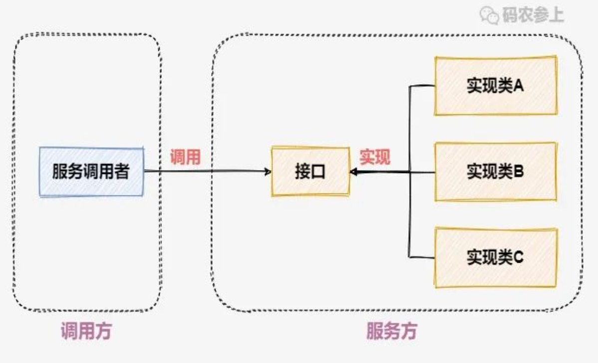
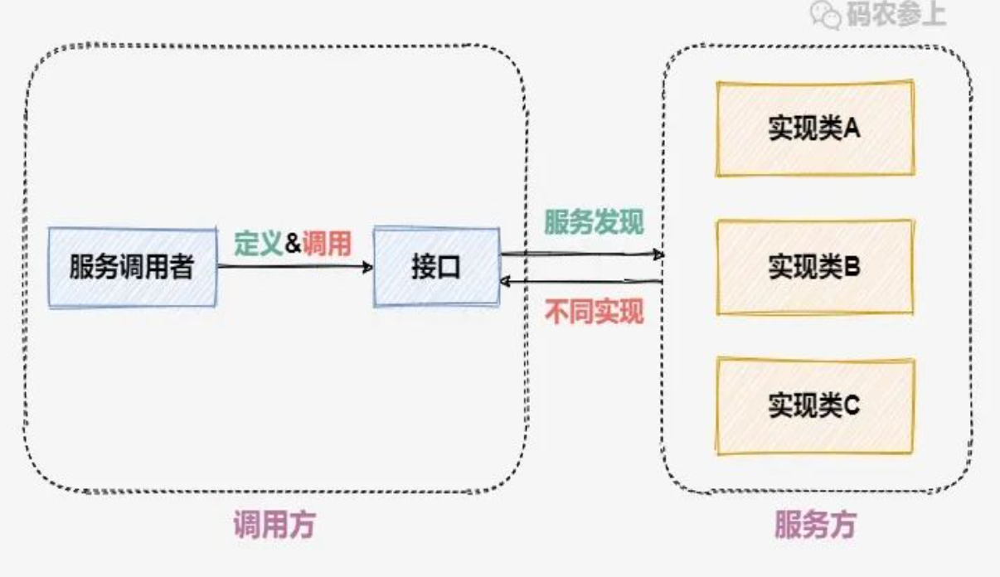
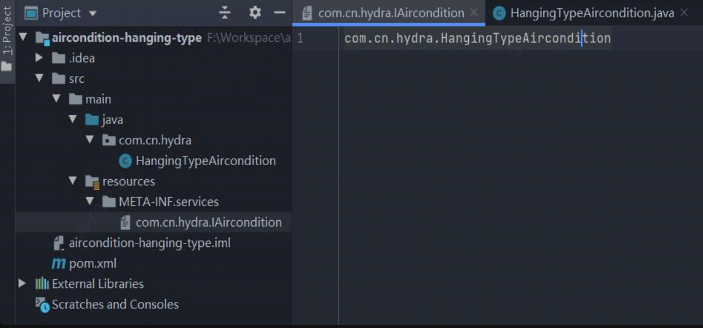
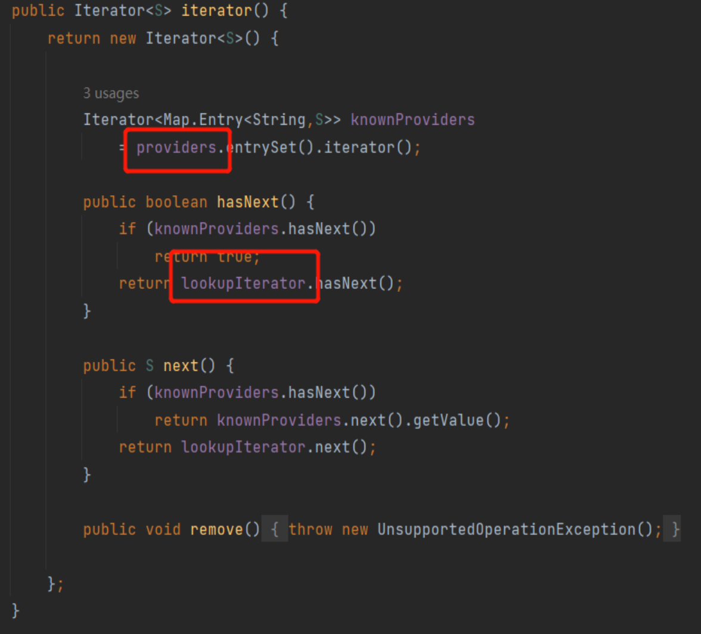

tags:: SPI

- SPI全称 service provider interface。服务提供者接口，实现的是一种服务发现机制
- spring项目中，添加一个接口层，通过spring的依赖注入，借助@Autowired方式注入接口的实现类的实例对象，对于service的调用就基于接口操作
- 
- SPI的框架图
	- 
	- 服务调用方定义一个接口规范，不同的服务提供者可以进行实现。调用方可以通过某种机制来发现服务提供方，通过接口来进行调用
	- SPI强调的是服务调用者对服务实现的一种约束，服务提供者根据这种约束实现的服务，可以被服务调用者发现。
- 实例：
	- 项目里创建一个接口，定义了接口的实现方式，这个接口要给服务的实现方来使用，用maven把它打成jar包，服务的提供者在项目中就可以引入这个jar包了，有了这个规范，后续产品跟新换代，都能介入到系统。而且有很多种接入方都能进行介入
	- 网关，在网关定义了一个接口以及接口的方法，进行发布之后，导出生成SDK，让天润的人接入进去，其实就是一种SPI的接入方式
- 服务实现
	- 引入jar包，创建服务类，实现前面定义的接口
	- 在项目的resources目录下，创建META-INF/services目录，以前面定义的接口名 创建一个文件，在文件里写入实现类的全限定名。
		- 
		- 用maven打成jar包，提供给调用方使用。
- 服务发现
	- ```
	      public class AirconditionApp{
	          public static void main(String[]args){
	              new AirconditionApp().turnOn("VerticalType");
	          }
	          public void turnOn(String type){
	              ServiceLoader<IAircondition> load = ServiceLoader
	                      .load(IAircondition.class);
	  
	              for(IAircondition iAircondition:load){
	                  System.out.println("检测到:"+iAircondition.getClass().getSimpleName());
	                  if(type.equals(iAircondition.getType())){
	                      iAircondition.turnOnOff();
	                  }
	              }
	          }
	      }
	  
	  ```
- 原理
	- ServiceLoader类
		- 
		- 
		- providers是个缓存，迭代器先从这里查找，如果里面有就在providers里找，如果没有，就用懒加载的lookupIterator
	- lazyIterator接口实现
		- 
		- hasNextService实现。取出接口取出实现类的类名放到nextName里
			- 
		- nextService里，加载实现类，实例化对象，放到缓存里去。基于反射来做的
			- 
- 应用
	- slf4j就是spi的应用实例
	- 实现了插槽式介入其他具体的日志框架
-
-
- TODO maven打成jar包怎么打啊 package吗
- TODO 反射的机制，cglib
- TODO 线程池最佳实践
-
-