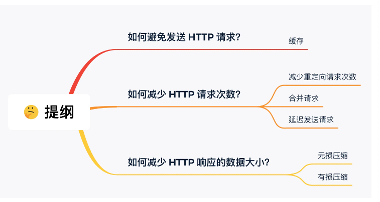
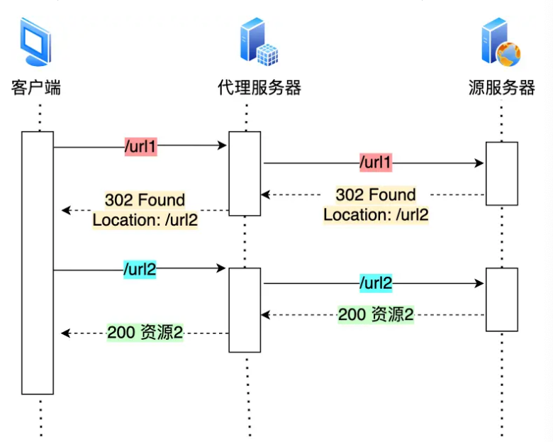
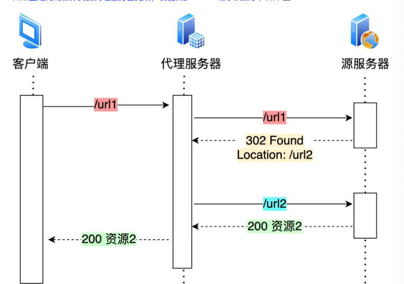
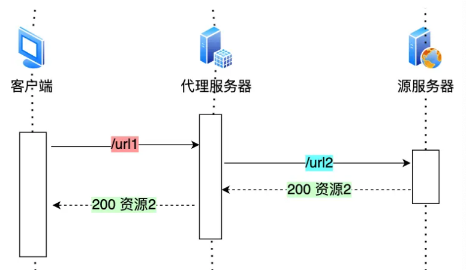
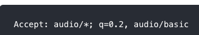

- 
- 如何避免发送
	- 缓存,详见 [[http常见面试题]] 这里的强制缓存和协商缓存这块
	- 简单来说,客户端第一个请求,服务器会估算一个过期时间返回来,然后客户端把返回值存在磁盘里,然后第二次请求时,如果没过期,就从磁盘里读,如果过期了, 会带着etag标识去请求,如果没变,就返回304,表示资源没变,你还用之前的吧,如果变了,就返回200,把新的返回值带回去
- 如何减少http请求次数
	- 减少重定向请求次数
		- 如果重定向的话,请求url1后,会返回新的地址,然后客户端又要去请求url2
		- 
		- 如果有代理服务器的话,还多一次
		- 如果代理服务器可以自己做重定向,可以少一次
			- 
		- 如果把重定向的规则放在代理服务器上,又能少一次,他自己重定向过去
			- 
		- 如果是永久重定向,那下次客户端就自动用新的那个url访问,301类型
	- 合并请求
		- 把多个小文件请求合成一个大的,可以减少发送重复的http头
		- 因为有队头阻塞的问题,为了防止单个请求的阻塞,浏览器会同时发起5-6个请求,每个对应不同的tcp链接,如果合并了,会减少tcp链接的数量
			- 这个操作是浏览器解析html要加载的资源数量,根据自己的并发连接限制决定发起多少个链接
		- 合并方式
			- css image sprites 把多个图标合成一个大图片,然后css再把大图片切割回去
			- 服务端用webpack打包工具把资源打包成一个大文件
			- 把图片二进制数据用base64编码之后,用url形式嵌入到html文件中
		- 问题
			- 合在一起了,只要有一个小资源变化了,客户端要重新下载整个打字员文件,带来额外网络消耗
	- 延迟发送请求
		- html里有很多资源,有的不需要
		- 按需获取,客户向下滑动之后,在加载,可能人家一下子就退出了
- 减少http响应的数据大小 - 压缩
	- 无损压缩
		- 信息不会破坏还是原来那样,gzip 在content-encoding里告知压缩算法
	- 有损压缩
		- 解压的数据会和原始数据不太一样,但是差不多
		- 对于音频,视频,图片等
		- 可以通过请求头 accetp里的 q质量因子来告知期望的资源质量
			- 
		- 比较好的是谷歌的webp格式
		- 音频视频的连续帧的变化很小,画面静态的地方,只要有个静态的关键帧,其他的用增量数据来表达,好很多