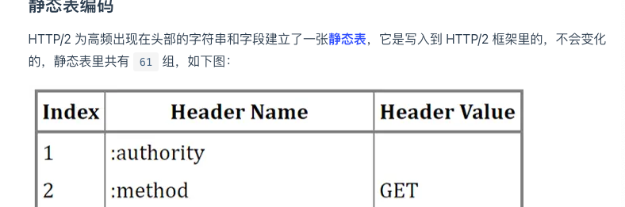
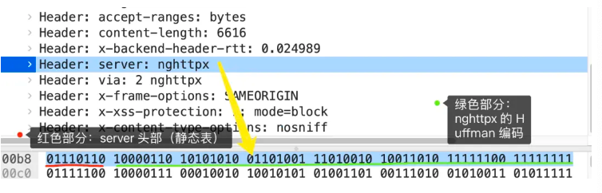
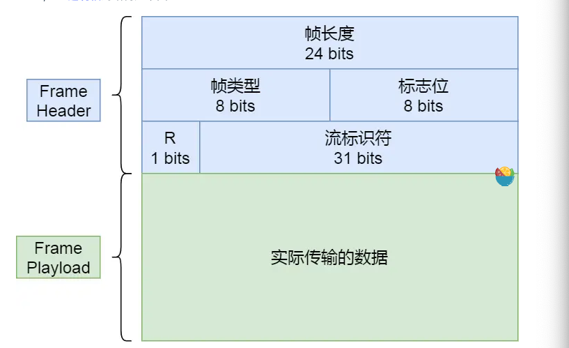
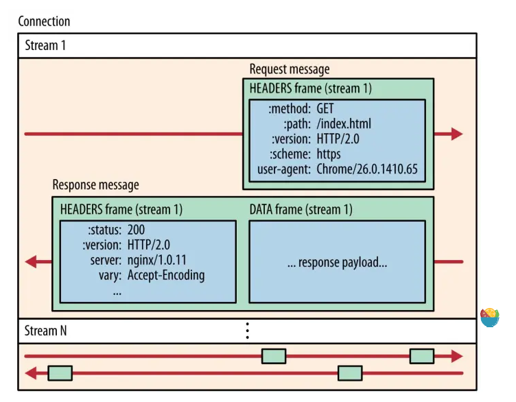
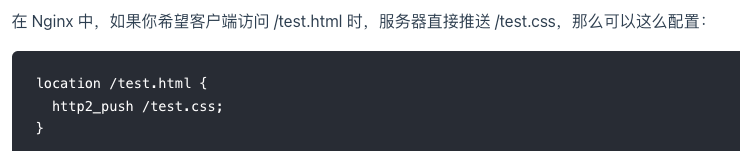
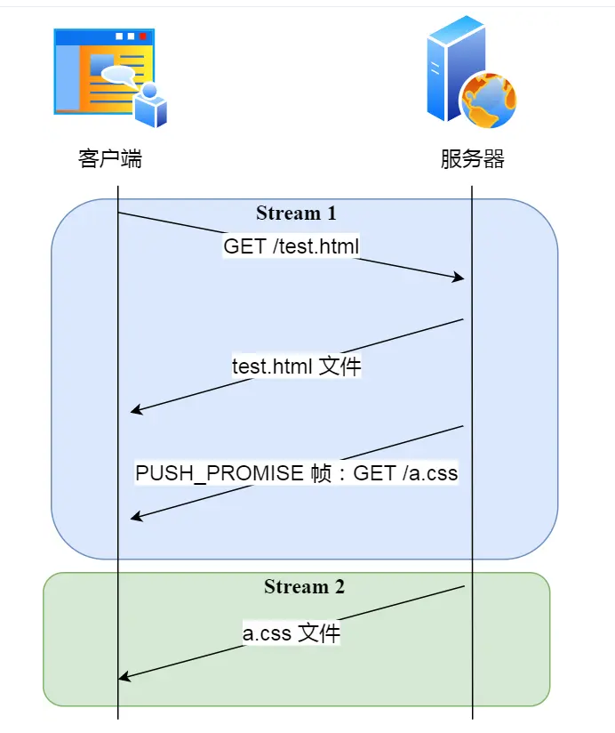

tags:: 小林网络

- 问题是啥
	- 头部巨大重复
	- 并发连接耗时
	- 服务器不能主动推送
	- 请求-响应模型
- 兼容1.1
	- 没有在url里引入新的协议名，浏览器和服务器在背后自己升级，让用户意识不到
	- 只在应用层改变，基于tcp协议，请求方法，状态码，头规则都不变
- 头部压缩
	- 有很多固定字段，如cookie，user agent，accept，压缩
	- 大量的请求和响应报文里的字段都是重复的
	- 字段是ascll编码，可以改成二进制编码
	- HPACK算法
		- 静态字典
		- 动态字典
		- huffman编码（压缩算法
		- 客户端和服务器两端都会建立和维护字段，长度较小的索引号标识重复字符串，用huffman编码压缩数据，能达到50%-90%的高压缩率
	- 静态表编码
		- 
		- 
		- 头部字段属于静态表范围，并且 Value 是变化，那么它的 HTTP/2 头部前 2 位固定为 `01`
		- 第二个字节，首个比特位表示value是否经过huffman编码，剩余7位是value的长度，后面nghttpx经过huffman编码过的
	- 动态表编码
		- 静态表只有61中高频出现在头部的字符串
		- 第一次发送时头部中的「`User-Agent` 」字段数据有上百个字节，经过 Huffman 编码发送出去后，客户端和服务器双方都会更新自己的动态表，添加一个新的 Index 号 62。**那么在下一次发送的时候，就不用重复发这个字段的数据了，只用发 1 个字节的 Index 号就好了，因为双方都可以根据自己的动态表获取到字段的数据**。
		- 使得动态表生效有一个前提：**必须同一个连接上，重复传输完全相同的 HTTP 头部**。如果消息字段在 1 个连接上只发送了 1 次，或者重复传输时，字段总是略有变化，动态表就无法被充分利用了。
		- 动态表也不是越大越好，越大占用内存越多，影响服务器性能。Web 服务器都会提供类似 `http2_max_requests` 的配置，用于限制一个连接上能够传输的请求数量，避免动态表无限增大，请求数量到达上限后，就会关闭 HTTP/2 连接来释放内存。
- 二进制帧
	- 
- 并发传输
	- 
	- 一个链接中的streamid不能复用的，只能顺序递增，用完了要发一个控制帧GOAWAY，关闭tcp链接
	- 一般默认是128个是上限
	- 可以设置优先级，帧头里的标志位可以设置优先级
- 服务器主动推送资源
	- 
	- 用push_promise来传输http头部，用promised stream id告诉客户端，接下来在哪个偶数号stream中发送包体
	- 
	- 1，2可以并发