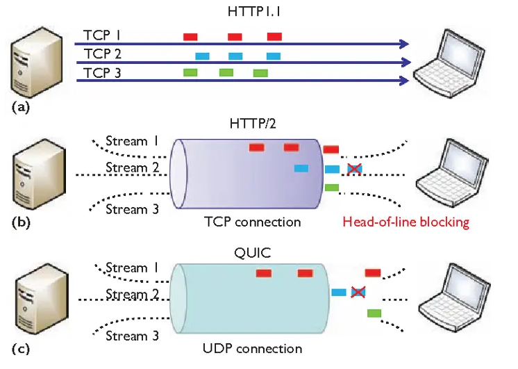

tags:: 小林网络

- http2的弊端
	- 队头阻塞
	- tcp和tls的握手时延迟
	- 网络迁移要重新连接
- quic协议特点
	- 无队头阻塞
		- udp不关系数据包顺序，丢失了也不关心
		- quic会保证数据包的可靠性，包都有一个序号唯一标识，某个流中的数据包丢失了，这个流的其他数据包到达了，数据也无法被http3读取，直到重传丢失的报文http3
		- 但是不会影响其他的数据报文
		- 
	- 更快的连接建立
		- **QUIC 内部包含了 TLS，它在自己的帧会携带 TLS 里的“记录”，再加上 QUIC 使用的是 TLS 1.3，因此仅需 1 个 RTT 就可以「同时」完成建立连接与密钥协商，甚至在第二次连接的时候，应用数据包可以和 QUIC 握手信息（连接信息 + TLS 信息）一起发送，达到 0-RTT 的效果**。
	- 连接迁移
		- 用连接id标记通信两个端点，只要保留了上下文，就可以无缝复用