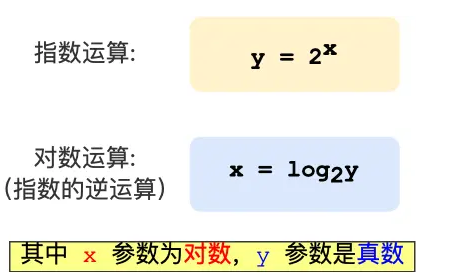
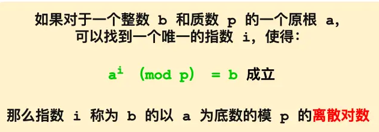
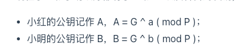
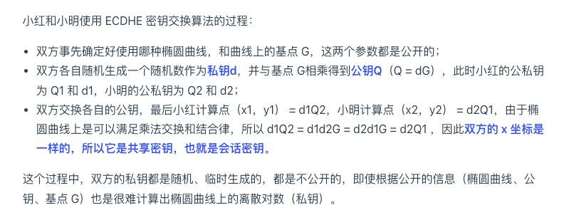
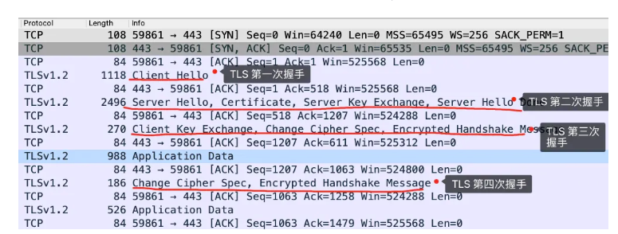
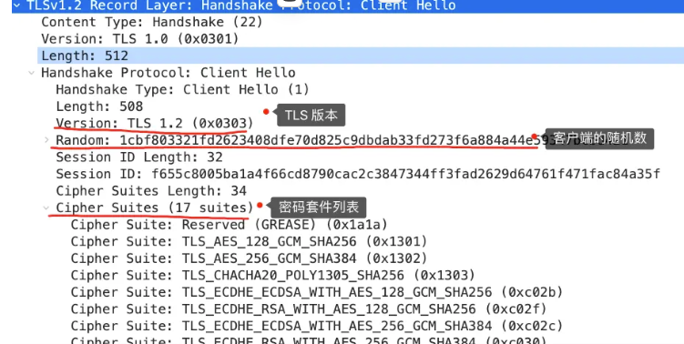
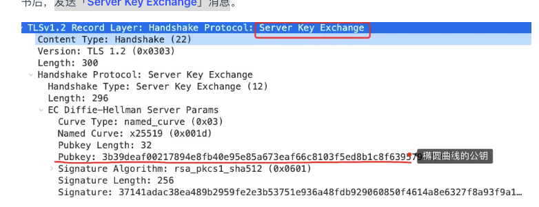

tags:: 小林网络

- 离散对数
	- 
	- 在对数基础上加上模运算，得出来的数是不连续的
	- 离散对数的概念：
		- 
		- 底数a和模数p是公开的，b是真数，i是对数，直到了对数能很容易算出真数，知道了真数却很难算出对数
		- **特别是当模数 p 是一个很大的质数，即使知道底数 a 和真数 b ，在现有的计算机的计算水平是几乎无法算出离散对数的，这就是 DH 算法的数学基础。**
- DH算法
	- 双方先约定底数和模数，这俩是公开的
	- 双方都有个自己的私钥，私钥不能泄露，工具私钥算出公钥(对数)，公钥也可以公开，因为即使公开了也算出不来私钥，交换公钥
	- 
	- 然后小红执行运算： B ^ a ( mod P )，其结果为 K，因为离散对数的幂运算有交换律，所以小明执行运算： A ^ b ( mod P )，得到的结果也是 K。
	  id:: 65db0550-f8ac-4cb9-bf09-b77c79fc6e2b
	- K就是他们的对称加密秘钥
- DHE算法
	- 静态的DH算法，有一方私钥是静态的，这样很可能一直累计计算，可能会破解
	- 这个算法是两边私钥在每次秘钥交换的时候，都搞成随机的，E是ephemeral 临时的意思
	- 保证了前向安全
- EDHE算法
	- DHE效率不太好
	- ECDHE 算法是在 DHE 算法的基础上利用了 ECC 椭圆曲线特性，可以用更少的计算量计算出公钥，以及最终的会话密钥。
	- 
	- 不太可逆，是个点乘运算，很容易算到公钥，但是反推不到私钥
- EDHE握手过程
	- 
	- 第一次握手
		- 「**Client Hello**」消息，消息里面有客户端使用的 TLS 版本号、支持的密码套件列表，以及生成的**随机数（*Client Random*）**。
		- 
	- 第二次握手
		- 服务端收到客户端的「打招呼」，同样也要回礼，会返回「**Server Hello**」消息，消息面有服务器确认的 TLS 版本号，也给出了一个**随机数（*Server Random*）**，然后从客户端的密码套件列表选择了一个合适的密码套件。
		- 密码套件
			- 「 TLS_ECDHE_RSA_WITH_AES_256_GCM_SHA384」
			- 密钥协商算法使用 ECDHE；
			- 签名算法使用 RSA；
			- 握手后的通信使用 AES 对称算法，密钥长度 256 位，分组模式是 GCM；
			- 摘要算法使用 SHA384；
		- 发送server key exchange
			- 
			- 选择了**名为 x25519 的椭圆曲线**，选好了椭圆曲线相当于椭圆曲线基点 G 也定好了，这些都会公开给客户端；
			- 生成随机数作为服务端椭圆曲线的私钥，保留到本地；
			- 根据基点 G 和私钥计算出**服务端的椭圆曲线公钥**，这个会公开给客户端。
		- 就是「**Server Hello Done**」消息，服务端跟客户端表明：“这些就是我提供的信息，打招呼完毕”。
	- 第三次握手
		- 验证证书合法性
		- 生成随机数作为客户端的私钥，然后根据曲线和g算出来客户端的曲线公钥
		- 发client key exchange给服务端
		- 最后的会话秘钥是 客户端随机数+服务端随机数+共享秘钥（公钥+私钥）更随机
	- 第四次握手
		- 服务端也会有一个同样的操作，发「**Change Cipher Spec**」和「**Encrypted Handshake Message**」消息，如果双方都验证加密和解密没问题，那么握手正式完成。于是，就可以正常收发加密的 HTTP 请求和响应了。
- 客户端可以不用等服务端的最后一次 TLS 握手，就可以提前发出加密的 HTTP 数据，节省了一个消息的往返时间
- 为什么安全
	- 中间商可以在中途篡改信息，但是过不了ca的证书验证
	- 后续监听消息，即使知道了服务器的私钥信息，但是因为每次会话秘钥都是随机的私钥进行加密的，所以无法破解
	- 如果是中间商自己生成个私钥，那要当时通信的时候，服务端拿着中间商的公钥去生成信息，才能够获取到信息