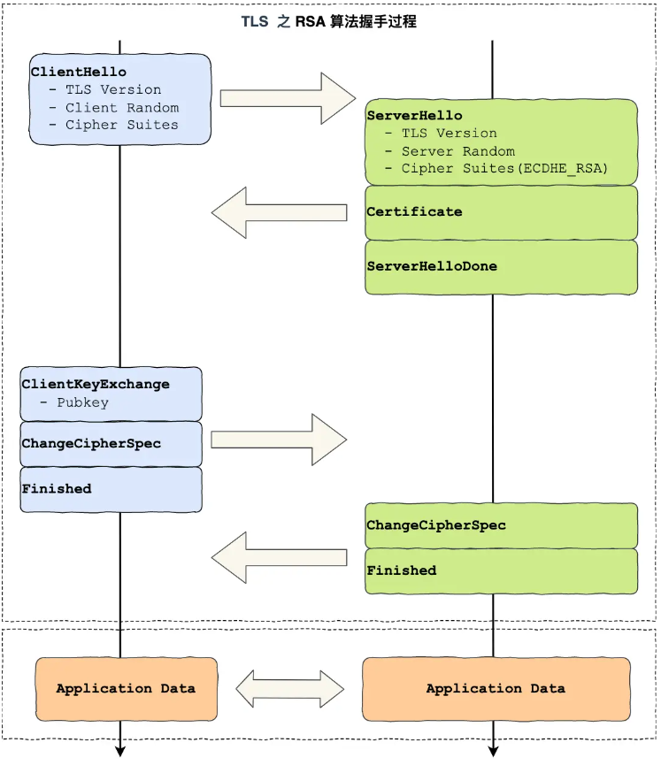
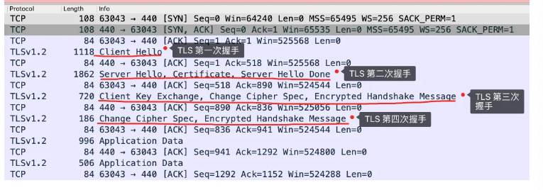
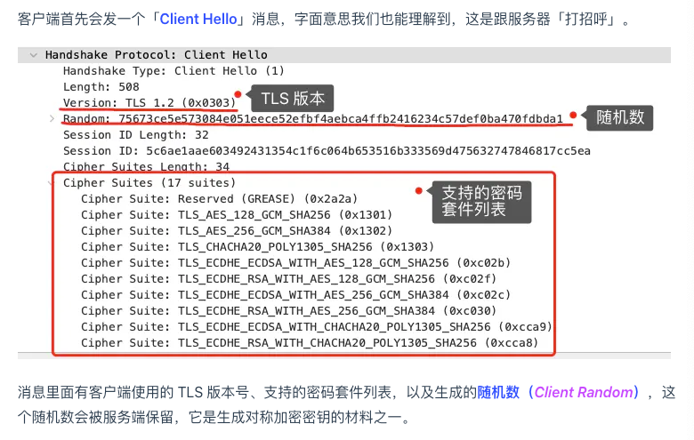

tags:: 小林网络

- tls握手过程
	- 
- RAS握手过程
	- 
	- 第一次握手
		- 客户端发个Client Hello消息
		- 
	- 第二次握手
		- 服务端返回Server Hello，里面确认TLS版本号，给个随机数，选择的密码套件
		- 密码套件，基本上是 秘钥交换算法+签名算法+对称加密算法+摘要算法
		- 发送 server certificate 把证书给客户端
		- server hello done 发完了，结束了
	- 客户端验证证书
		- [[http常见面试题]]里有
	- 第三次握手
		- 客户端生成随机数，服务器公钥加密，通过Client key exchange发给服务端
		- change cipher spec 后面用会话秘钥发消息
		- **Encrypted Handshake Message（Finishd）** 之前发的消息摘要，用会话秘钥加密，让服务端验证
			- 加密通信是否可用，之前握手信息是否被中途篡改过
	- 第四次握手
		- 发「**Change Cipher Spec**」和「**Encrypted Handshake Message**」消息，如果双方都验证加密和解密没问题，那么握手正式完成。
- 缺陷
	- 因为客户端传递随机数（用于生成对称加密密钥的条件之一）给服务端时使用的是公钥加密的，服务端收到后，会用私钥解密得到随机数。所以一旦服务端的私钥泄漏了，过去被第三方截获的所有 TLS 通讯密文都会被破解。
	- 不具备前向安全