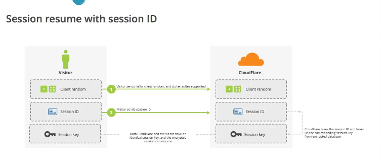

tags:: 小林网络

- 性能损耗
	- TLS协议握手过程
		- 双方都临时生成公司钥
		- 客户端验证证书的时候，验证证书是否被吊销
		- 计算pre-master，对称加密秘钥
		- 
	- 握手后的对称加密报文传输
- 硬件优化
	- https协议是计算密集型，不是IO密集型，买好的CPU
	- 支持AES-NI特性的CPU，优化了AES算法，加速数据的加解密传输过程
	- 查询是否支持这个AES-NI指令集
		- 
	- 如果支持就用AES算法，否则用cahcha20
- 软件优化
	- 正在使用的软件升级到最新版本，会有最新的特性，优化以前的问题或性能
- 协议优化
	- 秘钥交换算法
		- ECOHE秘钥交换，可以抢跑，在第三次握手后，第四次握手前，就可以发送加密应用数据了
		- 安全性也高，有前向安全性
		- 曲线选择x25519曲线
			- 
		- 对称算法，对安全性不是特别高的话，用AES_128_GCM
			- 
	- TLS升级
		- 
		- 在client hello消息里就带上了支持的椭圆曲线，以及曲线对应的公钥
		- 服务端收到后选定曲线，带上公钥
		- 可以算出会话秘钥，进行传输了
		- 1.3只支持ECDHE算法了，而且只支持最安全的几个密码套件
			- 1.2支持一些不安全的，中间人利用降级攻击，伪造客户端的消息，替换客户端支持的密码套件为一些不安全的密码套件，让服务器被迫用这个密码套件
- 证书优化
	- 证书传输优化
		- 选择ECDSA证书，这个秘钥长度短
	- 验证优化
		- 要知道证书是否被CA吊销了，客户端有时会去访问CA，下载CRL或OCSP，确认证书有效性
		- CRL
			- 由ca定期更新，如果服务器证书在这个列表里，证书就失效了
			- 问题
				- 刚被吊销后，客户端更新CRL之前还是会信任，时效性太差
				- 列表越来越大，下载速度很慢
		- OCSP 现在用的
			- 在线证书状态协议
			- 给ca发送查询请求，让ca返回证书的有效状态
			- 但是每次都要去查询，会有开销，网络状态不行或者ca服务器繁忙，也不太好
		- OCSP Stapling
			- 服务器向ca周期性查询证书状态，获得一个带时间戳和签名的响应结果，并缓存
			- 客户端发请求，服务器把响应结果在tls握手的时候给客户端，有签名，服务器没法篡改，客户端不用去查询了
			- 也不是实时的，但是可以设置比较短的有效期，达到基本上实时
- 会话复用
	- 把首次tls握手协商的对称加密秘钥缓存起来，下次建立的时候复用
	- session id
		- 客户端服务器首次连接后，在内存缓存会话秘钥，用唯一的sessionid来标识
		- 客户端再次连接时，hello消息里带上session id，服务器收到后从内存里找，然后直接用秘钥进行会话
		- 为了安全，内存里的会话秘钥会定期失效
		- 
		- 缺点
			- 服务器要保持每一个客户端的会话秘钥，内存压力大
			- 多台服务器通过负载均衡提供服务，再次连接不一定会命中之前的服务器，所以还是走完整的tls握手过程
	- session ticket
		- 服务器不缓存，客户端缓存
		- 第一次连接的时候，加密会话秘钥作为ticket给客户端，客户端缓存，再次连接的时候，发送ticket，服务器解密，验证有效期
		- 
		- 要确保每台服务器加密 会话秘钥 的秘钥是一致的，不然会有问题
		- 不具备前向安全性，被破解了，前面劫持的通信秘文会被破解
		- 重放攻击
			- a向b证明身份，提供了密码，c窃听了并且保留了密码
			- 下一次，c用保留的密码给b
			- 虽然他没法假冒别的信息，但是可以截取报文，不断重放
			- 如果中间人截获了某个客户端的 Session ID 或 Session Ticket 以及 POST 报文，而一般 POST 请求会改变数据库的数据，中间人就可以利用此截获的报文，不断向服务器发送该报文，这样就会导致数据库的数据被中间人改变了，而客户是不知情的。
			- 解决：给秘钥设置一个合理的过期时间
	- pre-shared key
		- 
		- 重连的时候，把ticket和http请求一起发给服务端，直接返回
		- 也有重放攻击的危险
	-