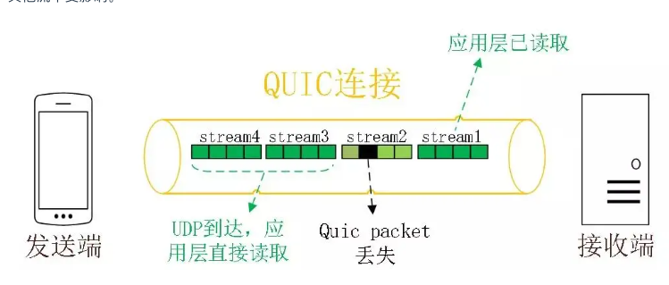

tags:: 小林网络

- http基本概念
	- 超文本传输协议
	- **HTTP 是一个在计算机世界里专门在「两点」之间「传输」文字、图片、音频、视频等「超文本」数据的「约定和规范」。**
	- 常见状态码
		- 
		- 2xx成功了
			- 200 ok 响应头会有body数据
			- 204 成功了，但是响应头没有body数据
			- 206 分块下载或断电续传，body里不是所有的数据
		- 3xx 重定向，资源变动了，要用新的url重新发送来获取咨询
			- 301 永久重定向，以后都用新的吧
			- 302 暂时的，先用另外一个吧
			- 都会在头里加上Location，表示后续你跳转的地址，浏览器会自动重定向过去
			- 304 资源没改，客户端可以继续用缓存的资源
		- 4xx 客户端有问题，报文错误，服务器没法处理
			- 400 报文错误
			- 403 服务端禁止访问资源
			- 404 资源不存在或没找到
		- 5xx 服务端错误
			- 500 笼统的不知道咋错了
			- 502 网关错了，访问后端服务器出错了
			- 503 很忙，稍后重试吧
	- 常见字段
		- host域名
		- content-length 返回数据 表示 本次返回的数据长度后面的就是下一个回应了
		- connection 客户端要求服务器使用http长链接
		- content-type 服务端告诉客户端 数据是什么格式 客户端用accept声明自己接收哪些格式
		- content-encoding 服务端返回数据用的什么压缩格式，客户端用accept-encoding标明自己支持哪种压缩格式
- GET和POST区别
	- get
		- 从服务器获取资源，具有幂等性，不会修改服务器资源
		- 参数是写在url里的
		- 浏览器会对url有长度限制
		- 安全且幂等
	- post
		- 请求对指定资源做处理
		- 放在body里
		- 不安全也不幂等
- HTTP缓存技术
	- 如果有很多重复的http请求，缓存在本地
	- 强制缓存
		- 浏览器判断缓存没过期，就直接用本地缓存，根本不发请求出去了
		- 这种会在返回值里标注 200(from disk cache)
		- 资源在客户端缓存有效期
			- cache-control 相对时间
			- expires 绝对时间
			- 如果都设置了，用cache-control
		- 浏览器第一次访问服务器资源，服务器返回的时候会在返回头加上cache-control
		- 再次访问的时候，会对比时间，如果没超过就用缓存的，否则去请求服务器
	- 协商缓存
		- 
		- 和服务器协商之后用本地缓存
		- 实现
			- 请求头部的if-modified-since和返回的last-modified
			- 流程
				- 客户端请求资源。
				- 服务器返回资源，并在响应头中包含`Last-Modified`头部。
				- 客户端存储资源和头部信息，并缓存资源。
				- 当客户端再次请求相同的资源时，它会在请求头中包含`If-Modified-Since`头部，其值为之前服务器发送的`Last-Modified`日期。
				- 如果服务器检查资源自从`If-Modified-Since`头部中的日期后未修改过，它会返回一个304 Not Modified状态码，而不是资源内容。
				- 客户端接收到304响应后，知道它可以安全地使用本地缓存的版本。
			- ### ETag / If-None-Match
				- **ETag**: 服务器在响应中发送这个头部，表示资源的一个唯一标识（通常是一个哈希值）。
				- **If-None-Match**: 客户端在后续请求中使用这个头部，发送之前服务器提供的ETag值。如果ETag没有变化，则表明内容没有更新。
				- 流程
					- 客户端请求资源。
					- 服务器返回资源，并在响应头中包含`ETag`头部。
					- 客户端存储资源和头部信息，并缓存资源。
					- 当客户端再次请求相同的资源时，它会在请求头中包含`If-None-Match`头部，其值为之前服务器发送的ETag值。
					- 如果服务器检查到ETag值匹配（即资源未变化），它会返回一个304 Not Modified状态码，而不是资源内容。
					- 客户端接收到304响应后，知道它可以安全地使用本地缓存的版本。
			- 最好用etag这种，因为更精确，用时间的控制的话，可能修改了并没有改时间，没有改，时间也变了，而且只能精确到秒级别
		- 在没命中强制缓存的时候，发起协商缓存字段请求
		- 
- http1.1特性
	- 优点
		- 简单 header+body的格式，头部也是key-value 易于理解
		- 灵活和可扩展 工作在应用层，下面可以随意变化
		- 应用广泛和跨平台
	- 缺点
		- 无状态，不需要额外资源记录状态信息，但是会导致完成关联性操作麻烦
			- Cookie 在请求和响应报文中写入cookie信息
			- 
		- 明文传输
			- 方便阅读，调试
			- 但是也有可能别有心人拿走了，不安全
		- 不安全
			- 通信用明文 账号密码偷走
			- 不验证通信方信息 遭遇伪装，假的淘宝
			- 无法证明报文完整性 可以被篡改
	- 性能
		- 长链接
			- 之前每次发请求，都要新建TCP链接，三次握手四次挥手，麻烦
			- 加入长链接，任意一端没有提出断开，就保持tcp链接
		- 管道网络传输
			- tcp链接里，可以发多个请求，只要有一个请求出去了，就可以发第二个
			- 但是在处理里，如果第一个还没有处理完，不会处理下一个，只是节省了在路上的时间
			- 
			- 但是这个不是默认开启的，浏览器基本没有支持
		- 队头阻塞
			- 如果一个请求在服务端被阻塞了，后面的也会被阻塞
			- 
- HTTP与HTTPS
	- https在http的基础上，在tcp和http网络层上加入了 SSL/TLS安全协议，要进行 SSL/TLS握手
	- http默认端口号是80，https默认端口号是443
	- https协议要向CA申请数字证书，保证服务器身份可信
	- HTTPS
		- 信息加密，交互信息无法被窃取，不会知道你的账号密码
		- 校验机制，无法篡改通信内容，改了就是乱码
		- 身份证书，证明淘宝是真的淘宝
		- 如何实现
			- 混合加密
				- 
				- 通信建立的时候用非对称加密 交换会话秘钥，秘钥有了之后
				- 后续的通信用会话秘钥，对称的效率高，非对称的安全性高
			- 摘要算法+数字签名
				- 为了保证内容没有被修改过，对内容算出一个指纹，指纹+值 发给对方
				- 收到，对内容算一个指纹，和发送方的指纹做比较，一样就是没改过
				- 但可能内容+哈希值都被人改过了，所以要验证服务端的信息验证
					- 公钥加密，私钥解密，保证内容传输的安全，所有的人都能发过来
					- 私钥加密，公钥解密，消息不会冒充，肯定是通过有私钥的人发出来的，但是只要有这个公钥的人都能看到
					- 
			- 数字证书
				- 万一公私钥都是假的！要找个权威的机构来验证
				- 把人格信息+公钥+数字签名打包成数字证书
				- 首先去机构验证数字证书是否合法，数字证书里有机构的数字签名，会拿着自己的公钥解密，如果能解密，就是合法的，然后把 数字证书里的公钥给用户
				- 
- https如何建立的，交互了什么
	- ssl/tls协议基本流程
		- 客户端向服务器索要并且验证公钥
		- 双方协商 产生 会话秘钥
		- 用秘钥进行加密通信
	- RSA 的TLS握手过程
		- 
		- ClientHello过程中，会告诉客户端支持的tls版本，产生的随机数 clientRandom，客户端支持的密码套件
		- ServerHello 确认TLS版本，产生随机数 ServerRandom 确认密码套件 服务器的数字证书
		- 客户端 通过操作系统里的CA公钥，确认服务器正确性，没问题的话，从数字证书里取出公钥，发送信息
			- 随机数 pre-master key 这个是被公钥加密的
			- 加密算法改变通知，后面用会话秘钥通信
			- 握手结束通知，这一个会把之前所有内容发生的数据做摘要，让服务端校验
		- 双方都有三个随机数了，用加密算法根据这三个随机数，生成会话秘钥
		- 服务端 信息
			- 加密通信算法改变通知
			- 握手结束通知，把之前所有内容做摘要，供客户端校验
		- 后续发送加密内容
		- 弊端
			- 如果服务端私钥泄露了，过去被第三方截获的所有密文都会被破解
			- 后续出现了ECDHE 秘钥协商书案发
	- 数字证书签发和验证流程
		- 
			- CA签发证书
				- 将持有者的公钥，用途，颁发者，有效时间 打包成一个包，进行hash计算得到一个hash值
				- CA对这个hash值加密，得到证书签名
				- 把签名添加在文件证书上，形成了数字证书
			- 校验
				- 客户端用同样的hash算法算出来hash值 hash1
				- 操作系统里有ca的公钥信息，浏览器用ca的公钥解密出certificate signature的值 hash2
				- 如果一样的，就表示可信赖
			- 证书信任链
				- 我们申请的证书一般不是根证书签发的，而是中间证书
				- 
					- 客户端收到baidu的证书，发现签发人不是根证书，无法根据本地已有的根证书的公钥去验证。
					- 去找baidu的证书签发人，向ca请求中间证书
					- 请求了之后发现中间证书的证书是根证书签发的，会检查这个证书在根证书清单上吗，在的话，用根证书的公钥验证中间证书，如果验证通过，就认为中间证书可信
					- 然后就用中间证书的公钥验证baidu的证书，如果通过，也可信
					- 
					- 为了保证根证书的安全性，将根证书隔离的越严格越好，不然根证书无了，所有的都有问题了
	- https应用数据如何保证完整性
		- tls实现有握手协议和记录协议
			- 握手协议在上面
			- 记录协议，保护应用程序数据并且验证完整性和来源
		- 记录协议
			- 
				- 分割成好多短片段
				- 分别进行压缩
				- 压缩里加上消息认证码
				- 用对称密码进行加密
				- 加上数据类型，版本号，压缩后的长度组成最终的报文数据
	- https一定安全可靠吗
		- 
		- 漏洞在验证证书合法性，他肯定不是合法的，会弹出提醒，如果你执意要访问那没法
			- 
		- 或者是电脑中毒了，安装了中间人的根证书，不会弹出提醒
		- 为什么抓包工具能截取https数据
			- 中间人要满足下面两点，才能实现明文代理
				- 作为客户端要和服务器建立连接，这个没问题
				- 要作为服务端和客户端建立连接，这个时候 服务端要有对应域名的私钥，获取方式如下
					- 网站服务端拿到私钥
					- 去CA拿域名签发私钥
					- 自己签发证书，且要被浏览器信任（用的这个）
			- 抓包工具要在客户端安装fiddler的根证书，起到CA作用
		- 如何避免被中间人抓取数据
			- 避免中毒
			- 不要信任别人证书，尤其是提醒你他不行的
			- https双向认证
				- 服务端也验证客户端
				- 
				- 服务端一看客户端不可信任，拒绝通信，客户端发现服务端不可信任，终止通信
- http演变
	- 1.1 对比1.0
		- 使用了长链接
		- 支持管道网络传输,只要第一个请求发出去了,不用等他回来,就可以发第二个请求
		- 缺点
			- 请求/响应头部没有压缩就发出去了，首部信息越多延迟就越大，只能压缩body部分
			- 首部太长，每次都一样，浪费多
			- 队头阻塞
			- 没有请求优先级控制
			- 请求只能从客户端开始，服务器只能被动响应
	- 2的优化
		- 基于https，安全性有保证了
		- 
	- 头部压缩了
		- 同时发很多请求，头一样的或相似的，协议会帮你消除重复部分
		- hpack 客户端服务器维护一个头信息表，所有字段存到表中，生成索引号，后面就不发送同样字段了，发索引号
	- 二进制格式
		- 
		- 收到报文后，不需要把明文改成二进制，直接解析二进制报文
	- 并发传输
		- stream，多个stream复用一条tcp链接
			- 
			- **针对不同的 HTTP 请求用独一无二的 Stream ID 来区分，接收端可以通过 Stream ID 有序组装成 HTTP 消息，不同 Stream 的帧是可以乱序发送的，因此可以并发不同的 Stream ，也就是 HTTP/2 可以并行交错地发送请求和响应**。
	- 服务器推送
		- 可以主动向客户端发消息
		- 客户端和服务器双方都可以建立stream，客户端的需要必须要奇数，服务器必须要偶数
		- 
	- 缺陷
		- 
		- tcp中的队头阻塞，tcp中如果前一个字节数据没有到达，后续收到的字节数据需要等待
		- 可能是网络丢失了，反正要重传，等待这个包
	- http3的优化
		- 
		- udp虽然不可靠，但是可以基于UDP的QUIC协议，实现类似TCP的可靠性传输
			- QUIC
				- 无队头阻塞
					- 
					- 一个流的丢失，只会阻塞这个流，其他流不会受到影响
				- 更快的连接建立
					- 
					- 
				- 连接迁移
					- tcp基于原地址，端口，目标地址，端口来确定连接
					- 当移动设备网络从4g切到wifi，ip地址变化，就要断开连接，会卡顿下
					- quic是通过链接id来标记两个端的，所以ip地址变了，只要有上下文信息(连接id，tls秘钥等)就可以无缝服用
			- 缺点
				- QUIC 是新协议，对于很多网络设备，根本不知道什么是 QUIC，只会当做 UDP，这样会出现新的问题，因为有的网络设备是会丢掉 UDP 包的，而 QUIC 是基于 UDP 实现的，那么如果网络设备无法识别这个是 QUIC 包，那么就会当作 UDP包，然后被丢弃。