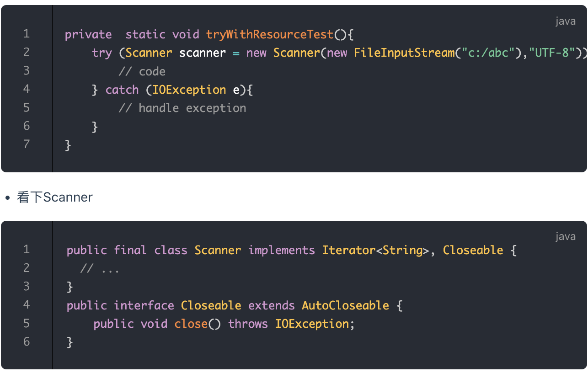
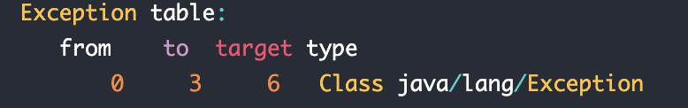

tags:: 异常，java

- try-catch-finally的执行顺序
	- ```
	  try {                        
	      //执行程序代码，可能会出现异常                 
	  } catch(Exception e) {   
	      //捕获异常并处理   
	  } finally {
	      //必执行的代码
	  }
	  ```
	- 执行顺序
		- try 如果没有捕获到异常，try块里的内容一一执行，程序跳过catch，执行finally语句及其后的语句
		- try有异常，catch语句里没有捕获这个异常的情况。异常会抛给JVM处理，finally语句块里的语句还是会被执行，finally语句之后的语句不会被执行
		- try有异常，catch里也有对应的处理。try里按照顺序执行，执行到异常之后，跳到catch语句块里，找到对应的catch块，catch块里执行完之后，如果有return，暂存return的结果，继续执行finally语句。最后返回到catch里return
- try-finally
	- 一般finally里放一些代码用来关闭资源，关闭连接。
	- finally不会执行的情况
		- 用了system.exit()退出程序
		- finally块里也发生了异常
		- 断电了
		- 关闭CPU
		- 程序所在的线程死了
- try-with-resource
	- 更优雅的方式来实现资源的自动释放，自动释放的资源需要是实现了 AutoCloseable 接口的类。
	- 
	- try代码块退出的时候，自动调用Scanner.close方法。
	- 如果是原来的，把scanner.close放在finally代码块的话，在finally里抛出异常，不会继续走。现在这种，会被抑制，抛出的还是原始异常，
	- 被抑制的异常会由 addSusppressed 方法添加到原来的异常，如果想要获取被抑制的异常列表，可以调用 getSuppressed 方法来获取。
- 异常实践指南
	- 只针对不正常的情况才使用异常。
		- Java 类库中定义的可以通过预检查方式规避的RuntimeException异常不应该通过catch 的方式来处理，比如：NullPointerException，IndexOutOfBoundsException等等。
			- 异常机制的设计初衷是用于不正常的情况，所以，创建，抛出，捕获异常的开销很昂贵
			- 把代码放在try-catch里阻止了JVM实现本来可能要执行的某些特定的优化
			- 对数组进行遍历的标准模式并不会导致冗余的检查，有些现代的JVM实现会将它们优化掉。
	- ### 在 finally 块中清理资源或者使用 try-with-resource 语句
		- 在try块的最后释放资源，会导致在中间抛出异常之后，释放资源的代码就被跳过去了
	- 尽量使用标准的异常
	- 对异常进行文档说明，在javadoc添加@throws说明，描述抛出异常的场景，尽可能的描述问题和相关信息
	- 优先捕获最具体的异常
		- 只有匹配异常的第一个catch块会被执行
	- 不要捕获Throwable类
		- 会捕获所有异常和错误，比如outOfMemoryError和stackoverflow错误，这种不应该由应用程序处理
	- 不要忽略异常
		- 比如不抛出异常，不做处理，也不记录日志
	- 不要记录并抛出异常
		- 有那种，记录了，然后又抛出去了，会导致经常会给同一个异常输出多条日志
		- 如果要提供更有用的信息，可以将异常包装为自定义异常
		- 仅仅当想要处理异常时才去捕获，否则只需要在方法签名中声明让调用者去处理。
	- 包装异常时不要抛弃原始异常
		- 一般是包装的时候，把原始异常设置为原因。
		- 否则会丢失堆栈跟踪和原始异常消息，不好排查问题
	- 不要使用异常  控制程序的流程
		- 例如，本应该使用if语句进行条件判断的情况下，你却使用异常处理，这是非常不好的习惯，会严重影响应用的性能。
	- 不要在finally里用return
		- 如果在finally里用return，会在finaly里直接返回，丢失了try块里的返回点
- 深入理解异常
	- 异常表：exception table
		- 
		- **from** 可能发生异常的起始点
		- **to** 可能发生异常的结束点
		- **target** 上述from和to之前发生异常后的异常处理者的位置
		- **type** 异常处理者处理的异常的类信息
		- 怎么用
			- 1.JVM会在当前出现异常的方法中，查找异常表，是否有合适的处理者来处理
			- 2.如果当前方法异常表不为空，并且异常符合处理者的from和to节点，并且type也匹配，则JVM调用位于target的调用者来处理。
			- 3.如果上一条未找到合理的处理者，则继续查找异常表中的剩余条目
			- 4.如果当前方法的异常表无法处理，则向上查找（弹栈处理）刚刚调用该方法的调用处，并重复上面的操作。
			- 5.如果所有的栈帧被弹出，仍然没有处理，则抛给当前的Thread，Thread则会终止。
			- 6.如果当前Thread为最后一个非守护线程，且未处理异常，则会导致JVM终止运行。
		-