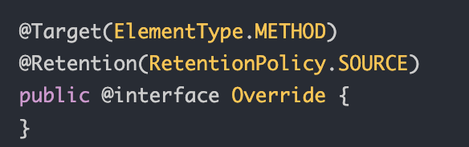
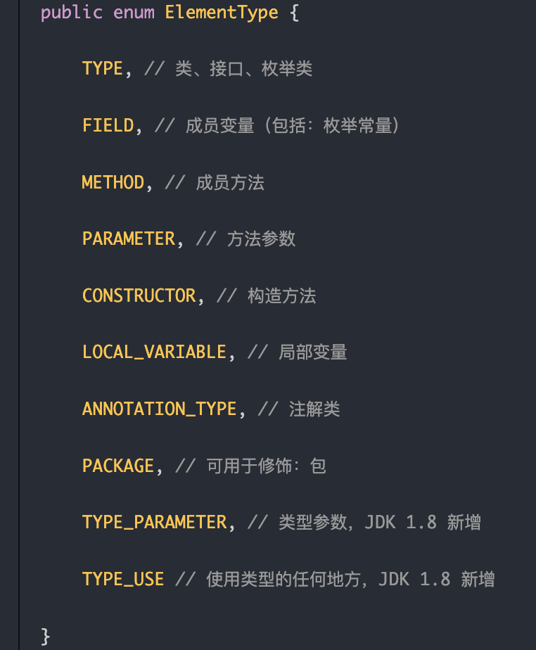
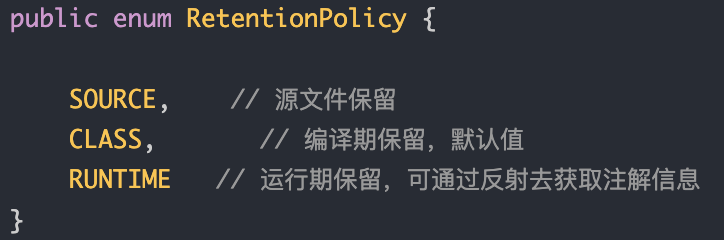
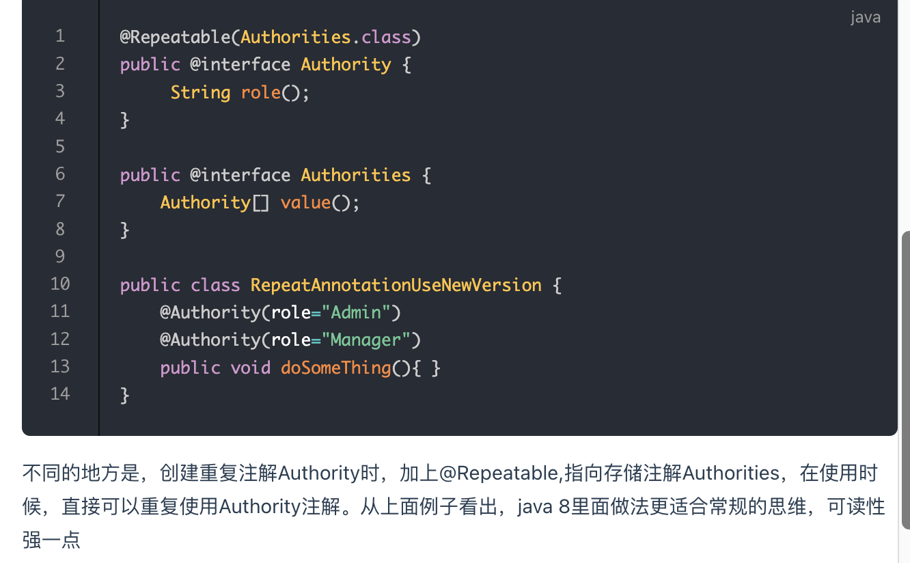
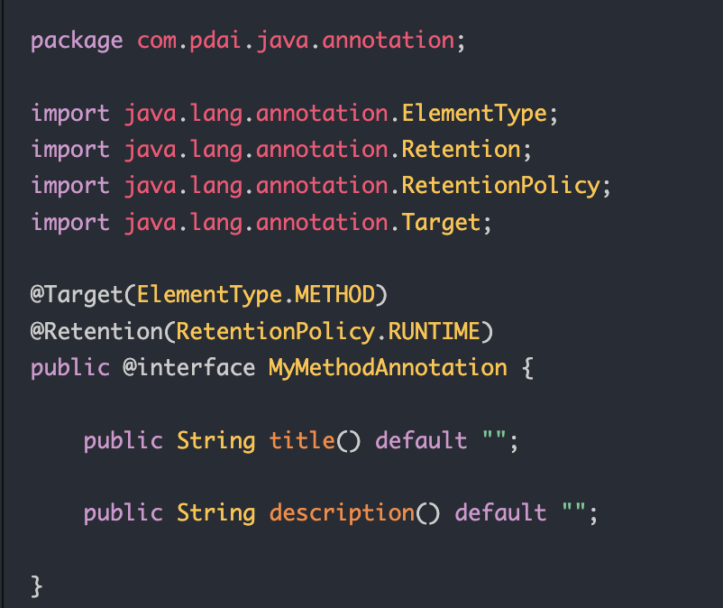
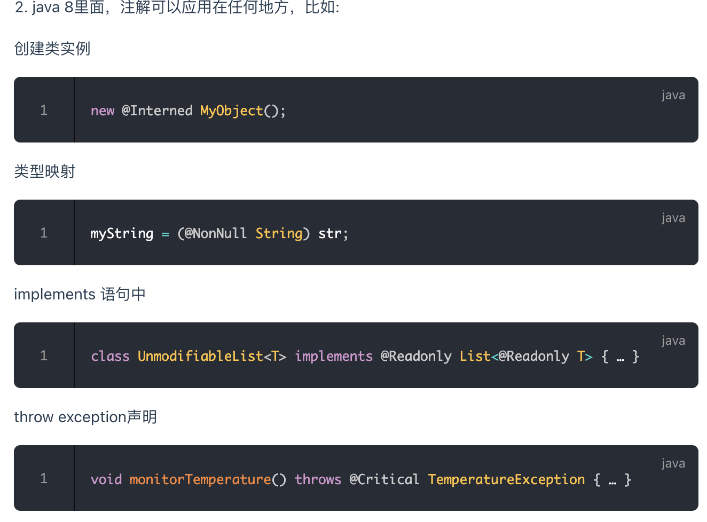

tags:: 注解，java

- 注解基础
	- 用来对代码进行说明
	- 使用范围
		- 包
		- 类
		- 接口
		- 字段
		- 方法
		- 方法参数
		- 局部变量
	- 作用
		- 生成文档
		- 编译检查
		- 编译时动态处理 如动态生成代码
		- 运行时动态处理 如用反射注入实例
	- 分类
		- java自带的标准注解
			- override，deprecated，suppressWarnings
		- 元注解
			- 定义注解的注解
			- retention，target，inherited，documented，retention
		- 自定义注解，根据自己的需求定义注解
- java内置注解
	- 
	- target：修饰方法。
	- retention：什么时候生效
- 元注解
	- target：描述注解的使用范围，注解可以用在什么方法
	- 
	- retention & retentionTarget
		- 描述注解保留的时间范围
		- 
	- documented
		- 描述在使用javadoc工具为类生成帮助文档时是否要保留其注解信息
	- inherited
		- 被它修饰的Annotation将具有继承性。如果某个类使用了被@Inherited修饰的Annotation，则其子类将自动具有该注解。
	- native
		- 使用 @Native 注解修饰成员变量，则表示这个变量可以被本地代码引用，常常被代码生成工具使用
	- repeatable
		- 允许在同一申明类型（类，属性，方法）多次使用同一个注解
		- java8之前也有类似的解决方案
			- ```
			  public @interface Authority {
			       String role();
			  }
			  
			  public @interface Authorities {
			      Authority[] value();
			  }
			  
			  public class RepeatAnnotationUseOldVersion {
			  
			      @Authorities({@Authority(role="Admin"),@Authority(role="Manager")})
			      public void doSomeThing(){
			      }
			  }
			  ```
		- 可读性不好
		- 现在：
			- 
		-
- 注解与反射接口
	- 通过反射包java.lang.reflect下的AnnotatedElement接口提供这些方法。
	- 只有注解被定义为RUNTIME后，该注解才能是运行时可见，当class文件被装载时被保存在class文件中的Annotation才会被虚拟机读取。
	- AnnotatedElement 接口是所有程序元素（Class、Method和Constructor）的父接口，所以程序通过反射获取了某个类的AnnotatedElement对象之后，程序就可以调用该对象的方法来访问Annotation信息。
- 自定义注解
	- 
	- 就可以在方法上加上注解信息了
	- 通过反射接口获取注解的信息
		- ```
		  1. 获取这个类上的所有方法
		  Method[] methods = TestMethodAnnotation.class.getClassLoader()
		                  .loadClass(("com.pdai.java.annotation.TestMethodAnnotation"))
		                  .getMethods();
		  2. 遍历所有的方法，判断方法上是否有自定义的这个注解
		  method.isAnnotationPresent(MyMethodAnnotation.class)
		  3. 获取自定义注解信息
		   MyMethodAnnotation methodAnno = method
		                              .getAnnotation(MyMethodAnnotation.class);
		  ```
- 深入理解注解
	- java8新注解
		- repeatable 说过的
		- 类型注解
			- 
			- 类型注解不会影响java的编译时间，加载时间以及运行时间。最后编译成的class文件不包含类型注解。
			- 类型注解的作用：
				- ```
				  Collections.emptyList().add("One");
				  int i=Integer.parseInt("hello");
				  System.console().readLine();
				  ```
				- 这个代码虽然能编译通过，但是会有很多的运行时异常。类型注解就被用来做强类型检查。配合插件式check framework，在编译的时候就能检测出runtime error，提高代码质量。