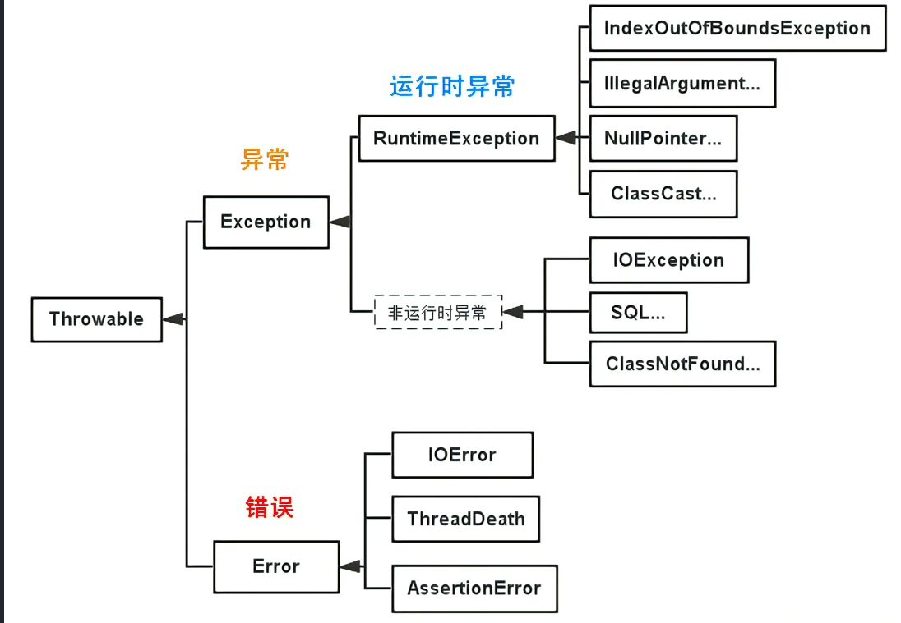

tags:: java

- 异常类层次结构
	- 
	- error 无法处理的错误，严重错误
	- exception：可以捕获并且处理的异常。
	  id:: 6408a138-056b-450a-a49f-6644453d6e11
		- 编译时异常，语法角度是必须处理的异常。不处理，程序不能编译通过。
			- runtimeException。一般是逻辑错误引起的
	- 可查异常，可以预计的，一旦有这种异常，必须采取某种方式处理。
	- **不可查异常**(编译器不要求强制处置的异常)包括运行时异常（RuntimeException与其子类）和错误（Error）。
	- #### [#](https://pdai.tech/md/interview/x-interview.html#throw%E5%92%8Cthrows%E7%9A%84%E5%8C%BA%E5%88%AB)