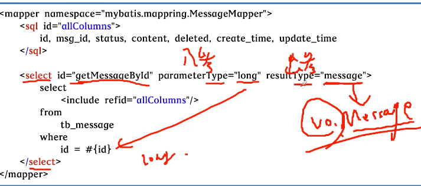

- 主流持久层的技术框架
	- JDBC
		- 步骤
			- 注册驱动和数据库信息 Class.forName("com.mysql.cj.jdbc.Driver");
			- 获得了Connection，用它打开statement对象
				- connection = DriverManager.getConnection("jdbc:mysql://[localhost:3306/muse?useSSL=false](http://localhost:3306/muse?useSSL=false)", "root", "root");
			- 通过statement对象执行sql语句，获取结果对象resultSet
				- ps = connection.prepareStatement("select name, age from tb_user");
				- rs = ps.executeQuery();
			- 通过代码把resultSet对象转化成pojo对象
			- 关闭数据库资源
		- 优点
			- 我们只需要会调用JDBC接口中的方法即可，使用简单
			- 使用同一套Java代码，进行少量的修改就可以访问其他JDBC支持的数据库
			- 执行快，更明了
		- 缺点：
			- 代码量很大，编码麻烦
			- 需要我们对异常进行正确捕获并关闭链接。场景单一，就去数据库查询
	- hibernate
		- 例子
		- 使用Hibernate的3个步骤：
		- 使用Hibernate的3个步骤：
			- ① 引入Hibernate的Maven依赖
			- ② 在hibernate.cfg.xml配置、文件中配置数据库数据源
			- ③ 编写User.hbm.xml配置文件，配置User与tb_user表的映射关系  这个就是自己的表的映射关系
		- 优点：
			- ① 将映射规则分离到XML/注解中，减少了代码的耦合度
			- ② 无需管理数据库连接，只需配置相应的XML配置文件
			- ③ 会话只需要操作Session对象即可，关闭资源也只需要关闭Session即可
		- 缺点：
			- ① 全表映射不便利，更新时需要发送所有字段
			- ② 无法根据不同的条件组装不同的SQL
			- ③ 对于多表关联和复杂SQL查询支持较差
			- ④ HQL性能较差，无法优化SQL
	- MyBatis
		- 使用MyBatis的4个步骤：
			- ① 引入MyBatis的Maven依赖
			- ② 在mybatis-config.xml配置文件中配置数据库数据源
			- ③ 编写UserMapper.xml配置文件，编写SQL和配置User与tb_user表的映射关系
			- ④ 编写数据操作接口UserMapper.java文件
		- 优点：
			- ① 可以配置动态SQL，可以对SQL进行优化，并通过配置来决定SQL的映射规则。
			- ② 具有自动映射功能，在注意命名规则的基础上，无需再写映射规则。
			- ③ 提供接口编程的映射器，只需要一个接口和映射文件便可以运行，代码耦合度低。
		- 缺点：
			- ① SQL语句的编写工作量较大，尤其是字段多、关联表多时更是如此，对开发人员编 写SQL语句的功底有一定要求。
			- ② SQL语句依赖于数据库，导致数据库移植性差，不能随意更换数据库。
- MyBatis基本操作
	- 查询操作
		- 
		-