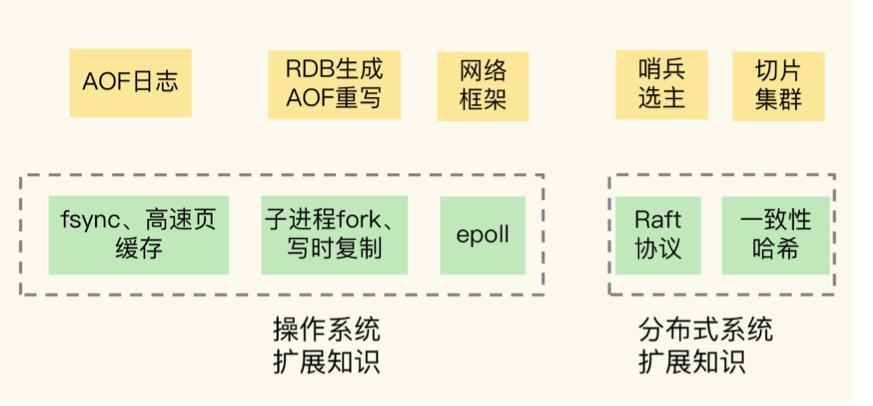

tags:: redis，书籍

- redis设计与实现
- redis 使用手册
- redis 开发与运维
- [¬]()
-
- 需要了解的点
	- redis系统架构
	- 数据结构
	- 线程模型
	- 持久化
	- 主从复制
	- 切片集群
	- 常见命令和配置
	- 集群搭建
	- IO模型
	- AOF，RDB机制
	- redis阻塞
	- 优化内存使用
	- 处理bigkey
- 
-