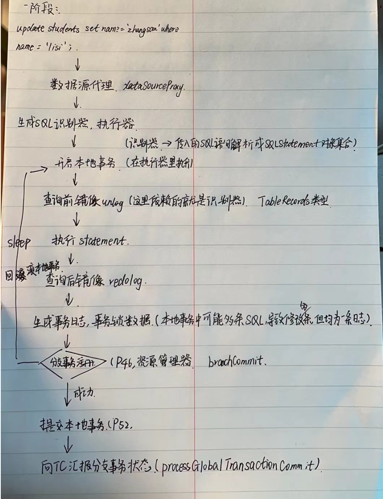

tags:: seata，at模式

- 
- 二阶段
	- 当全局事务为提交状态的时候，会释放各个分支事务的全局锁，推进二阶段提交
	- 资源管理器，当收到提交指令时，删除保存的事务日志，会立即返回，去异步线程批量删除
		- 分支事务提交（branchCommit）异步线程进行分支事务二阶段提交，将Phase2Context上下文放到异步执行队列中。
		- 定时任务区拉取，按照资源ID分组。
			- 根据资源ID取得数据源代理