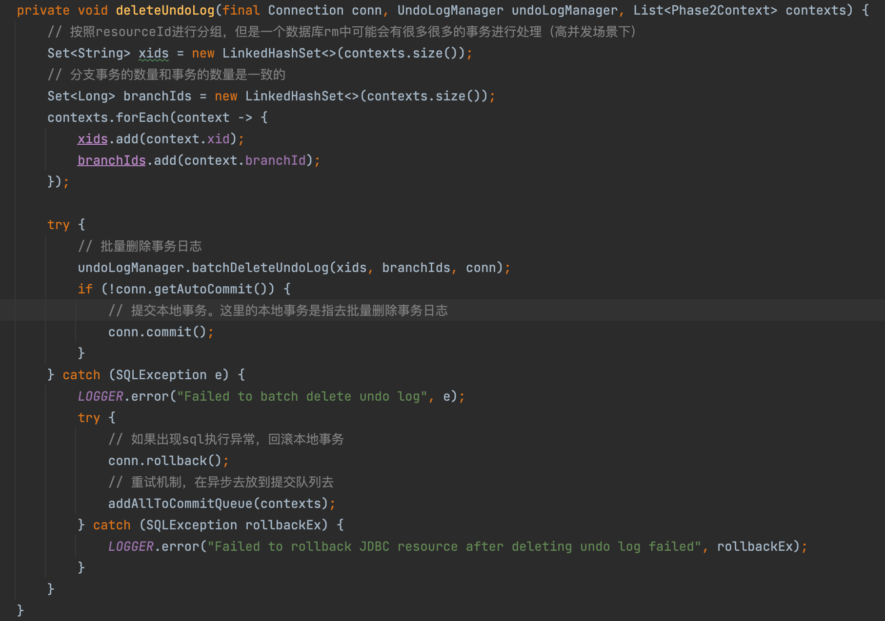
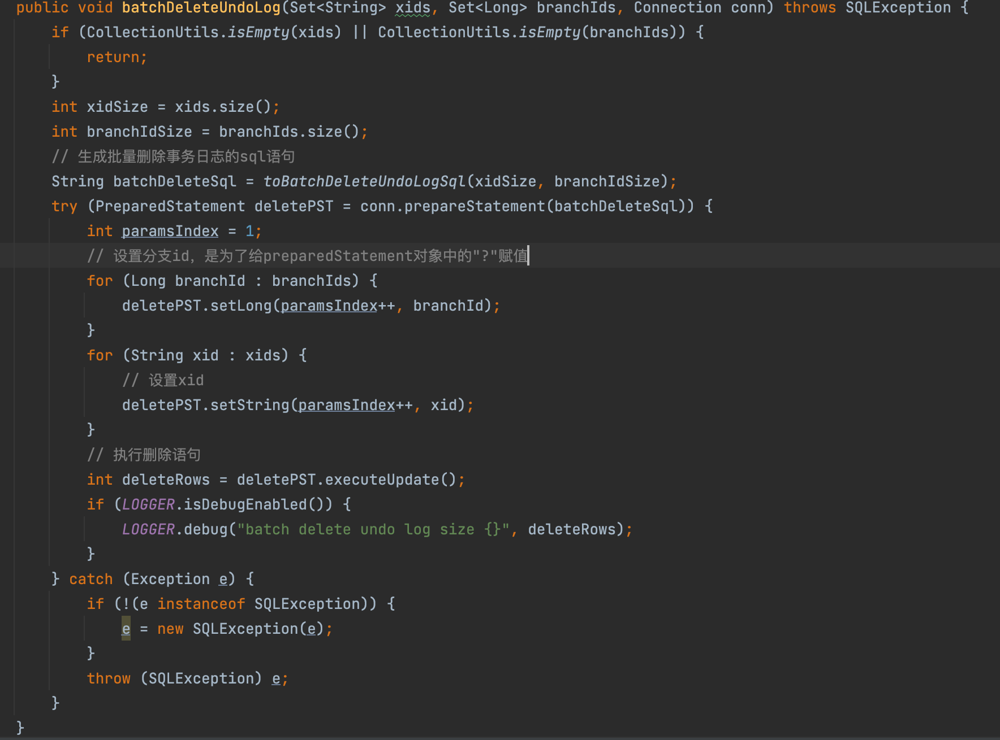
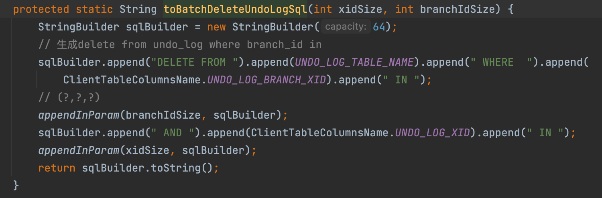
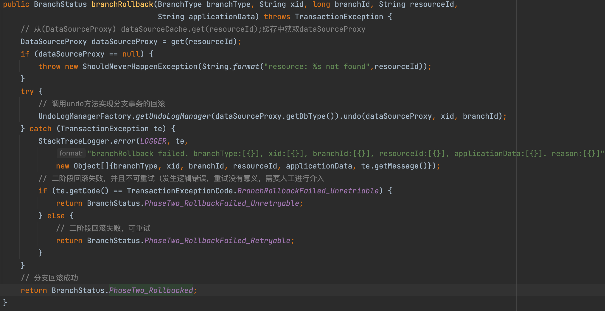
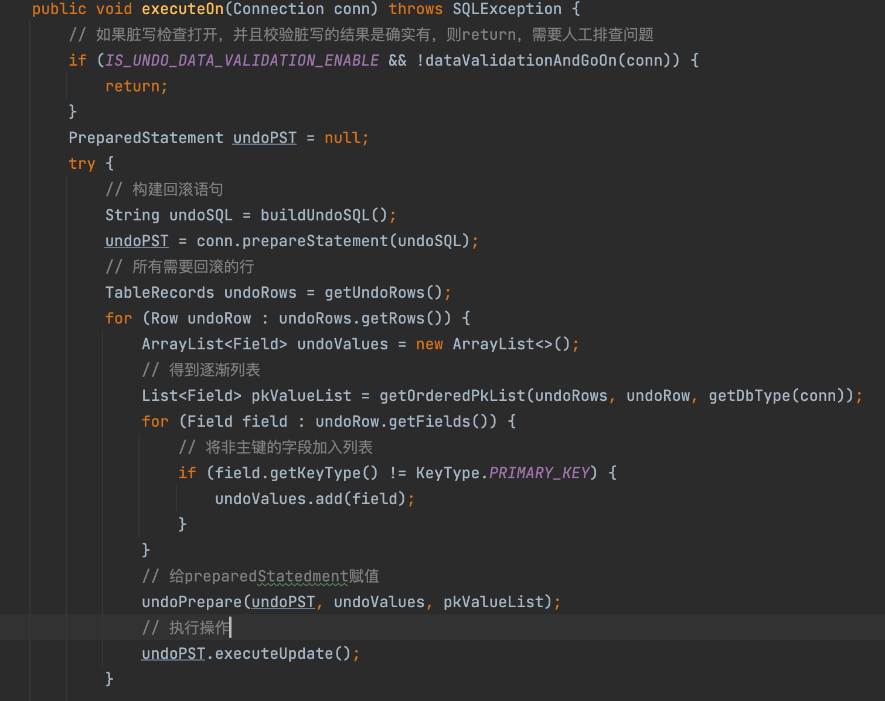
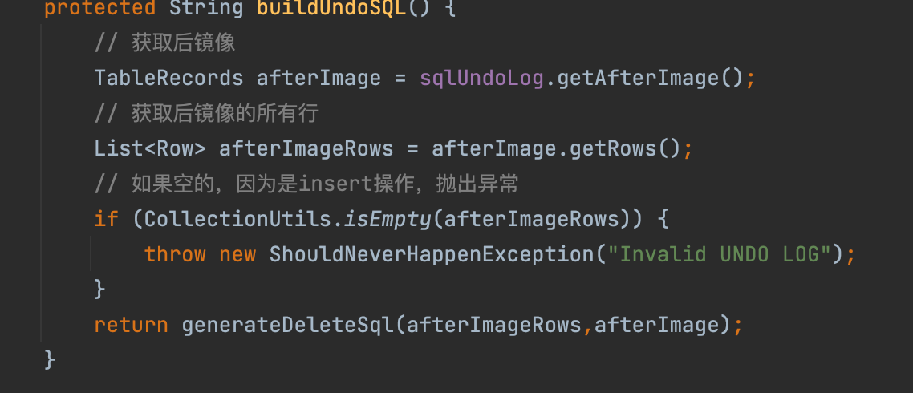
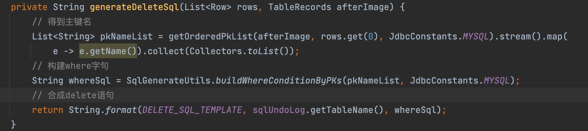

tags:: seata，at模式

- 
- 二阶段
	- 当全局事务为提交状态的时候，会释放各个分支事务的全局锁，推进二阶段提交
	- 资源管理器，当收到提交指令时，删除保存的事务日志，会立即返回，去异步线程批量删除
		- 分支事务提交（branchCommit）异步线程进行分支事务二阶段提交，将Phase2Context上下文放到异步执行队列中。
		- 定时任务区拉取，按照资源ID分组。
			- 根据资源ID取得数据源代理
			- 获取一个普通数据库连接！不是数据库连接代理
			- 通过 UndoLogManagerFactory.getUndoLogManager(dataSourceProxy.getDbType())获取undolog管理器
			- 把二阶段上下文列表拆分成多个小列表，防止列表过大，造成拼接处的SQL语句过长。
			- 对每个小列表进行处理，调用deleteUndoLog方法删除一批分支事务的日志
			- 
			- batchDeleteUndoLog方法的具体实现
				- 在这里这个paramsIndex，1就是对应第一个?，依次往后推
				- 
			- toBatchDeleteUndoLogSql
				- 
- 回滚处理
	- 如果全局事务是回滚状态的话，事务协调器会推进二阶段回滚
	- 资源管理器收到回滚指令后，会回滚一阶段已经执行的sql语句，还原业务数据
	- 用前镜像还原业务数据
		- 1. 校验脏写，对比后镜像和数据库中的当前值是否一致
		  2. 如果数据完全一致，则没有脏写，则还原数据
		  3. 如果数据不一致，则说明已经有别的修改，需要转人工处理
	- 代码解析
		- branchRollback()方法的具体实现
			- 
		- undo方法实现逻辑
			- ```
			  public void undo(DataSourceProxy dataSourceProxy, String xid, long branchId) throws TransactionException {
			          Connection conn = null;
			          ResultSet rs = null;
			          PreparedStatement selectPST = null;
			          // autoCommit的当前状态
			          boolean originalAutoCommit = true;
			  
			          for (; ; ) {
			              try {
			                  // 获取一个普通数据库连接
			                  conn = dataSourceProxy.getPlainConnection();
			                  // The entire undo process should run in a local transaction.
			                  // 因为删除undo log和恢复业务数据的SQL要放在同一个本地事务里进行提交，这样才能保持一致性
			                  // 所以如果本来设置的是自动提交的，要修改成手动
			                  if (originalAutoCommit = conn.getAutoCommit()) {
			                      conn.setAutoCommit(false);
			                  }
			  
			                  // 生成查询unlog的preparedStatement,并且拼接参数，查询出来
			                  selectPST = conn.prepareStatement(SELECT_UNDO_LOG_SQL);
			                  selectPST.setLong(1, branchId);
			                  selectPST.setString(2, xid);
			                  rs = selectPST.executeQuery();
			  
			                  boolean exists = false;
			                  while (rs.next()) {
			                      exists = true;
			                      // 可能服务器会发送多个回滚请求，所以设置了个状态，防止重复回滚
			                      int state = rs.getInt(ClientTableColumnsName.UNDO_LOG_LOG_STATUS);
			                      if (!canUndo(state)) {
			                          if (LOGGER.isInfoEnabled()) {
			                              LOGGER.info("xid {} branch {}, ignore {} undo_log", xid, branchId, state);
			                          }
			                          return;
			                      }
			  
			                      String contextString = rs.getString(ClientTableColumnsName.UNDO_LOG_CONTEXT);
			                      Map<String, String> context = parseContext(contextString);
			                      byte[] rollbackInfo = getRollbackInfo(rs);
			  
			                      String serializer = context == null ? null : context.get(UndoLogConstants.SERIALIZER_KEY);
			                      UndoLogParser parser = serializer == null ? UndoLogParserFactory.getInstance()
			                          : UndoLogParserFactory.getInstance(serializer);
			                      // 解码rollbackInfo字段
			                      BranchUndoLog branchUndoLog = parser.decode(rollbackInfo);
			  
			                      try {
			                          // 保持序列化器名称
			                          setCurrentSerializer(parser.getName());
			                          // 一条分支事务里可能有多个语句操作
			                          List<SQLUndoLog> sqlUndoLogs = branchUndoLog.getSqlUndoLogs();
			                          //从后往前回滚
			                          if (sqlUndoLogs.size() > 1) {
			                              Collections.reverse(sqlUndoLogs);
			                          }
			                          for (SQLUndoLog sqlUndoLog : sqlUndoLogs) {
			                              // 获取表元数据
			                              TableMeta tableMeta = TableMetaCacheFactory.getTableMetaCache(dataSourceProxy.getDbType()).getTableMeta(
			                                  conn, sqlUndoLog.getTableName(), dataSourceProxy.getResourceId());
			                              sqlUndoLog.setTableMeta(tableMeta);
			                              // 获取回滚执行器
			                              AbstractUndoExecutor undoExecutor = UndoExecutorFactory.getUndoExecutor(
			                                  dataSourceProxy.getDbType(), sqlUndoLog);
			                              // 进行回滚
			                              undoExecutor.executeOn(conn);
			                          }
			                      } finally {
			                          // remove serializer name？？？
			                          removeCurrentSerializer();
			                      }
			                  }
			  
			                  //如果undo_log存在，则表示分支事务已完成第一阶段，
			                  //我们可以直接回滚并清理undo_log
			                  //否则表示分支事务中存在异常，
			                  //导致undo_log不写入数据库。
			                  //例如，业务处理超时，全局事务是启动器回滚。
			                  //为了确保数据一致性，我们可以插入一个具有GlobalFinished状态的undo_log
			                  //以防止其他程序的第一阶段的本地事务被正确提交。
			                  if (exists) {
			                      // 删除undo log
			                      deleteUndoLog(xid, branchId, conn);
			                      conn.commit();
			                      if (LOGGER.isInfoEnabled()) {
			                          LOGGER.info("xid {} branch {}, undo_log deleted with {}", xid, branchId,
			                              State.GlobalFinished.name());
			                      }
			                  } else {
			                      insertUndoLogWithGlobalFinished(xid, branchId, UndoLogParserFactory.getInstance(), conn);
			                      conn.commit();
			                      if (LOGGER.isInfoEnabled()) {
			                          LOGGER.info("xid {} branch {}, undo_log added with {}", xid, branchId,
			                              State.GlobalFinished.name());
			                      }
			                  }
			  
			                  return;
			              } catch (SQLIntegrityConstraintViolationException e) {
			                  // Possible undo_log has been inserted into the database by other processes, retrying rollback undo_log
			                  if (LOGGER.isInfoEnabled()) {
			                      LOGGER.info("xid {} branch {}, undo_log inserted, retry rollback", xid, branchId);
			                  }
			              } catch (Throwable e) {
			                  if (conn != null) {
			                      try {
			                          conn.rollback();
			                      } catch (SQLException rollbackEx) {
			                          LOGGER.warn("Failed to close JDBC resource while undo ... ", rollbackEx);
			                      }
			                  }
			                  if (e instanceof SQLUndoDirtyException) {
			                      throw new BranchTransactionException(BranchRollbackFailed_Unretriable, String.format(
			                          "Branch session rollback failed because of dirty undo log, please delete the relevant undolog after manually calibrating the data. xid = %s branchId = %s",
			                          xid, branchId), e);
			                  }
			                  throw new BranchTransactionException(BranchRollbackFailed_Retriable,
			                      String.format("Branch session rollback failed and try again later xid = %s branchId = %s %s", xid,
			                          branchId, e.getMessage()),
			                      e);
			  
			              } finally {
			                  try {
			                      if (rs != null) {
			                          rs.close();
			                      }
			                      if (selectPST != null) {
			                          selectPST.close();
			                      }
			                      if (conn != null) {
			                          if (originalAutoCommit) {
			                              conn.setAutoCommit(true);
			                          }
			                          conn.close();
			                      }
			                  } catch (SQLException closeEx) {
			                      LOGGER.warn("Failed to close JDBC resource while undo ... ", closeEx);
			                  }
			              }
			          }
			      }
			  ```
		- 在表里找到对应的branchId和xid查到undo_log表中的记录，把记录里rollback_info字段转成branchUndoLog对象，循环处理对象中的SQLUndoLog对象。
		- 对于SQLUndoLog对象，使用Undo执行器进行回滚。所有对象回滚完之后，删除对应的undo_log，提交本地事务。
		- undo执行器实现回滚
			- AbstractUndoExecutor.excutedOn()方法
			- 
			- 1. 脏写检查2.构建用来补偿的sql语句，创建一个preparedStatement对象3.执行undoPrepare方法将undolog中取到的值赋值给preparedStatement对象。4. 执行preparedStatement对象
		- 脏写检查
			- ```
			  protected boolean dataValidationAndGoOn(Connection conn) throws SQLException {
			          TableRecords beforeRecords = sqlUndoLog.getBeforeImage();
			          TableRecords afterRecords = sqlUndoLog.getAfterImage();
			          // 比较前后镜像
			          Result<Boolean> beforeEqualsAfterResult = DataCompareUtils.isRecordsEquals(beforeRecords, afterRecords);
			          if (beforeEqualsAfterResult.getResult()) {
			              if (LOGGER.isInfoEnabled()) {
			                  LOGGER.info("Stop rollback because there is no data change " +
			                          "between the before data snapshot and the after data snapshot.");
			              }
			              // 如果一样的话，就不用回滚
			              return false;
			          }
			  
			          // 查询当前值
			          TableRecords currentRecords = queryCurrentRecords(conn);
			          // 比较当前值和后镜像是否相同
			          Result<Boolean> afterEqualsCurrentResult = DataCompareUtils.isRecordsEquals(afterRecords, currentRecords);
			          // 当前值和后镜像不同的时候，比较当前值和前镜像是否一样，如果一样，不回滚
			          if (!afterEqualsCurrentResult.getResult()) {
			              Result<Boolean> beforeEqualsCurrentResult = DataCompareUtils.isRecordsEquals(beforeRecords, currentRecords);
			              if (beforeEqualsCurrentResult.getResult()) {
			                  if (LOGGER.isInfoEnabled()) {
			                      LOGGER.info("Stop rollback because there is no data change " +
			                              "between the before data snapshot and the current data snapshot.");
			                  }
			                  return false;
			              } else {
			                  // 当前值和前后均不一样，出现脏写
			                  if (LOGGER.isInfoEnabled()) {
			                      if (StringUtils.isNotBlank(afterEqualsCurrentResult.getErrMsg())) {
			                          LOGGER.info(afterEqualsCurrentResult.getErrMsg(), afterEqualsCurrentResult.getErrMsgParams());
			                      }
			                  }
			                  if (LOGGER.isDebugEnabled()) {
			                      LOGGER.debug("check dirty data failed, old and new data are not equal, " +
			                              "tableName:[" + sqlUndoLog.getTableName() + "]," +
			                              "oldRows:[" + JSON.toJSONString(afterRecords.getRows()) + "]," +
			                              "newRows:[" + JSON.toJSONString(currentRecords.getRows()) + "].");
			                  }
			                  throw new SQLUndoDirtyException("Has dirty records when undo.");
			              }
			          }
			          return true;
			      }
			  ```
		- 构建回滚语句
			- insert语句的回滚语句，以后镜像为数据来源，delete掉一阶段中插入的行
				- 
				- 
			- delete语句的回滚
				- 获取前镜像作为数据来源，把一阶段中删除的行重新插入进去
			- update语句 的回滚
				- 获取前镜像，回滚语句还是update，将一阶段中更新的行恢复回去
			- 成功完成二阶段回滚之后，会对该分支在一阶段中加的seata全局锁进行放缩操作