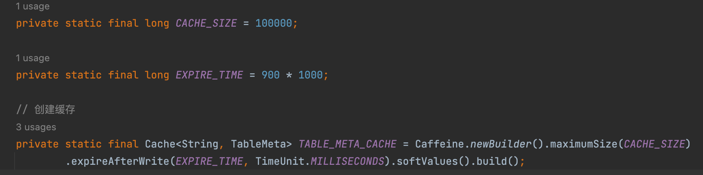

tags:: seata

- 基本原理
	- 通过seata的数据源代理datasourceproxy类对数据库进行操作
	- 业务通过jdbc接口访问数据库资源的时候，数据源代理会拦截所有请求。除了执行原始请求外，还会做一些和分布式事务相关的工作，产生前，后镜像，加锁数据，保存事务日志
	- 每个参加at模式事务的数据库都是一个资源。本地事务提交前，会向tc注册一个分支事务。对应会插入一行事务日志，注册分支事务成功后，提交本地事务。提交之后，向tc汇报分支事务状态。
	- 全都执行完之后，会根据事务管理器有没有收到异常来决定提交还是回滚全局事务。
	- 事务协调器会根据分支事务id，从事务日志表找到事务日志。
- 工作流程示例
	- 场景：买了东西，要将余额减掉，同时需要去增加积分操作。
	- 分析，有两个seata全局事务。一个是余额服务，一个是积分服务。同时是一个事务嵌套，余额服务传递事务上下文到积分服务。积分服务自己声明的全局事务是不生效的。
	- 流程
		- 余额服务tm向tc申请开启一个全局事务，返回全局事务id  xid
		- 开启本地事务，生成undo log，执行业务sql语句，生成redo log，将undo log和redo log保存下来，生成全局锁数据
		- rm向tc注册分支事务
		- 提交本地事务
		- rm向tc上报事务状态
		- 远程调用，把xid传给积分服务
		- 积分服务开启本地事务，生成undo log，执行业务sql语句，生成redo log，保存。生成全局锁数据
		- 积分服务rm向tc注册服务
		- 提交本地事务
		- 积分服务rm向tc上报事务状态。
		- 积分服务返回远程调佣成功给余额服务
		- 余额服务的tm向tc申请全局事务的提交、回滚
		- 二阶段处理：
			- 提交，则tc通知各个rm异步清理本地事务日志
			- 回滚，tc通知各rm回滚数据
	- 事务日志表
		- datasourceproxy拦截业务sql语句后，生成前后镜像事务日志，把事务日志保存在事务日志表（undo_log）
		- at模式中，每个参与事务的业务数据库都会创建一张事务日志表
		- 表里的字段
			- branch_id分支事务id
			- xid 全局事务id
			- context
			- rollback_info 记录了回滚的数据信息。也会冗余两种事务id
			- log_status
			- log_created
			- log_modified
			- ext
		- afterImage中的数据。
			- tableRecords：一个表的信息
			- row：一行的信息
			- field：行中各个字段的信息
			- tableRecords：
				- 
				- tableMeta 表元数据
					- 
					- 包括表名称，列元数据映射，索引元数据映射
					- 列元数据：列名，列数据类型，列是否允许为空，列是否为自增字段。创建表的时候会指定这些属性
					- 索引元数据：索引名称，索引类型，索引包含的列。
				- 表元数据的获取
					- 先从缓存里拿，缓存里没有，就从数据库执行查询并生成表元数据
					- 从缓存中获取
					- 
					- 
					-
-