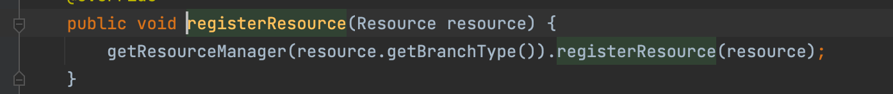
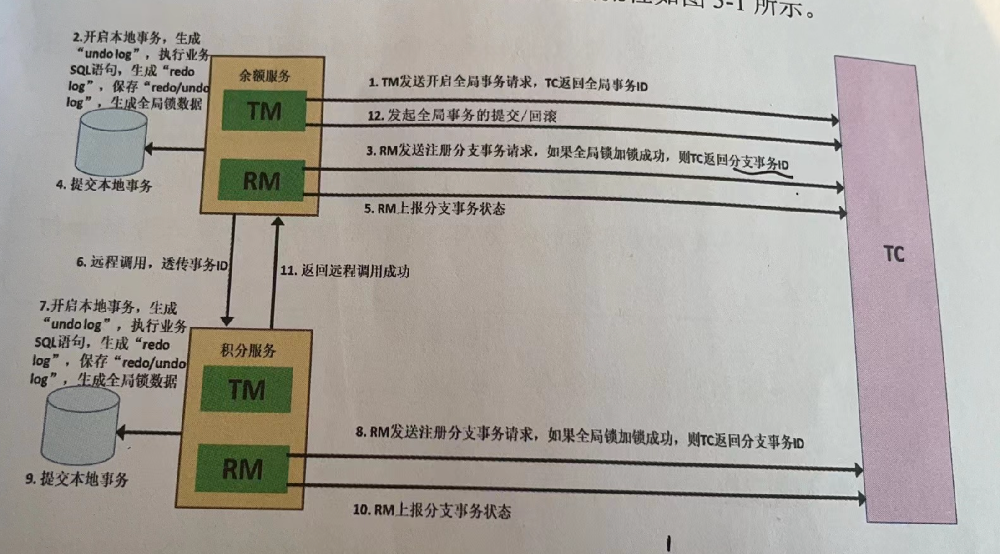
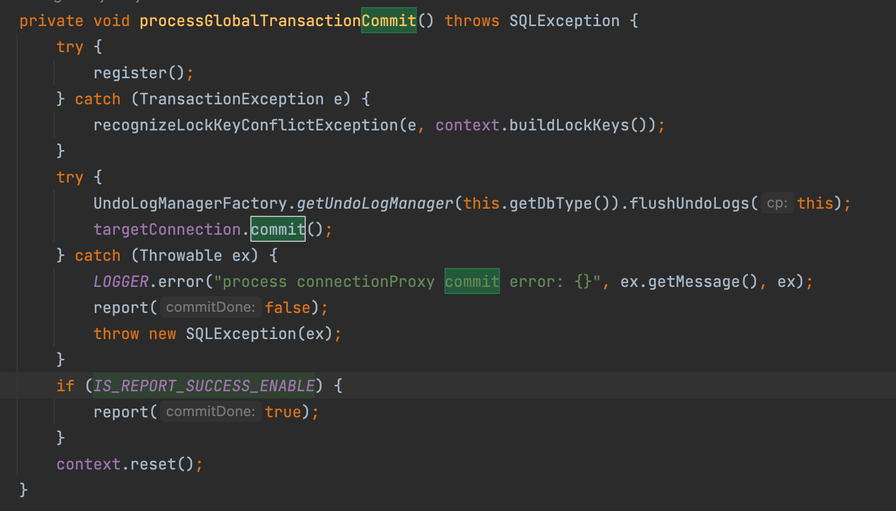
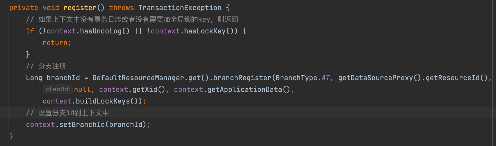
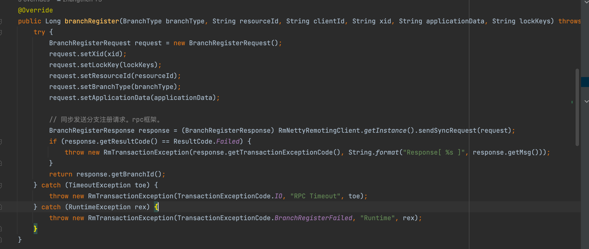

tags:: seata

- 对sql库里的dataSource，Connection，Statement，PreparedStatement这四个接口都进行了再次包装
- 数据源代理类 dataSourceProxy
	- 创建数据源代理。实现了resource接口，所以资源管理器可以把它看成一个资源来进行管理。继承abstractdataSourceProxy类。这个类是实现了dataSource接口的，可以拦截业务SQL语句
	- abstractDataSourceProxy定义了一个构造方法，要求传入原始的数据源，赋值给targetDataSource对象。该类其他方法直接调用对应方法
	- 构造函数实现
		- 将原始数据源保存为targetDataSource
		- 调用初始化方法init
		- 用原始数据源创建连接。datasource.getConnection()，用这个连接得到url地址，数据库类型，用户名称等信息
		- 将本数据源代理注册到资源管理器resourceManager中
	- 资源管理器
		- AT模式中，resourceManager实现类是DataSourceManager
		- resourceManager继承了resourceManagerInBound，ResourceManagerOutBound这两个接口
		- 接口定义了四个方法
			- 注册资源
			- 取消注册资源
			- 获取管理的所有资源
			- 获取资源的类型
			- inBound接口定义了对内的操作，接收事务协调器发来的请求，二阶段的分支事务提交请求，二阶段的分支事务回滚请求
			- outBound接口定义了对外的操作，主动发到事务协调器的事务请求。包括分支事务的注册，上报数据等。seata的锁查询。
		- 如何进行资源的注册
			- 
			- getBranchType获取分支事务的类型。
			- getResourceManager是根据事务的类型获取资源管理器
				- 在初始化所有资源管理器的时候，会加载所有resourceManager的子类。放到concurrentHashMap类型的map里，key是branchType，value是实现类
				- AT模式下，返回的类实例是DataSourceManager。这种叫SPI机制来加载实现类
			- registerResource方法来注册资源。
				- 在DataSourceManager中缓存了数据源代理对象，并且调用父类的注册方法。
				- 通过RPC客户端注册资源，将资源的资源组ID和资源ID发给事务协调器，注册当前资源。
				- TC在收到资源注册请求后，会把客户端连接和组ID和资源ID建立对应关系
				- 这样收到提交或回滚操作的时候，根据组ID+资源ID，找到对应客户端连接并发送请求。保证了二阶段操作的高可用。
	- 数据库连接代理
		- 通过数据库代理来创建的
		- 通过dataSourceProxy对象+Connection对象来构建ConnectionProxy
		- Connection可以通过dataSource.getConnection来创建。
		- 本地事务提交
			- 用lockretryPolicy.execute()方法来做锁冲突重试机制
			- 锁冲突重试机制
				- 资源管理器发送创建分支事务请求到服务端，服务端为该分支事务设计的行进行加锁。防止数据冲突。
				- 如果冲突了，查询配置，是直接回滚还是重试。默认为回滚。
				- 如果回滚，那就执行一次。如果重试，则如果锁冲突，就休眠一会然后重试。如果是其他报错，也直接异常退出循环。在重试了设定的次数之后，还锁冲突，那也会抛异常（等待超时异常）退出循环。
				- 退出循环了之后，上层捕获异常，回滚本地事务，最终回滚整个分布式事务。
			- 本地事务提交的时候，会判断本地事务是否参与了全局事务
				- 参与了，会调用方法，进行分支事务提交
				- 没参与
					- 判断是否有查询全局锁请求。有，则调用方法，会查询seata全局锁
					- 没有，普通的本地事务提交，该本地事务与分布式事务没关系。
					- 
					- 分支事务提交
						- 
						- 向TC注册分支事务
							- 
							- 
						- 保存事务日志
						- ```
						      public void flushUndoLogs(ConnectionProxy cp) throws SQLException {
						          // 获取连接上下文
						          ConnectionContext connectionContext = cp.getContext();
						          // 如果上下文里没有事务日志，则返回
						          if (!connectionContext.hasUndoLog()) {
						              return;
						          }
						  
						          String xid = connectionContext.getXid();
						          long branchId = connectionContext.getBranchId();
						  
						          BranchUndoLog branchUndoLog = new BranchUndoLog();
						          branchUndoLog.setXid(xid);
						          branchUndoLog.setBranchId(branchId);
						          branchUndoLog.setSqlUndoLogs(connectionContext.getUndoItems());
						  
						          // 获取食物日志解释器
						          UndoLogParser parser = UndoLogParserFactory.getInstance();
						          // 将分支事务日志编码为字节数组，进行序列化。支持bzip2，gzip，lz4，zip等多种压缩算法，可以根据配置来选择
						          byte[] undoLogContent = parser.encode(branchUndoLog);
						  
						          if (LOGGER.isDebugEnabled()) {
						              LOGGER.debug("Flushing UNDO LOG: {}", new String(undoLogContent, Constants.DEFAULT_CHARSET));
						          }
						  
						          CompressorType compressorType = CompressorType.NONE;
						          // 如果需要压缩，则压缩字节数组
						          if (needCompress(undoLogContent)) {
						              compressorType = ROLLBACK_INFO_COMPRESS_TYPE;
						              // 执行压缩算法
						              undoLogContent = CompressorFactory.getCompressor(compressorType.getCode()).compress(undoLogContent);
						          }
						          // 插入事务日志，cp是connectionProxy
						          insertUndoLogWithNormal(xid, branchId, buildContext(parser.getName(), compressorType), undoLogContent, cp.getTargetConnection());
						      }
						  ```
							- 这个方法完成之后，本地事务提交
							- 因为undolog的写入和业务sql在一个本地事务里提交，所以只要业务sql执行成功，undolog也一定写入了。保证了二阶段回滚幂等性。回滚操作必须得是查到了undolog才回滚，在完成的时候要删除undolog。
							- 所以当收到了重复的回滚消息时，也不会对相同的数据多次回滚，因为第二次回滚的时候，对应的undolog就不在了
						- 提交本地事务。插入undolog与业务sql语句在同一个本地事务中
							- targetConnection.commit()方法
						- RM上报分支事务状态
							- 本地事务提交失败，分支事务的工作没有入库，无需对这个分支事务进行二阶段处理
							- 调用branchReport方法，失败则重试。重试次数可以配置
							- 也是个rpc调用
						- 重置事务上下文
					- 查询seata全局锁
						- 为了支持读未提交以上的隔离级别
						- 一阶段加上全局锁，提交本地事务，释放数据库锁。会导致分支事务完成后，数据修改入库后，但是它可能处于一个未结束的分布式事务，另外一个分布式事务！！！是另外一个分布式事务。查询它刚修改的行，会读到中间数据。
						- 分布式事务中的脏读，很多都是没有影响的，一般都是很快提交或回滚，短时间的中间状态通常是可接受的。
						- 当有需要读已提交隔离界别的时候，需要等待seata释放全局锁，避免中间状态被读到的问题。但是对应的会增加开销，导致响应时间边长。
						- 要根据实际场景决定是否选择读已提交隔离级别。查询语句默认采用“读未提交”隔离级别。
						- 检查锁
							- checkLock。检查seata全局锁，如果占用的话，抛出锁冲突异常，如果锁冲突可以选择重试或者失败返回。
							- 构建globalLockQueryRequest对象，可以通过sendSyncRequest方法把对象发送到事务协调器中，等待响应。
				-
	-