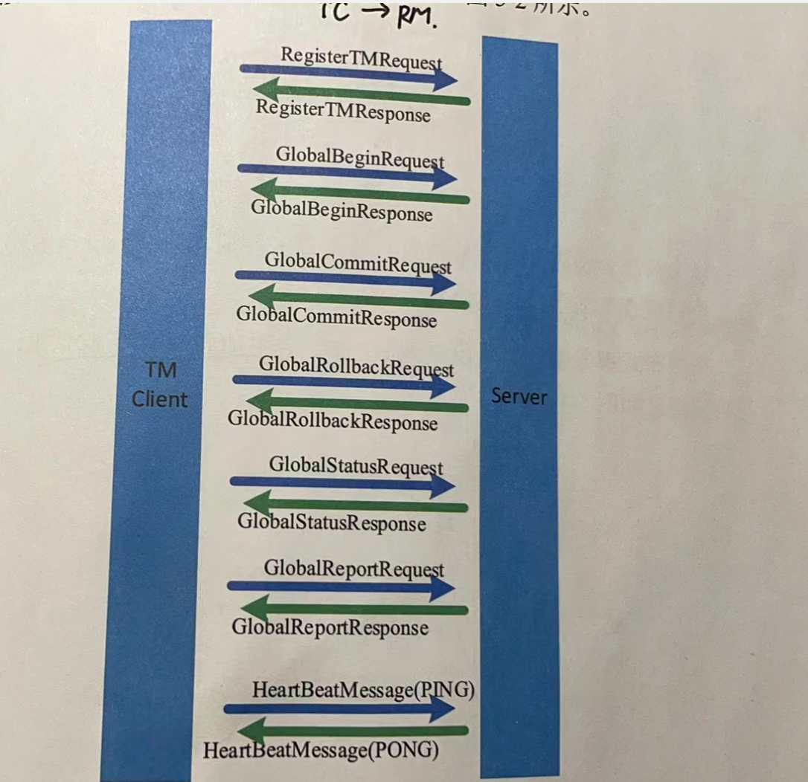
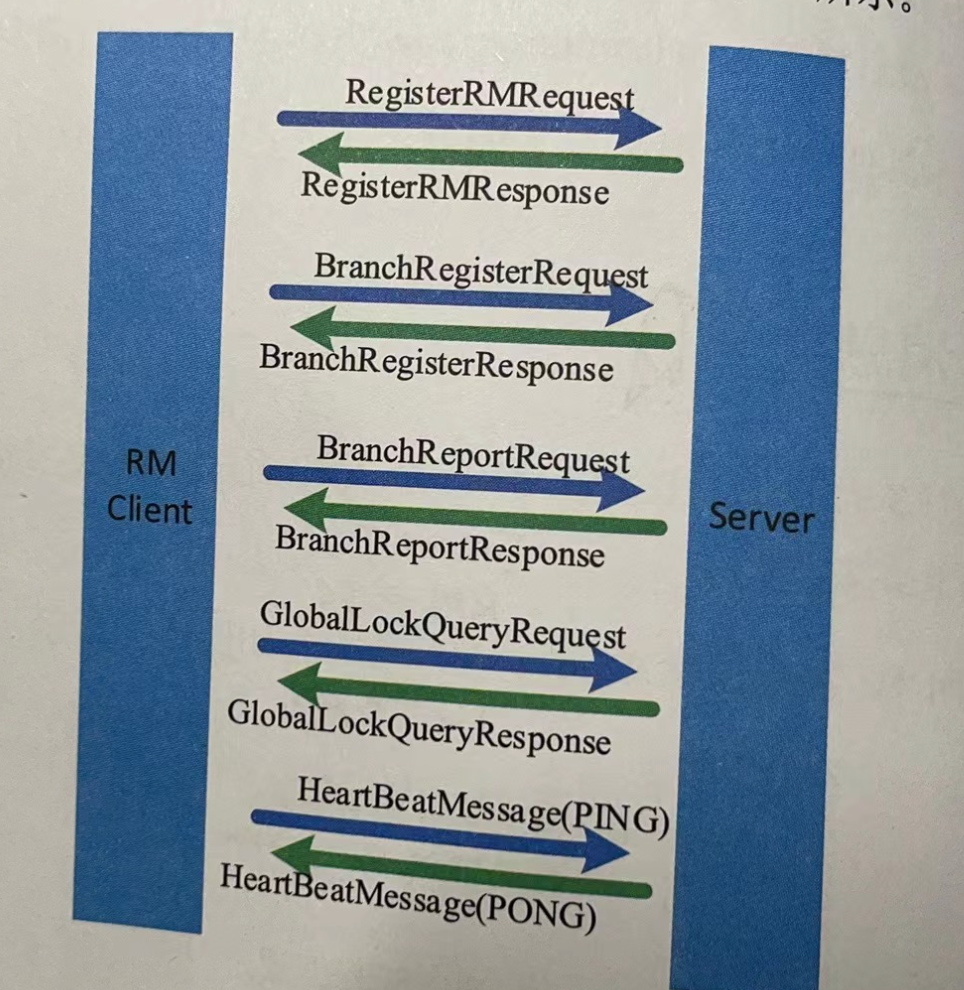
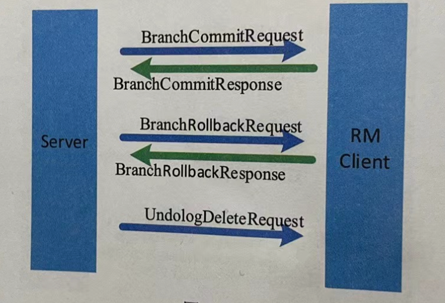

tags:: seata rpc 事务消息类型

- 分为TM主动向TC发起
	- 
	- TM注册消息
	- 全局事务开始消息
	- 全局事务提交消息
	- 全局事务回滚消息
	- 全局事务状态查询消息
	- 全局事务状态上报消息
	- 心跳消息
- RM主动向TC发起的消息
	- 
	- RM注册消息
	- 分支事务注册消息
	- 分支事务状态上报消息
	- 全局锁查询消息
	- 心跳消息
- TC主动向RM发起请求
	- 
	- 二阶段分支事务提交消息
	- 二阶段分支事务回滚消息
	- 将事务日志删除的消息