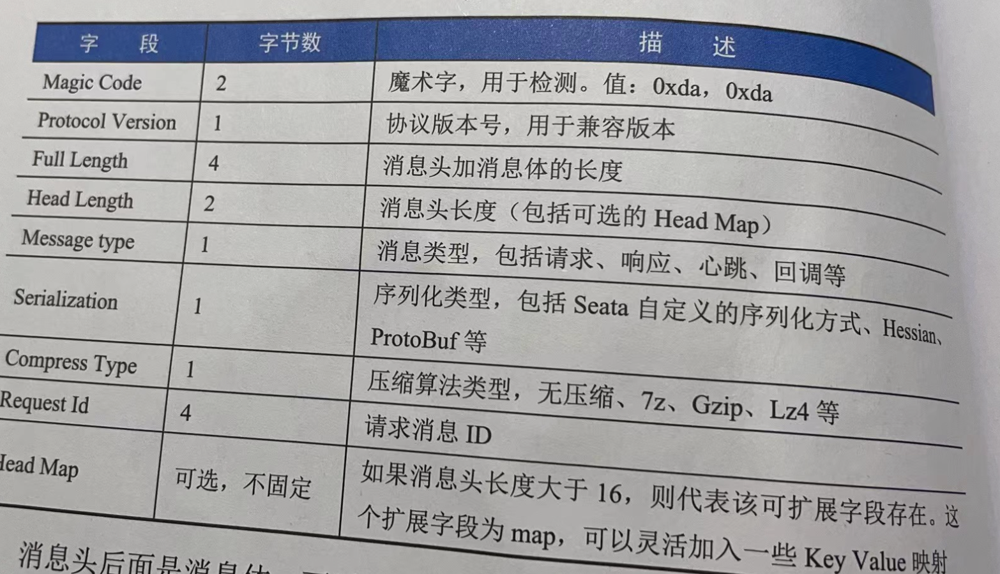

tags:: rpc，网络通信， seata

- rpc用来实现在RM,TM,TC之间进行事务创建，提交，回滚等操作时候的通信
- netty作为rpc的底层通信
- TODO 了解netty
- 引导类接口：remotingbootstrap。有两个实现类，一个是服务端，一个是客户端。定义了两个抽象方法：start和shutdown
- ```
      public void start() {
          // 设置了各种网络参数
          this.serverBootstrap.group(this.eventLoopGroupBoss, this.eventLoopGroupWorker)
              .channel(NettyServerConfig.SERVER_CHANNEL_CLAZZ)
                  // 对应的tcpip协议listen函数中的backlog参数，默认1024
              .option(ChannelOption.SO_BACKLOG, nettyServerConfig.getSoBackLogSize())
                  // 设定tcp套接字处于time_wait状态下的socket是否允许重复绑定使用，默认为true
              .option(ChannelOption.SO_REUSEADDR, true)
                  // 连接保持，默认为true
              .childOption(ChannelOption.SO_KEEPALIVE, true)
                  // 禁止使用nagle算法，默认为true
              .childOption(ChannelOption.TCP_NODELAY, true)
                  // 发送缓冲区大小，默认153600MB
              .childOption(ChannelOption.SO_SNDBUF, nettyServerConfig.getServerSocketSendBufSize())
                  // 接收缓冲区大小，默认153600MB
              .childOption(ChannelOption.SO_RCVBUF, nettyServerConfig.getServerSocketResvBufSize())
                  // 高水位，低水位线，保证系统不被压垮，默认为1MB,64MB
              .childOption(ChannelOption.WRITE_BUFFER_WATER_MARK,
                  new WriteBufferWaterMark(nettyServerConfig.getWriteBufferLowWaterMark(),
                      nettyServerConfig.getWriteBufferHighWaterMark()))
              .localAddress(new InetSocketAddress(getListenPort()))
              .childHandler(new ChannelInitializer<SocketChannel>() {
                  @Override
                  public void initChannel(SocketChannel ch) {
                      // 设置了netty自带的心跳检测处理类，编码，解码handler
                      ch.pipeline().addLast(new IdleStateHandler(nettyServerConfig.getChannelMaxReadIdleSeconds(), 0, 0))
                          .addLast(new ProtocolV1Decoder())
                          .addLast(new ProtocolV1Encoder());
                      if (channelHandlers != null) {
                          addChannelPipelineLast(ch, channelHandlers);
                      }
  
                  }
              });
  
          try {
              // 绑定监听端口
              this.serverBootstrap.bind(getListenPort()).sync();
              LOGGER.info("Server started, service listen port: {}", getListenPort());
              // 把自己的ip和端口号注册到注册中心，让客户端可以访问
              InetSocketAddress address = new InetSocketAddress(XID.getIpAddress(), XID.getPort());
              for (RegistryService registryService : MultiRegistryFactory.getInstances()) {
                  registryService.register(address);
              }
              initialized.set(true);
          } catch (SocketException se) {
              throw new RuntimeException("Server start failed, the listen port: " + getListenPort(), se);
          } catch (Exception exx) {
              throw new RuntimeException("Server start failed", exx);
          }
      }
  ```
- 消息设计
	- 消息头固定部分占用16byte，还可以添加扩展头Head Map
- 
- 消息头后面就是消息体，消息体的长度可以用full length和head length来计算得出。然后用指定的序列化类型进行编码和解码
- ```
  public void encode(ChannelHandlerContext ctx, Object msg, ByteBuf out) {
          try {
              if (msg instanceof RpcMessage) {
                  RpcMessage rpcMessage = (RpcMessage) msg;
                  // 初始长度。都是16byte
                  int fullLength = ProtocolConstants.V1_HEAD_LENGTH;
                  int headLength = ProtocolConstants.V1_HEAD_LENGTH;
                  // 获取消息类型
                  byte messageType = rpcMessage.getMessageType();
                  // 写魔术字，消息头中的magic code
                  out.writeBytes(ProtocolConstants.MAGIC_CODE_BYTES);
                  out.writeByte(ProtocolConstants.VERSION);
                  // full Length(4B) and head length(2B) will fix in the end. 
                  // 跳过6byte（消息全长4byte+头长度2byte，等到后面再补
                  out.writerIndex(out.writerIndex() + 6);
                  out.writeByte(messageType);
                  out.writeByte(rpcMessage.getCodec());// 解码器编码器类型
                  out.writeByte(rpcMessage.getCompressor());
                  out.writeInt(rpcMessage.getId());
  
                  // direct write head with zero-copy
                  Map<String, String> headMap = rpcMessage.getHeadMap();
                  if (headMap != null && !headMap.isEmpty()) {
                      // 对head map编码
                      int headMapBytesLength = HeadMapSerializer.getInstance().encode(headMap, out);
                      // 加上头长度
                      headLength += headMapBytesLength;
                      fullLength += headMapBytesLength;
                  }
  
                  byte[] bodyBytes = null;
                  // 如果不是心跳信息
                  if (messageType != ProtocolConstants.MSGTYPE_HEARTBEAT_REQUEST
                          && messageType != ProtocolConstants.MSGTYPE_HEARTBEAT_RESPONSE) {
                      // 载入序列化器
                      Serializer serializer = SerializerServiceLoader.load(SerializerType.getByCode(rpcMessage.getCodec()));
                      // 消息体进行序列化
                      bodyBytes = serializer.serialize(rpcMessage.getBody());
                      Compressor compressor = CompressorFactory.getCompressor(rpcMessage.getCompressor());
                      // 对消息体字节进行压缩
                      bodyBytes = compressor.compress(bodyBytes);
                      // 总体的长度要加上body的长度
                      fullLength += bodyBytes.length;
                  }
  
                  if (bodyBytes != null) {
                      // 写body
                      out.writeBytes(bodyBytes);
                  }
  
                  // 当前的write的值
                  int writeIndex = out.writerIndex();
                  // 当前的值-记录的长度加上magic+version的值，跳转到记录full的位置
                  out.writerIndex(writeIndex - fullLength + 3);
                  out.writeInt(fullLength);
                  out.writeShort(headLength);
                  out.writerIndex(writeIndex);
              } else {
                  throw new UnsupportedOperationException("Not support this class:" + msg.getClass());
              }
          } catch (Throwable e) {
              LOGGER.error("Encode request error!", e);
          }
      }
  ```
- 解码
	- ```
	  public Object decodeFrame(ByteBuf frame) {
	          // 读取前两个字节，来验证摸数字是否匹配
	          byte b0 = frame.readByte();
	          byte b1 = frame.readByte();
	          if (ProtocolConstants.MAGIC_CODE_BYTES[0] != b0
	                  || ProtocolConstants.MAGIC_CODE_BYTES[1] != b1) {
	              throw new IllegalArgumentException("Unknown magic code: " + b0 + ", " + b1);
	          }
	  
	          byte version = frame.readByte();
	          // TODO  check version compatible here
	          int fullLength = frame.readInt();
	          short headLength = frame.readShort();
	          byte messageType = frame.readByte();
	          byte codecType = frame.readByte();
	          byte compressorType = frame.readByte();
	          int requestId = frame.readInt();
	          // 构建rpc消息
	          RpcMessage rpcMessage = new RpcMessage();
	          rpcMessage.setCodec(codecType);
	          rpcMessage.setId(requestId);
	          rpcMessage.setCompressor(compressorType);
	          rpcMessage.setMessageType(messageType);
	  
	          // 读取head map长度
	          int headMapLength = headLength - ProtocolConstants.V1_HEAD_LENGTH;
	          if (headMapLength > 0) {
	              // 解码head map
	              Map<String, String> map = HeadMapSerializer.getInstance().decode(frame, headMapLength);
	              rpcMessage.getHeadMap().putAll(map);
	          }
	  
	          // 心跳请求消息为ping，心跳恢复消息为pong
	          if (messageType == ProtocolConstants.MSGTYPE_HEARTBEAT_REQUEST) {
	              rpcMessage.setBody(HeartbeatMessage.PING);
	          } else if (messageType == ProtocolConstants.MSGTYPE_HEARTBEAT_RESPONSE) {
	              rpcMessage.setBody(HeartbeatMessage.PONG);
	          } else {
	              int bodyLength = fullLength - headLength;
	              if (bodyLength > 0) {
	                  // 获取body的长度，进行长度的解压缩，加载序列化器，反序列化消息体
	                  byte[] bs = new byte[bodyLength];
	                  frame.readBytes(bs);
	                  Compressor compressor = CompressorFactory.getCompressor(compressorType);
	                  bs = compressor.decompress(bs);
	                  Serializer serializer = SerializerServiceLoader.load(SerializerType.getByCode(rpcMessage.getCodec()));
	                  rpcMessage.setBody(serializer.deserialize(bs));
	              }
	          }
	  
	          return rpcMessage;
	      }
	  ```