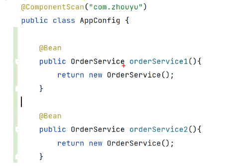
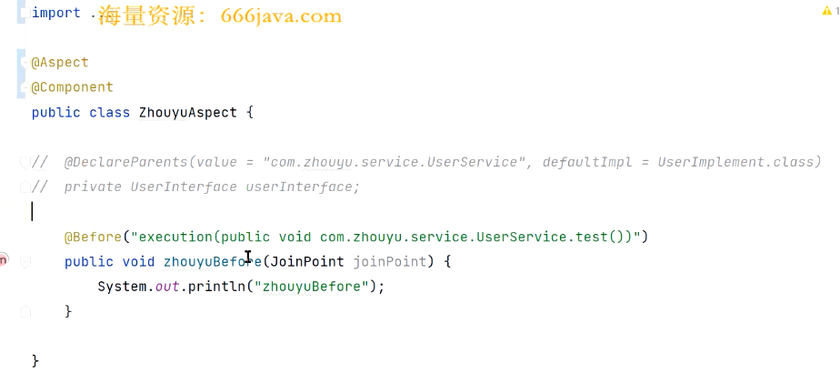
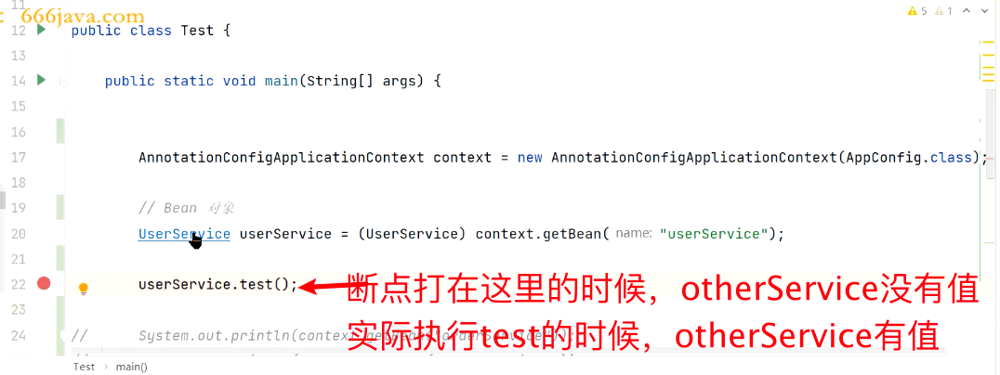

tags:: spring

- spring-framework
	- ```
	  ClassPathXmlApplicationContext context = new ClassPathXmlApplicationContext("spring.xml");
	  UserService userService = (UserService) context.getBean("userService");
	  userService.test();
	  ```
	- 通过xml去定义一些扫描路径等的信息
	- 后续
		- ```
		  AnnotationConfigApplicationContext context = new AnnotationConfigApplicationContext(AppConfig.class);
		  
		  UserService userService = (UserService) context.getBean("userService");
		  userService.test();
		  ```
		- 根据类的定义，注解的方式来定义扫描的包路径等信息
- spring帮我们创建出来的bean和我们自己new出来的区别
	- 如果UserService中Autowired一个别的component 叫OrderService，那UserService被创建出来的时候，orderService也有值，也被创建出来了。但是如果是自己new的话，那OrderService不会被创建出来
- 创建bean的流程
	- UserService.class-->无参构造方法---> 对象--->依赖注入（属性赋值)-->初始化前(@postConstruct)--> 初始化（InitializingBean）--> 初始化后(AOP切面) --> 代理对象-->Bean
	- 1. 要创建这个类的对象，一定是通过这个类的无参构造方法，生成了对象，这个时候orderService是没有值的
	  3. 通过依赖注入，给那些在这个类里声明了Autowired的属性赋值。遍历这个类的所有属性，判定这个属性上面有没有autowired的注解
	  4. 如果想要在初始化前这个步骤去调用的话，可以用@PostConstruct方法来对其中的对象做一些初始化的操作
	  5.这个类如果实现了InitializingBean这个接口，那就会默认要去实现afterPropertiesSet方法
	- ```
	  	protected void invokeInitMethods(String beanName, Object bean, @Nullable RootBeanDefinition mbd)
	  			throws Throwable {
	  
	  		boolean isInitializingBean = (bean instanceof InitializingBean);
	  		if (isInitializingBean && (mbd == null || !mbd.hasAnyExternallyManagedInitMethod("afterPropertiesSet"))) {
	  			if (logger.isTraceEnabled()) {
	  				logger.trace("Invoking afterPropertiesSet() on bean with name '" + beanName + "'");
	  			}
	  			((InitializingBean) bean).afterPropertiesSet();
	  		}
	  
	  		if (mbd != null && bean.getClass() != NullBean.class) {
	  			String[] initMethodNames = mbd.getInitMethodNames();
	  			if (initMethodNames != null) {
	  				for (String initMethodName : initMethodNames) {
	  					if (StringUtils.hasLength(initMethodName) &&
	  							!(isInitializingBean && "afterPropertiesSet".equals(initMethodName)) &&
	  							!mbd.hasAnyExternallyManagedInitMethod(initMethodName)) {
	  						invokeCustomInitMethod(beanName, bean, mbd, initMethodName);
	  					}
	  				}
	  			}
	  		}
	  	}
	  ```
- Bean的销毁
-
- UserService.class-->无参构造方法---> 对象--->依赖注入（属性赋值)-->初始化前(@postConstruct)--> 初始化（InitializingBean）--> 初始化后(AOP切面) --> 代理对象-->Bean
	- 构造方法的选择
		- 如果没有定义构造方法，那就默认走无参构造方法
		- 如果定义了多个，默认选无参的那个，如果没有无参的还是多个，会报错，找不到默认的构造方法。也可以使用@Autowired注解放在某个构造函数上，就表示告诉spring这个是默认的，那就不会报错了
		- 如果没有无参的，但是只有一个别的，就会走别的
	- 如果只有一个有参的，那里面的参数从何而来呢？
		- 会去bean的容器里去找，如果这个属性是个bean，标注了component的话，就能找到，并且传入进来。
		- 如果没有标注是component，找不到bean，启动就会报错
		- 那如何找到这个bean呢？
			- 拿着名字去找，不太可行，因为在无参构造方法里，这个名字其实只是个形参，可以是个别的名字，那就会找错
			- 拿着类型去找，可能会找到多个。比如有个是根据代码生成的，有的是根据标注component去生成的。
			- 
			- 先拿着类型去找，找到三个，然后再去根据名字去找Map<beanName, bean对象>。但是也可能找不到hh，找不到就报错。如果拿着类型去找，只找到一个，就直接返回了。
			- @Bean会覆盖@Component，如果名字一样的话
- AOP
	- 
	- 打开AOP的配置 @EnableAspectJAutoProxy
	- 
	- 为什么呢？
		- 因为在AOP之后，其实是用了cglib的代理，生成了一个代理对象，所以在getBean的时候，这个userService皮下其实是个UserServiceProxy的代理对象，代理对象的otherService是没有值的
		- ```
		  class UserServiceProxy extends UserService{
		   	UserService target;
		      
		      public void test() {
		      	// 执行@Before里定义的方法
		          target.test();
		      }
		  }
		  ```
		- 当实际执行test的时候，又变成了实际的UserService的对象来执行，他的otherService是有值的