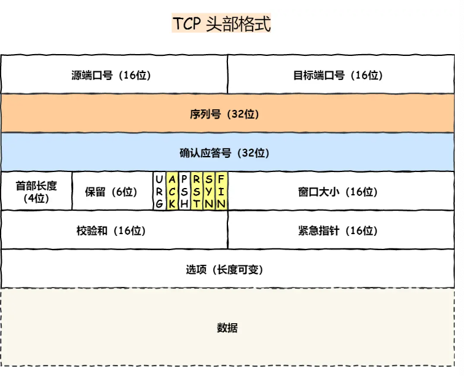
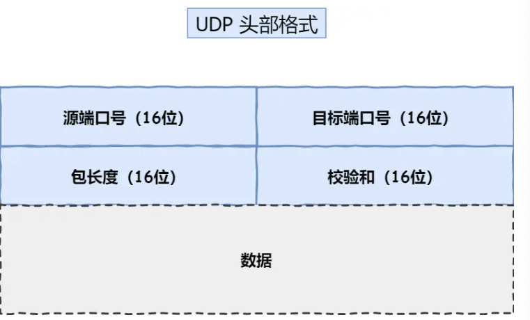
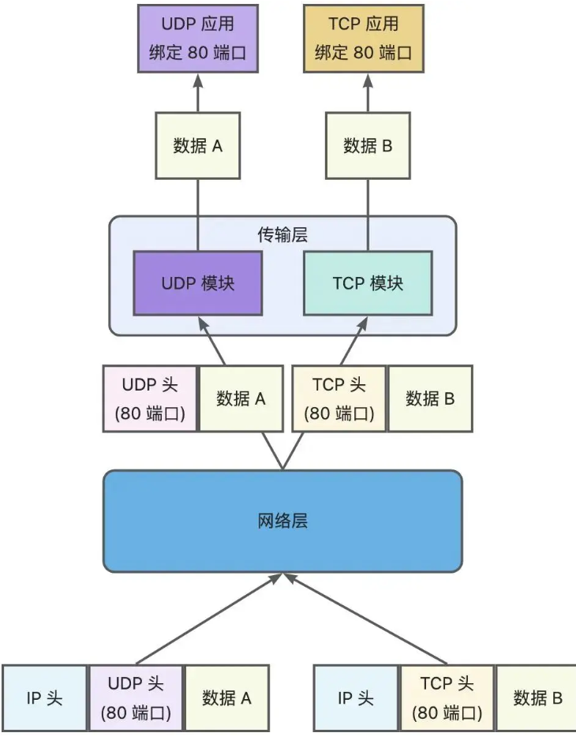
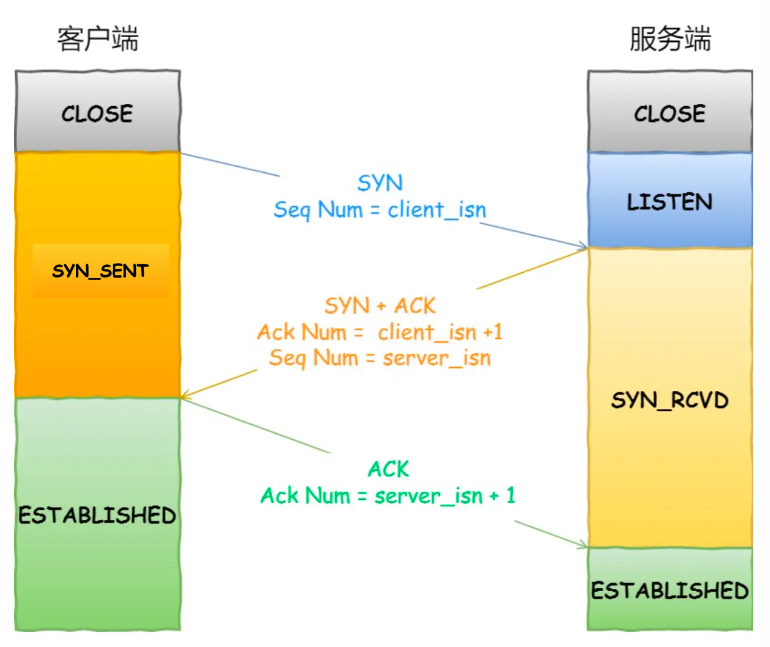
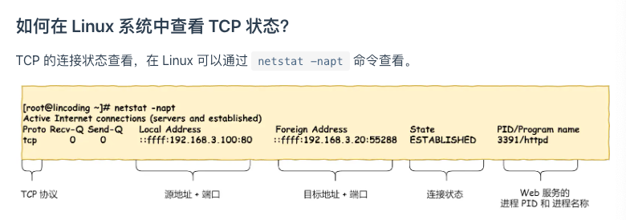
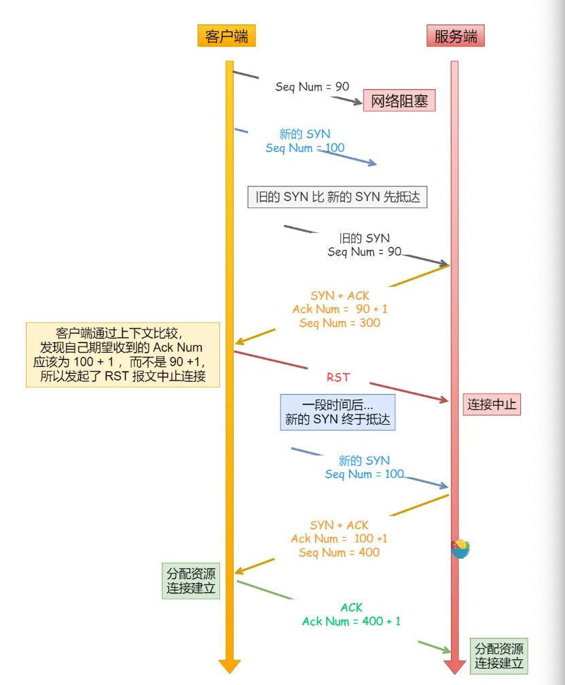
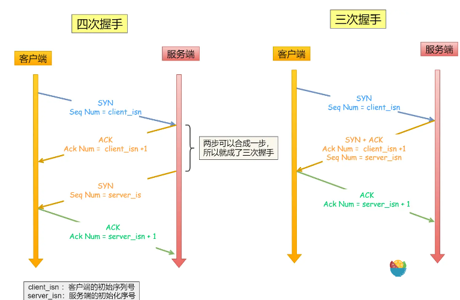
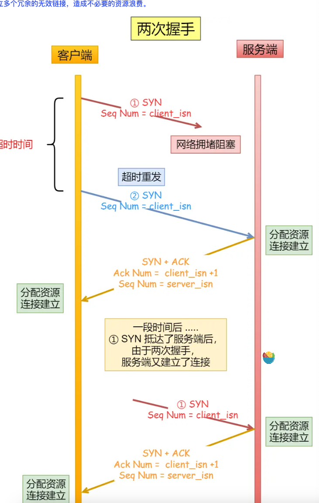
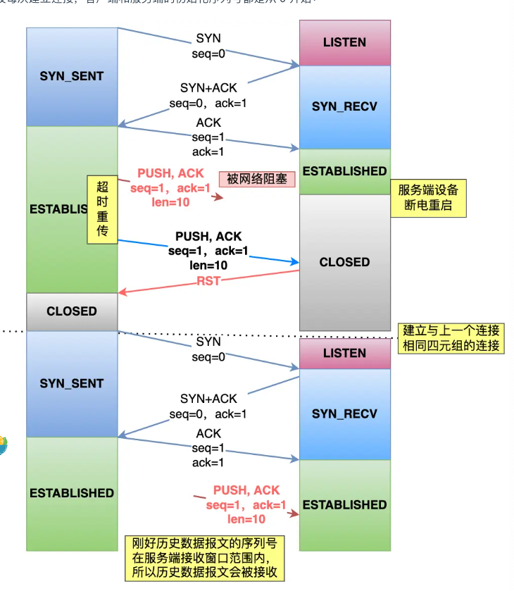
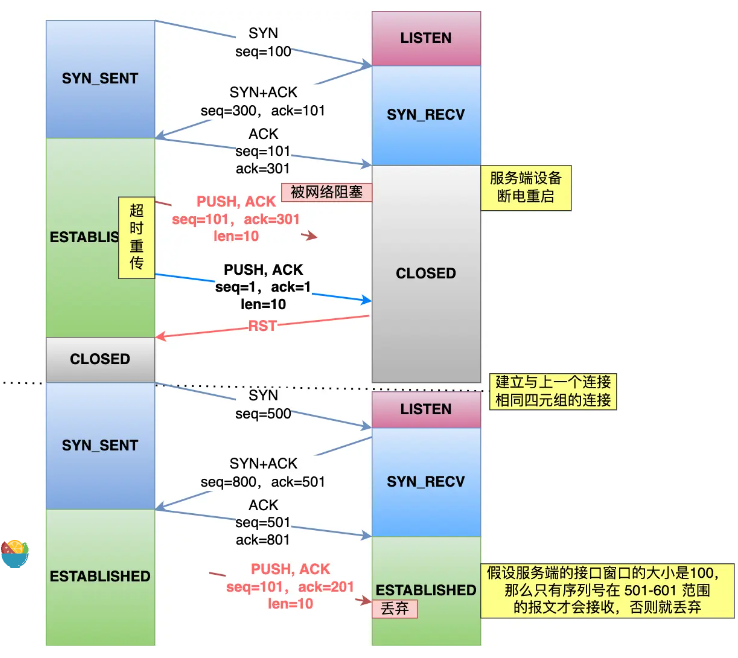

- TCP 基本认识
	- tcp头格式
		- 
		- 序列号 建立连接的时候生成个随机数当初始值，然后通过syn包传过去，后面每次发送就在这个的基础值上+1，解决网络包乱序问题
		- 确认应答号 下一次期望收到的数据的序列号，发送端收到这个确认应答之后可以认为在这个序号以后的数据已经被正常接收了，用来解决丢包问题
		- 控制位
			- ack 回复消息的时候，除了最初建立连接时的syn包之外，这个值必须是1
			- rst 有异常要强制断开
			- syn 希望建立连接，在序列号字段设置初始值
			- fin 希望断开连接了
	- 为啥需要tcp协议
		- ip层是不可靠的，不保证网络包的交付，顺序和完整性
		- 需要靠上层的tcp协议来保证这些
	- 什么事是tcp
		- 面向连接的，可靠的，基于字节流的传输层通信协议
		- 一对一连接，保证报文一定能到达，是通过字节流的形式，
	- tcp连接
		- 用来保证可靠性和流量控制维护的状态，socket，序列号，窗口大小
	- 服务器监听了端口，tcp最大连接数是多少
		- 客户端的ip数 * 客户端的端口数
		- 客户端ip数最多个2的32次方，端口数最多2的16次方
		- 但是tcp连接是个文件，如果文件描述符被占满了，也会报错，从系统级、用户级、进程级限制了可打开的文件描述符的最大数量
		- 内存限制，tcp链接要占用内存，超过了会发生OOM
	- udp和tcp的区别
		- udp
			- 
			-
		- 区别
			- 连接
				- tcp面向连接，得先连接才能传输
				- udp不需要
			- 服务对象
				- tcp一对一
				- udp可以有一对一，一对多，多对一
			- 可靠性
				- tcp可靠，无差错，保证顺序，保证不丢，不重复
				- udp 不保证，尽最大努力发
			- 拥塞控制
				- tcp有，保证数据安全性
				- udp没有，网络很拥挤了，也照发
			- 首部开销
				- tcp 一堆消息
				- udp 只有8个字节，固定的
			- 传输方式
				- tcp 流式发送，没有边界
				- udp 一个一个包发，但是可能会丢包，乱序
			- 分片不同
				- 超过最大大小了，在传输层分片
				- 超过了，ip层分片
		- 应用场景
			- tcp用于 ftp文件传输，http，https
			- udp 视频，音频，广播通信
	- tcp和udp可以用同一个端口吗
		- 可以的，因为在传输层他俩是两个协议，两个独立的软件模块，即使端口一样，但是模块不同，不会冲突
		- 
- tcp连接建立
	- 三次握手
		- 
		- **第三次握手是可以携带数据的，前两次握手是不可以携带数据的**
		- 
	- 为什么是三次握手，不是两次也不是三次
		- 避免历史连接
			- 
			- 如果客户端先发了一个请求，但是网络阻塞了，于是又发了一个，然后旧的要先到了，这样的话，会返回一个91的ack，但是客户端发现他期望的是101，就返回一个rst，关闭连接，然后过了会儿，新的请求到了，返回ack为101，对的！建立连接
			- 如果是两次握手的话，服务端发了ack出去之后就自动进入了连接状态，很可能都发送出去消息了，然后客户端发现不对，发了rst，白白建立了历史连接，白白发了数据。
			- 当第三次握手发出去后，客户端就可以发消息了，这时候ack丢了，服务端还在syn_received状态，收到数据包也还是可以正常建立连接，正常接收数据包
		- 同步双方初始序列号
			- 双方的序列号很重要，能保证数据不重复，有序且没有丢
			- 所以服务端收到客户端的序列号，告知下，给对方序列号，对方也告知下，这样才能保证两边都收到了
			- 
		- 避免资源浪费
			- 如果客户端发的syn报文阻塞了，客户端没有收到ack就会重发，没有第三次握手，服务端也不知道客户端收到自己回复的ack报文了没，所以没收到一个，就建立一个连接
			- 那就会创建好多个无用的连接
			- 
			- 不使用「两次握手」和「四次握手」的原因：
			- 「两次握手」：无法防止历史连接的建立，会造成双方资源的浪费，也无法可靠的同步双方序列号；
			- 「四次握手」：三次握手就已经理论上最少可靠连接建立，所以不需要使用更多的通信次数。
	- 为什么每次建立连接，初始化的序列号要求不一样
		- 防止历史报文被下一个相同四元组的连接接收
			- 
			- 
		- 防止黑客伪造相同序列号的报文被对方接收
		- 如何随机生成的
			- 随机数是会基于时钟计时器递增的，基本不可能会随机成一样的初始化序列号。
	- ### 既然 IP 层会分片，为什么 TCP 层还需要 MSS 呢？
		- 在网络分层的话,如果一个IP分片丢失了,整个报文的所有分片都要重传
		- 当某个分片丢了,无法组装成一个完整的tcp报文,无法将数据报文送到tcp层.那接收方就不会返回ack给发送方,那发送方就会把整个tcp报文重发
		- mss 最大报文长度
		- 如果重新发的话,可以只发一个mss的报文,而不用重传所有的分片,大大增加了重传的效率
	- 第一次握手丢失了,会发生什么