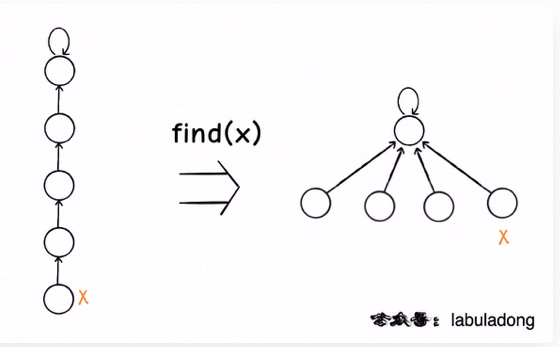

tags:: 图，union-find，并查集

- 动态连通性其实可以抽象成给一幅图连线。
- 用森林表示图的动态连通性，用数组具体实现这个森林
- 表示：
	- ```
	  class UF {
	  	private int count;
	      private int[] parent;
	      private int[] size;
	      
	      public UF(int n) {
	      	this.count = n;
	          parent = new int[n];
	          for(int i = 0; i < n; i++) {
	          	parent[i] = i;
	              size[i] = 1;
	          }
	      }
	      
	      public void union(int p, int q) {
	      	int rootP = find(p);
	          int rootQ = find(q);
	          if(rootP == rootQ) {
	          	return;
	          }
	          if(size[rootP] > size[rootQ]) {
	          	parent[rootQ] = rootP;
	          }else {
	          	parent[rootP] = rootQ;
	          }
	          count--;
	      }
	      
	      private int find(int x) {
	      	while(parent[x] != x) {
	          	parent[x] = parent[parent[x]];
	          	x = parent[x];
	          }
	          return x;
	      }
	      
	      public int count() {
	      	return count;
	      }
	      
	      public boolean connected(int p, int q) {
	      	int rootP = find(p);
	          int rootQ = find(q);
	          return rootP == rootQ;
	      }
	  }
	  ```
- 为了让树的高度尽可能平衡，尽量让小的树接到大的树里
- 路径压缩。
- 
-