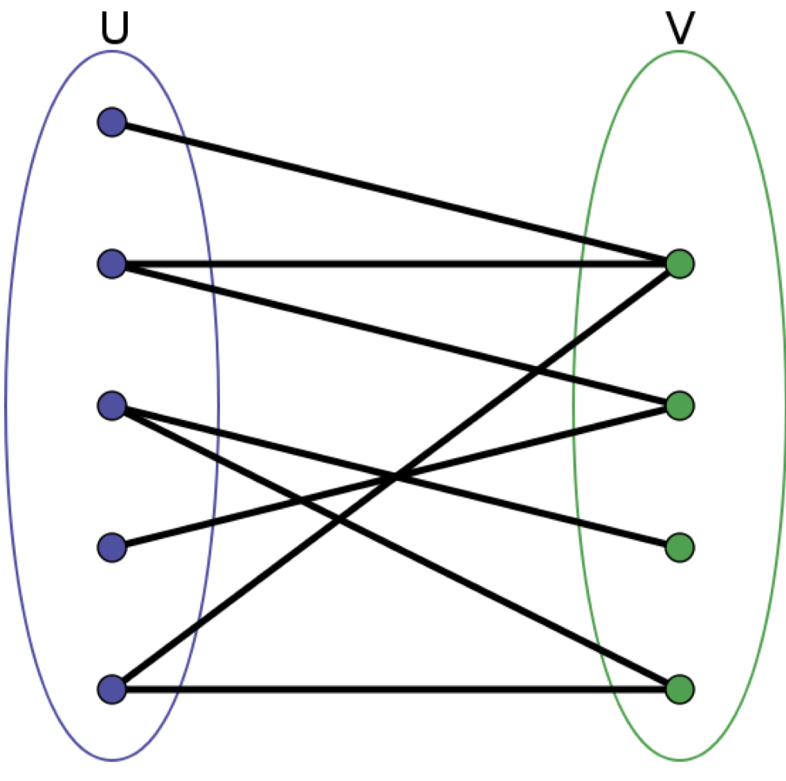

tags:: 二分图，图

- 二分图的顶点集可分割成两个互不相交的子集，图中每条边依附的两个顶点都分别属于这两个自己，且两个自己内的顶点不相邻。
- 
- 可以在某些场景更高效的存储数据。比如演员和电影的关系。
- 判断是否为二分图-DFS
	- ```
	  class Solution {
	      boolean[] visited;
	      boolean[] color;
	      boolean ok = true;
	      public boolean isBipartite(int[][] graph) {
	          int n = graph.length;
	          visited = new boolean[n];
	          color = new boolean[n];
	  
	          for(int i = 0; i < n; i++) {
	              if(!visited[i]) {
	                  traverse(graph, i);
	              }
	          }
	          return ok;
	      }
	  
	      void traverse(int[][] graph, int v) {
	          if(!ok) {
	              return;
	          }
	          visited[v] = true;
	          for(int w : graph[v]) {
	              if(visited[w]) {
	                  if(color[w] == color[v]) {
	                      ok = false;
	                  }
	              }else {
	                  color[w] = !color[v];
	                  traverse(graph, w);
	              }
	          }
	      
	  ```