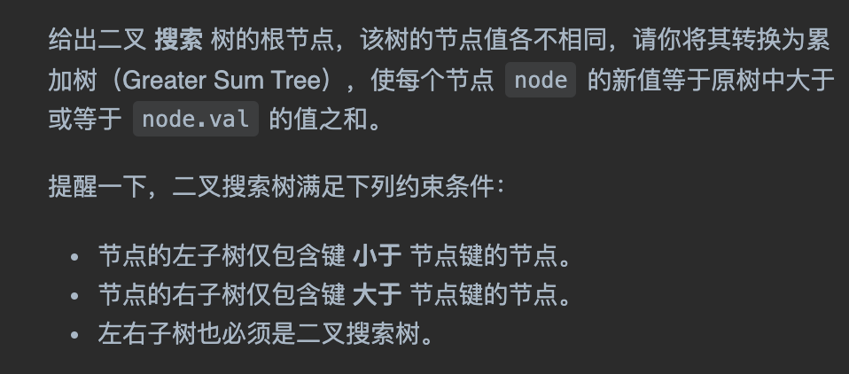

tags:: 二叉树，二叉搜索树，算法秘籍
title:: 二叉搜索树[中序遍历有序]

	- 特点：
		- 左小右大，左子树的最大值也比根节点的值小，右子树的最小值也比根节点的值大
		- 中序遍历之后，得到的数组是有序的
- 一般查找第k小的元素，如果想达到对数级的复杂度，关键也在于每个节点得知道自己排第几
	- 如果想查找排名为k的元素，当前节点知道自己排名第m，可以比较m和k的大小
		- 如果m==k则返回当前节点
		- k< m说明要找的元素在左子树，就直接去搜左子树
		- k>m 说明要找的元素在右子树，知己去搜索右子树
	- 这就需要再二叉树节点中维护额外信息，每个节点需要记录，以自己为根的这颗二叉树有多少个节点。这样，node就能根据node.left的节点个数，推断出node节点的排名
- 题目
	- 
	- ```
	  class Solution {
	      int res = 0;
	      public TreeNode convertBST(TreeNode root) {
	          traverse(root);
	          return root;
	      }
	  
	      void traverse(TreeNode root) {
	          if(root == null) {
	              return;
	          }
	          traverse(root.right);
	          res += root.val;
	          root.val = res;
	          traverse(root.left);
	      }
	  }
	  ```
- 反着中序遍历下，这样在这个节点前面的就是比它大的节点了，累加起来就行