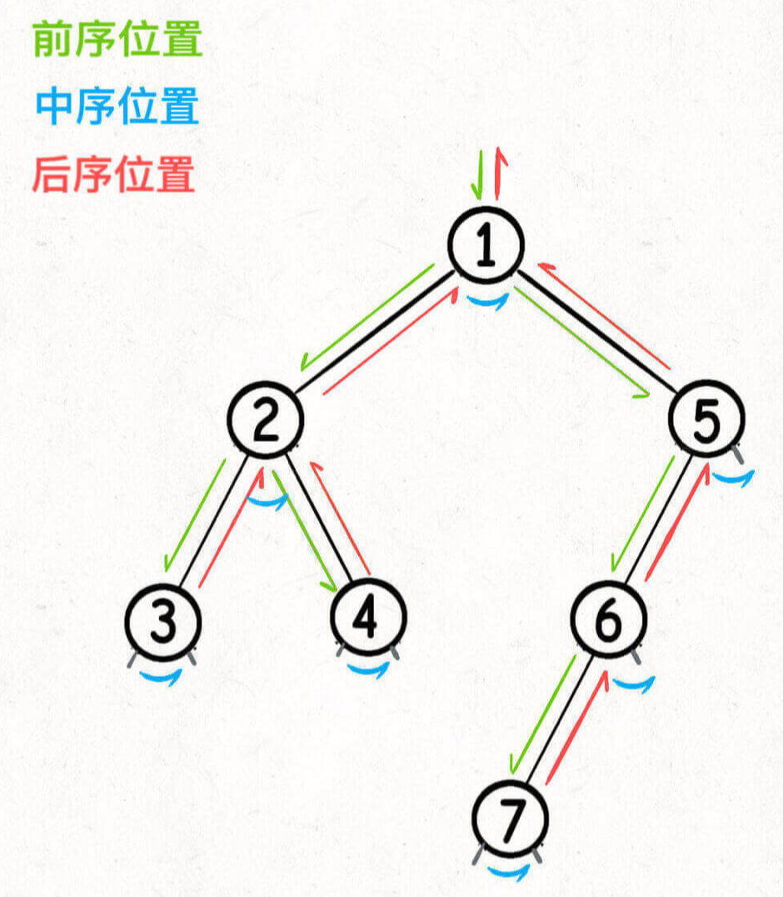

tags:: 算法秘籍

- 总结
	- 前序位置的代码在刚刚进入一个二叉树节点的时间执行
	- 后序位置的代码在讲到离开一个二叉树节点的时候执行
	- 中序位置的代码在一个二叉树节点左子树遍历完，即将开始遍历右子树的时候执行
	- 
- 两种解题思路
	- 遍历一遍二叉树得到答案  对应回溯算法核心框架
	- 通过分解问题计算出答案 对应动态规划核心框架
- 二叉树题目通用思考过程：
	- 是否可以通过遍历一遍二叉树得到答案
	- 如果不能，是否可以定义一个递归函数，通过子问题的答案推导出原问题的答案
- 后序位置的特殊之处
	- 中序主要用在BST场景总，二叉搜索树
	- 前置位置的代码执行是自顶向下的，后序位置的代码执行是自底向上的。这样可以获取参数数据，还能获取子树通过函数返回值传递回来的数据。
- 层次遍历
	- 属于迭代遍历