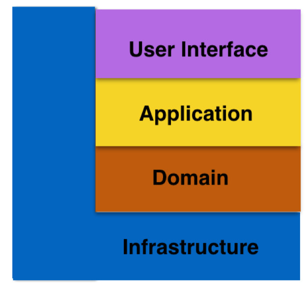
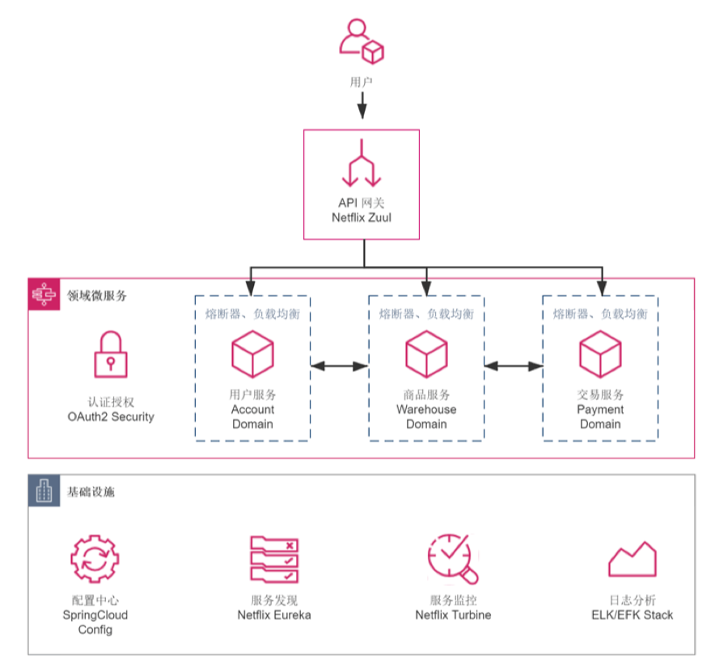
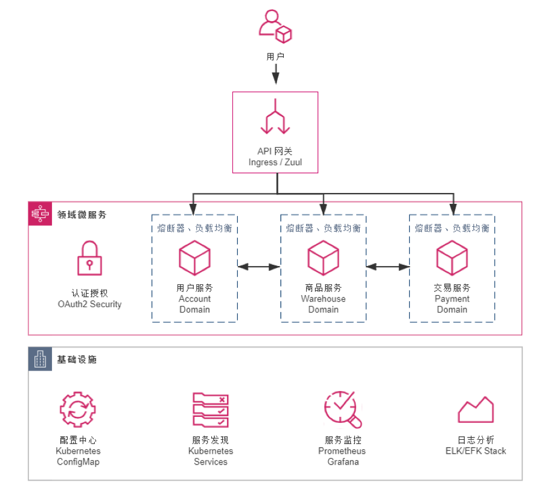
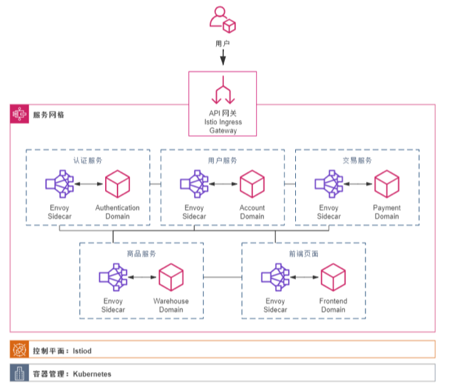

- 单体架构spring boot
	- 在服务器上安装docker
	- 输入docker run -d -p 8080:8080 --name bookstore icyfenix/bookstore:monolithic命令，会尝试先从本地进行拉取，如果拉不到，就去docker hub里下载这个镜像到本地
	- 在服务器上要设置防火墙，现在设置的所有的都可以访问
	- 在mac上，输入 服务器ip地址+8080端口，就可以访问了
	- 工程结构（参照了ddd的分层模式和设计原则
		- resource 面向用户信息，接受用户的请求及最后将信息返回给用户
		- application 定义软件本身对外暴露的能力。尽量简单，不包含任何业务规则或者知识，只是为了下一层的领域对象协调任务，分配工作，使得他们互相协作
		- domain 实现业务逻辑，处理业务状态信息及业务规则
		- infrastructure 底层的通用技术能力
		- 
		-
- spring cloud
	- 
	- 非功能性技术模块（认证，授权
	- 基础设施 配置中心、服务发现等
	- docker compose
		- 是一个用于定义和运行多容器docker应用程序的工具
		- 用yaml文件配置应用程序的服务
		- 可以用一个单一的命令，从配置中创建并启动所有服务，能一次性启动，停止和重建服务
		- 自动设置一个网络，可以通过服务名称互相发现和通信，不需要显示配置ip地址
		- 在compose文件里管理数据卷和卷挂载，可以共享文件
		- 环境隔离，用项目名称隔离环境，在一个主机上运行多个环境
- kubernetes
	- 
	- 真正的区别在 Kubernetes 的实现版本中直接删除了配置中心、服务注册中心的工程，在其他工程的 pom.xml 中也删 除了如 Eureka、Ribbon、Config 等组件的依赖。取而代之的是新增了若干以 YAML 配置文 件为载体的Skaffold 和 Kubernetes 的资源描述，这些资源描述文件，将会动态构建出 D NS 服务器、服务负载均衡器等一系列虚拟化的基础设施，去代替原有的应用层面的技术组 件
- 服务网络 Istio
	- 基于kubernetes之上
	- 服务网格 service mesh，中间人流量劫持的方式，用在应用和基础设施之间的便车代码，让用户代码可以专注业务需求，不必关注分布式技术
	- 边车代理：
		- 每个微服务旁边都部署了一个轻量级的网络代理。负责处理和网络通信相关的各种任务，如：服务发现、负载均衡、故障恢复、安全性、监控等
		- 这个代理通常是透明的
		- 工作原理
			- 服务之间通信，当一个微服务要和另外一个微服务通信的时候，将请求发送到本地的边车代理，代理接收到请求后，负责查找目标服务位置，将请求转发到目标服务的边车代理，目标服务的边车代理将请求转发给目标服务
			  logseq.order-list-type:: number
			- 边车代理处理所有入站和出站的网络通信，包括 重试、超时、断路器模式
			  logseq.order-list-type:: number
			- 边车代理可以被集中配置，以应用一致的路由规则、安全策略和其他网络配置，不需要在每个服务中单独配置
			  logseq.order-list-type:: number
			- 监控和日志，收集关于网络通信的详细指标和日志
			  logseq.order-list-type:: number
		- 通用实现：
			- envoy，通常和istio服务网格一起使用
	- 
- 无服务 AWS Lambda
	- 允许用户运行代码但是不需要管理服务器
	- 自动处理底层的基础设施管理任务，服务器和操作系统的维护，容量分配，自动扩展，代码监控和日志管理等
	- 上传代码，为每个传入的请求自动运行这段代码，为代码执行的时间付费
	-
-
-
-
- 安装docker
	- [在 Ubuntu 上安装 Docker Engine | Docker 文档 --- Install Docker Engine on Ubuntu | Docker Docs](https://docs.docker.com/engine/install/ubuntu/)
- curl的命令
	- `curl`: 是一个利用 URL 语法在命令行方式下工作的文件传输工具，它支持多种协议，包括 HTTP、HTTPS、FTP 等。
	- `-0`: 这个参数告诉 `curl` 使用远程文件的名称来保存下载的文件。也就是说，它将使用 URL 中最后一部分的名称（在这个例子中是 `docker-compose.yml`）作为保存到本地的文件名称。