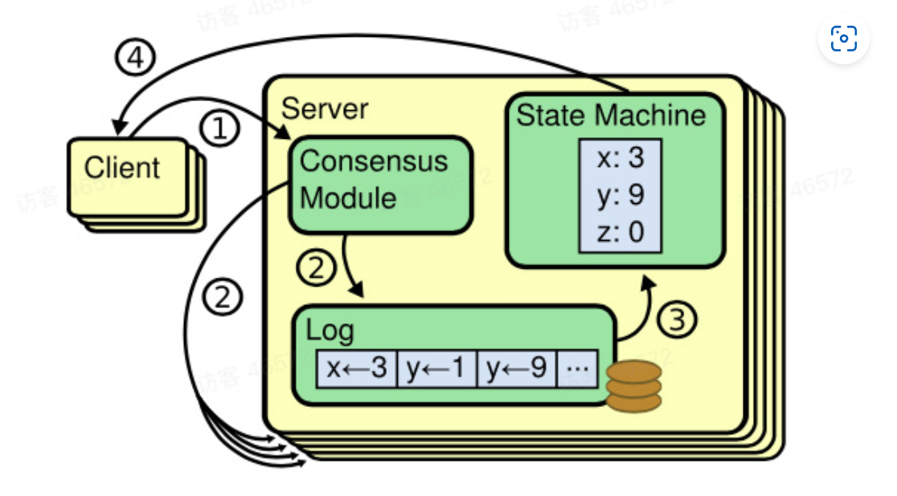

- 解决了一个什么样的问题
	- 在大数据时代，如果想要对大规模数据集进行存储和计算，如何进行
		- 将单台机器的性能，存储空间不断扩展，但是这会导致成本不断飙升
		- 利用多台性能一般的机器，合伙来做这个事情，可能会导致数据不一致的问题
	- 如何让跨网络的机器之间协调一致的工作
		- 状态的立即一致性  比较难达成，一般会牺牲高性能
		- 状态的最终一致性 是工业界比较普遍的做法
	- 如何应对网络的不可靠以及节点的失效
		- 可读写的状态
		- 写被阻塞了，只读的状态
		- 不可读写，可能机器全都崩溃了的状态
	- 机器之间能达到最终一致并且允许局部失败的算法 为分布式一致性算法
- 复制状态机
	- 
	- 客户端发出了请求，一台机器收到之后，不立即执行持久化的操作，而是放到log操作里，然后同步给其他的机器，等所有的机器都放入到log操作里，进行持久化操作，并返回响应给client机器。
- 定义问题
	- 输入：写入命令
	- 输出：能够保证集群里所有节点最终都处于相同的状态里
	- 约束：
		- 网络不确定，在非拜占庭情况下，出现网络分区（交换机出现问题，无论如何都无法进行实时的通信），冗余（数据没丢只是延迟了，但是导致重新发送了），丢失（数据丢失了），乱序（前面的延迟了，导致后面的先到了）等问题下要保证正确
		- 基本可用性：集群中大部分节点能保持相互通信，集群就应该能正确响应客户端
		- 不依赖时序，不用依赖物理时钟或极端的消息延迟来保证一致性
		- 快速响应，对客户端请求的响应不能依赖集群中最慢的节点
- 可行解
	- 初始化的时候，选举出来一个领导者，负责发送日志到其他跟随者，决定日志顺序
	- 读请求到来的时候，在任意节点都可以读，但是写请求只能打到领导者节点里
	- 领导者先将请求写入到自己的日志里，同步给半数以上的节点，跟随者表示接受到了，返回结果，领导者实际提交日志里的修改操作
	- 日志最终由领导者按照顺序应用与状态机，其他跟随者随机应用到状态机
	- 领导者要是出现了问题，需要重新选取出新的领导者
	- 当有新的节点加入或退出集群，要将配置信息同步给整个集群
-