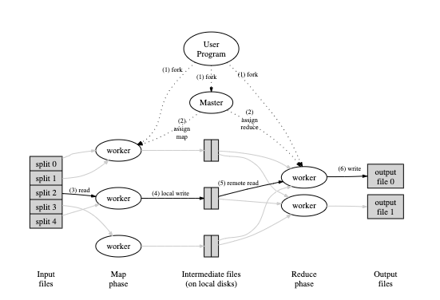

tags:: 分布式

- 分布式概览
	- 可扩展性 scalable
		- 当一个系统的使用用户很少的时候，其实很好实现，可能就是一个WEB页面+DB就能够提供服务，但是如果突然用户量突增，可能就无法支撑服务，就需要扩容
		- 但是扩容并不是说，买几个机器，部署上WEB页面就可以的，当WEB页面能提供服务了之后，可能DB就会成为瓶颈。
		- 同样的加DB，就会有服务同步的问题存在，数据的协同，万一断网了咋办等一系列问题
	- 容错性 fault tolerance
		- 如果说只有一台机器提供服务，其实出错的概率可能很低，但是如果有1000台机器来进行处理，那么出错的概率就会大大增加，在设计的时候就要考虑到各种情况
		- 可用性 availablility
			- 要保证服务的可用性，可能就要加入很多冗余的服务，比如说主从服务器等，对关键的数据进行备份
		- 可恢复性 recoverability
			- 如果很多台机器都大批量出现了问题，要保存现场等操作，保证数据的正确性
			- 确保修复之后，能恢复正常，不会带来错误
		- 非易失性存储：如果把数据都存储在内存里的话，一旦断电就会有问题，所以一般都会把数据存在 非易失性存储中，但是因为现在写磁盘的话，还是用机械臂扫盘那种存储方式，所以效率其实是很低的
		- 复制 replication 但是这个的难点是，如何保存一致
	- 一致性 consistency
		- 强一致性：无论什么时候读取的都是最新的数据，且读取哪台机器上的数据都是一致的，但是很复杂，实现成本很高。
			- 比如用副本来进行容错，那就要让这些副本发生各种错误的概率是不同的，比如说，都放一个机房的话，一着火可能就团灭了，所以一般放的隔很远，但是这种情况下，数据同步可能耗时就很很长（光速传输也会耗时），这样每次都要保持强一致性，成本高
		- 弱一致性：允许一些不一致
- MAP-REDUCE
	- extension://amkbmndfnliijdhojkpoglbnaaahippg/pdf/index.html?file=https%3A%2F%2Fpdos.csail.mit.edu%2F6.824%2Fpapers%2Fmapreduce.pdf
	- 
		- 1. 将输入的文件(很大)分割成M个部分，每个部分大概是16-64M的大小，在机群上启动很多程序副本
		  2. 副本里会有个主程序，主程序负责分配。分配了M个映射任务和N个规约任务。映射任务负责搞map操作，规约任务负责搞reduce操作。由master来选择空闲的工作程序，并分配任务
		  3. map任务的工作机器：并行的读取内容，将分片里的内容解析成键值对的形式，作为输入执行map函数，将生成的输出结果缓存到内存里
		  4. 定期将map任务生成的键值对写到本地磁盘里，磁盘由分区函数分为N个区域，这些缓冲对在本地磁盘上的位置会被传回给主节点，主节点将这些位置发给reduce工作者
		  5. reduce收到主节点发送的位置了之后，通过远程调用从映射工作进程的本地磁盘读取数据。读取的时候将中间键值对进行排序，让相同的键值对放在同一个reduce任务里。如果数据太多，内存里无法做排序，那就用外部排序
		  6. reduce工作器遍历中间数据，将<key, List<key对应的value>>作为输入进入reduce函数中，reduce函数的输出放到output file里
		  7. 当所以得map和reduce的任务都完成了，master节点会唤醒用户程序，结果返回到用户代码里
		  8. 完成之后，一个reduce任务会对应一个文件，为啥不把这N个文件合并呢，因为通常用户要把这些文件作为输入给另外一个map reduce调用，或者继续走分布式应用程序
	- 主节点中的数据结构
		- 主节点保存了多种数据结构，对于每个工作任务，他存储了任务的状态（空闲，进行中，已完成），工作机器的标识
		- 主节点负责把map函数输出出来的中间存储（key-value）的位置，传播给reduce任务，对于每个已经完成的map任务，主节点会存储任务生成的R个文件在硬盘中的位置和大小，map任务完成了，就会把这个位置推给正在执行中的reduce任务
	- 容错性
		- 工作节点失败了
			- 主节点会定时的ping每个工作节点，如果在一定时间之后还ping不通，就会标识工作节点失败了，这种情况下，会将运行在工作节点的任务置为初始空闲状态，重新找别的节点来执行。
			- 已经完成的map任务，在失败的时候会去重新调度执行，因为他的输出内容在断联机器的磁盘上，无法读取了。
			- 已经完成的reduce任务不需要重新执行，因为他的输出在全局文件系统里
			- 如果map任务开始在A上执行来着，后来A死了，转到B上了，会通知所有reduce机器，去B上读
		- 主节点失败了
			- 可以定期往checkpoint上写入所有的存储结构的状态，然后让备份机器读取checkpoint里的数据进行恢复，工作
			- 但是主节点只有一个，发生故障的概率很低，所以一般都是终止mapreduce操作，检查之后重新开始
		- 失败了之后的语音
			- 及时失败了，但是最后的输出还能保证是一致的
			- 这依赖于map和reduce的任务都能够原子性的提交输出。每个任务都会将输出写到私有的临时文件里，reduce任务生成一个，每个map任务会输出R个。
			- map任务完成之后，worker会给master发消息，包含r个临时文件的名字，master会进行去重并记录
			- reduce任务完成之后，会将临时文件的名字作为最终输出文件，底层文件系统会进行冲突检测，保证最终文件系统的数据来自同一个reducetask
	- 局部性
		- 网络带宽是相对稀缺的资源，将输入数据存储在在集群中每台机器的本地磁盘。GFS把输入文件切分成64MB大小的块，将块拷贝多份（通常是3块）存储在不同机器上。
		- master节点有所有输入文件的位置信息，将map task调度到这些机器上，其中一台有问题了之后，会把任务调度到其他有这个文件的那两台机器上
		- 输入数据从本地读取的，不消耗带宽
	- 任务粒度
		- 通常会把map任务分为M个部分，reduce任务分成R个，一般这两个值都远大于机器数量，每个机器都能执行不同的任务，以便能达到负载均衡
		- 大小的限制：主节点需要有O(m+r)个调度角色，在内存中保存O(m*r)个文件的状态，但是这个O也很小，因为使用一个字节的数据吧。
		- R的大小受用户的限制，因为每个R任务最终都会输出一个单独的文件。一般我们能选择M大小，通过切分成多小的任务快来。
		- 参考，2000个机器来跑 m=200000 r=5000
	- 备份任务
		- 在任务的执行过程中，可能会有一些任务会拖慢整个mapreduce操作，用了过长的时间去完成任务重最后几个任务。‘
		- 出现的可能原因
			- 硬盘坏了，性能下降严重等各种问题
		- 解决：
			- 当mapreduce操作接近结束的时候，会将仍然在执行的task进行备份执行，只要他或者他的备份任务执行完成了，就会标记成完成。
	- 扩展点
		- 分割函数
			- reduce任务重的r的选择，要把所有的key分成r个区间，一般来说采取的函数是hash算法，这种算法的好处是，分布的均匀。但是有一些场景需要用到别的分区函数
			- 输出值是URL，希望同一个