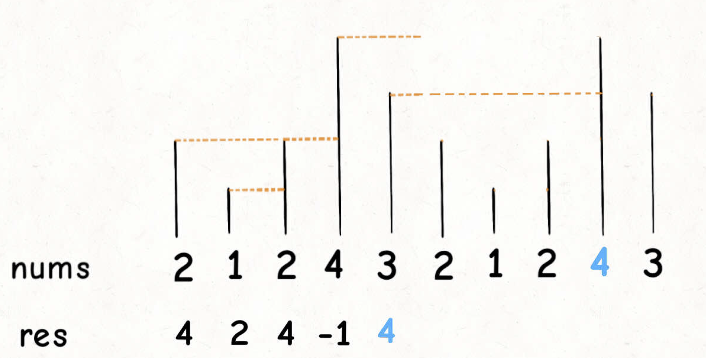

tags:: 栈，单调栈，算法秘籍

- TODO 503刷一下 
  SCHEDULED: <2022-11-19 Sat>
- 用途
	- 实际上还是栈，但是可以让新元素入栈后，栈内的元素都保持有序(单调递增或单调递减)。主要是为了解决，下一个更大的元素。
- 模板
	- ```
	  class Solution {
	      public int[] nextGreaterElement(int[] nums1, int[] nums2) {
	          Stack<Integer> stack = new Stack<>();
	          Map<Integer, Integer> map = new HashMap<>();
	          for(int i = nums2.length - 1; i >= 0; i--) {
	              while (!stack.isEmpty() && nums2[i] > stack.peek()) {
	                  stack.pop();
	              }
	              map.put(nums2[i], stack.isEmpty() ? -1 : stack.peek());
	              stack.push(nums2[i]);
	          }
	          int[] res = new int[nums1.length];
	          for(int i = 0; i < nums1.length; i++) {
	              res[i] = map.get(nums1[i]);
	          }
	          return res;
	      }
	  }
	  ```
- 思路
	- 因为要找比当前元素大的下一个元素，所以从后往前遍历
	- 当栈里的元素空的时候，说明后面没有比当前元素更大的元素，那就是-1.
	- 当栈中的元素不为空的时候，如果当前元素比栈顶还大，那栈里的元素就出栈，直到找到比自己大的那个元素，那他就是要找的对象
	- 
		- 拿这个举例，当遍历到4的时候，比4小的都可以出去了，因为对于4前面的元素，比它大的第一个元素，要么是4前面的元素，要么是4，绝不可能是4后面哪些比4小的元素了。
		- 栈里维护的元素，一定是越往下越大的。
- 题目变形
	- 求举例下一个比自己大的元素的index差值是多少
		- stack里存储index，后面返回的时候，返回index的差值就行
	- 环形数组的时候咋办
		- 一般都是通过%运算符来求模。先将长度翻倍，这样就能找到最后一个元素的所求值。
		- 
		- ```
		  class Solution {
		      public int[] nextGreaterElements(int[] nums) {
		          Stack<Integer> stack = new Stack<>();
		          int length = nums.length;
		          int[] res = new int[length];
		          for(int i = 2 * length - 1; i >= 0; i--) {
		              while (!stack.isEmpty() && nums[i % length] >= stack.peek()) {
		                  stack.pop();
		              }
		              res[i % length] = stack.isEmpty() ? -1 : stack.peek();
		              stack.push(nums[i % length]);
		          }
		          return res;
		      }
		  }
		  ```