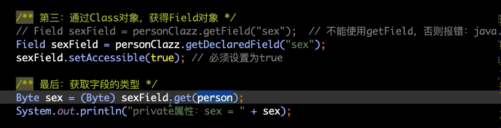
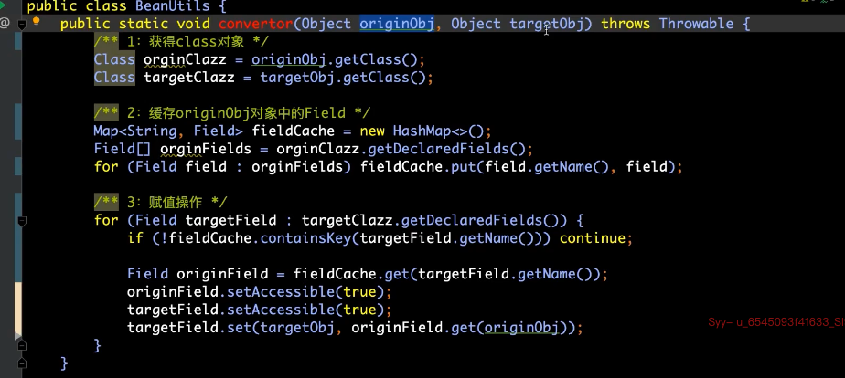
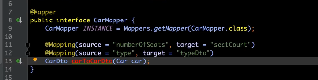
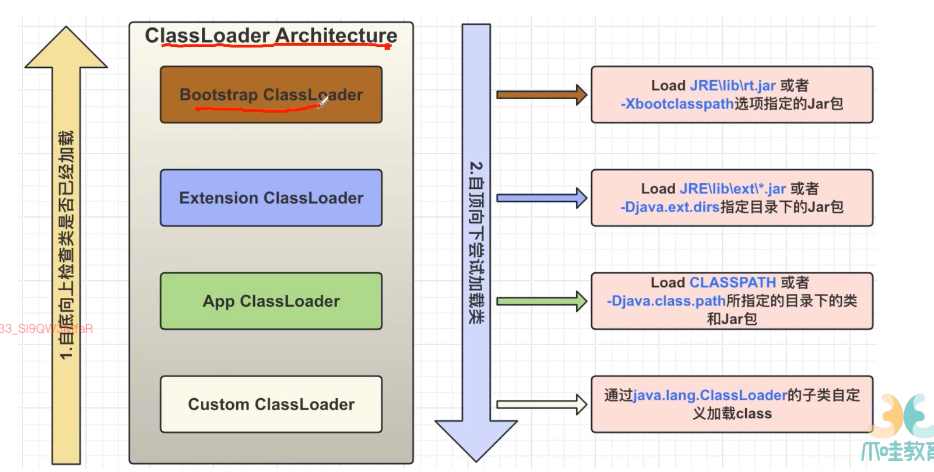
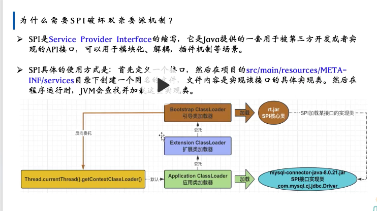
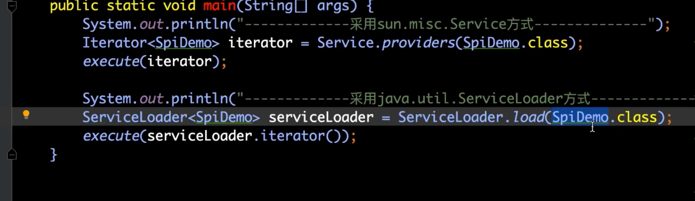

- 在编译期的时候，并不确定要调用哪个方法哪个类，在运行期的时候才知道
- 
- new 对象的模式，对应rtti这种，打开检查class文件，类加载期就是stduent类型
- 运行期的时候，打开或检查class文件
- jvm类加载流程
	- 开始的时候是程序猿便携的java源文件，通过类编译器编译成class文件
	- 类加载器classLoader，将class记载到jvm里
	- 通过加载、验证、准备、解析、初始化，将class文件的信息放到jvm各个区里去
	- class文件包含的内容
		- 类名，包名，属性，方法
		- 类名就是person.class，包名从pakage，属性field，方法，构造函数 constructor
		- 
	- 创建实例对象的步骤对比
		- 正常步骤
			- 加载class文件
			- 找到和入参匹配的构造函数
			- 通过构造函数创建对象
		- 反射
			- 运行期加载class文件 Class.forName()
			- class.getConstructor(Long.class, String.class)
			- constructor.newInstance()
			- 创建对象
				- 对象.class
				- 类名.class
				- forName
			- 哪种方式获得的class都是同一个类的映射，编译之后的target文件下的那个类的映射
		- 单例模式
			- 使用反射的话，不需要去new对象，就会破坏单例
			- getDeclaredConstructor 获取所有的构造参数，否则就是只能获取public的
			- constructor.setAccessible(true) 置为可拿取的
	- getField获取到所有的方法，包括父类的
	- 获取非public的对象 
- convertor
	- 
	- 
	- 这是现成的架构其实现在我们已经在用了
- 双亲委派机制
	- 
	- 根类加载器
	- 扩展类加载器
	- 应用类加载器
	- 自定义类加载器
	- 自底向上检查类是否已经加载，自顶向下尝试加载类
	- 
	- 正常来说的话，谁去调用，就是用调用的类来作为它的类加载器
	- 
	- spi的话，他的调用者是用serviceLoader的，这个调用者是用bootstrap classloader，这样如果还用之前的话，他是找不到应用类加载器的
		- 怎么解决
		- 就是load里的实现是别的实现，他没有用caller的类加载器，而是用当前线程的classloader，是应用类加载器来的，所以没问题
		-
-