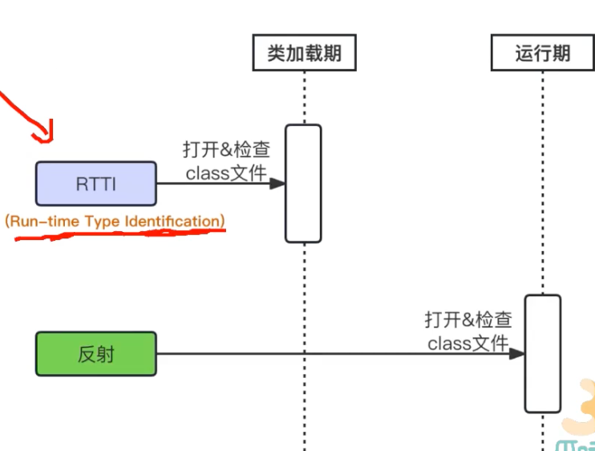
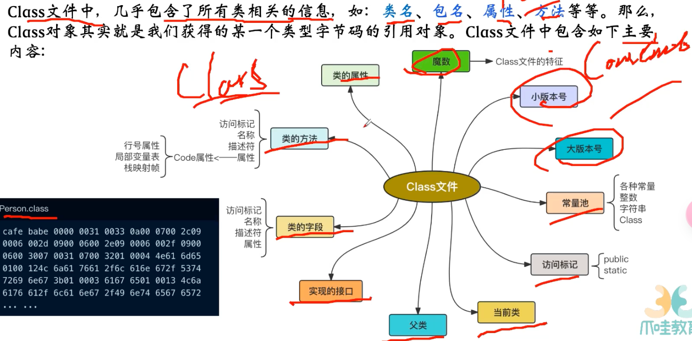

- 在编译期的时候，并不确定要调用哪个方法哪个类，在运行期的时候才知道
- 
- new 对象的模式，对应rtti这种，打开检查class文件，类加载期就是stduent类型
- 运行期的时候，打开或检查class文件
- jvm类加载流程
	- 开始的时候是程序猿便携的java源文件，通过类编译器编译成class文件
	- 类加载器classLoader，将class记载到jvm里
	- 通过加载、验证、准备、解析、初始化，将class文件的信息放到jvm各个区里去
	- class文件包含的内容
		- 类名，包名，属性，方法
		- 类名就是person.class，包名从pakage，属性field，方法，构造函数 constructor
		- 
	- 创建实例对象的步骤对比
		- 正常步骤
			- 加载class文件
			- 找到和入参匹配的构造函数
			- 通过构造函数创建对象
		- 反射
			- 运行期加载class文件 Class.forName()
			- class.getConstructor(Long.class, String.class)
			- constructor.newInstance()