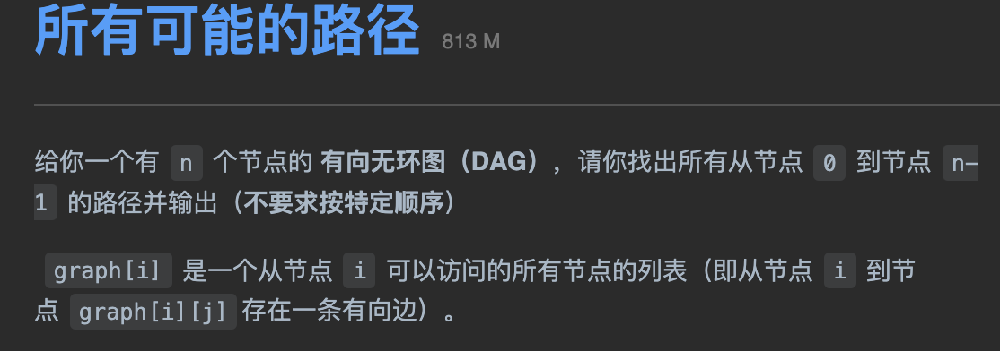

tags:: 图

- 本质上图是多叉树的延伸。一幅图是由节点和边构成的
- 
- 图节点的逻辑结构，和多叉树的结构很类似
	- ```
	  class Vertex {
	  	int id;
	      Vertex[] neighbors;
	  }
	  ```
- 一般的图的实现结构。
	- 邻接表
		- 将节点的邻居存在一个列表里，能通过列表中的节点找到所有相邻的令居
		- 优点
			- 占用空间少
		- 缺点
			- 无法快速判断两个节点是否相邻
	- 邻接矩阵
		- 结构是一个二维的布尔数组，如果两个节点相连，则matrix[x][y]的值就是true。想要找节点x的邻居，去扫一圈matrix[x][...]就行
- 
- 有向加权图
	- 存储某个节点x的所有邻居节点，还存储x到每个邻居的权重。
	- 数组里存储的不是布尔值还是int值，代表权重
- 无向图：等同于双向
- 图的遍历
	- 因为图可能包含环，所有从图的某一个节点开始遍历，可能走了一圈又回到了这个节点
	- ```
	  boolean[] visited;
	  boolean[] onPath;
	  
	  void traverse(Graph graph, int s) {
	  	if(visited[s]) return;
	      visited[s] = true;
	      onPath[s] = true;
	      for(int neighbor : graph.neighbors(s)) {
	      	traverse(graph, neighbor);
	      }
	      onPath[s] = false;
	  }
	  ```
	- visited是说这个节点有没有被访问过
	- onPath是说在不在正在遍历的这个路径上，后序统计路径会用上的。比如拓扑排序。
		- 很像回溯算法里的做选择和撤销选择，但是回溯算法的操作在for循环里面，这里是在for循环外面
		- 在for循环里面外面区别是对根节点的处理。在外面的话，会打印所有节点的进入和离开，在里面的话，会缺少整棵树根节点的进入和离开
- 题目：
	- 
- ```
  class Solution {
      List<List<Integer>> res = new LinkedList<>();
      public List<List<Integer>> allPathsSourceTarget(int[][] graph) {
          traverse(graph, 0, new LinkedList<>());
          return res;
      }
      
      void traverse(int[][] graph, int start, LinkedList<Integer> path) {
          path.addLast(start);
          
          if(start == graph.length - 1) {
              res.add(new LinkedList<>(path));
              path.removeLast();
              return;
          }
          
          for(int v : graph[start]) {
              traverse(graph, v, path);
          }
          
          path.removeLast();
      }
  }
  ```