- 程序 QQ.exe
- 程序起来之后是个进程 qq running
- 最小的执行单元是个线程
- 线程。一个程序里不同的执行路径
	- 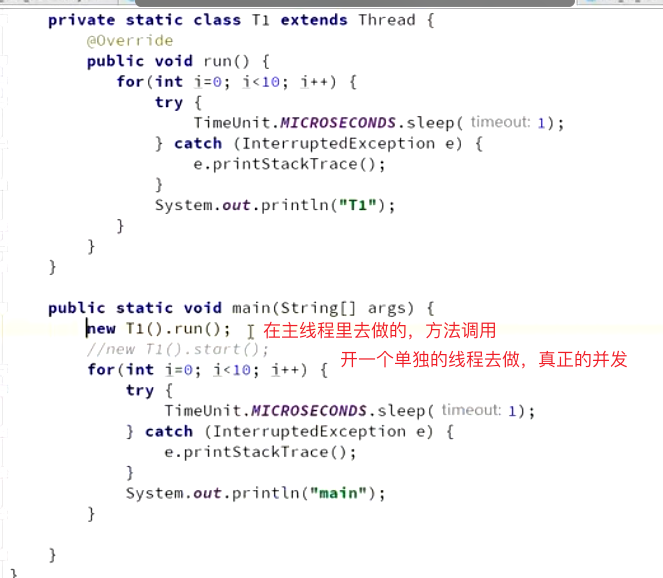
	- 创建方式
		- 继承Thread，重写run方法，使用的时候，new T1().start()才能真的去起一个线程去执行。如果是new T1().run()的话，只是方法调用，都是在主线程里做这个事情的。
		- 实现Runnable接口，重写run方法。new Thread(new MyRun()).start();
		- 第二种的变形，用lambda表达式
		- 通过线程池来启动 excutors.newCachedThread
		- 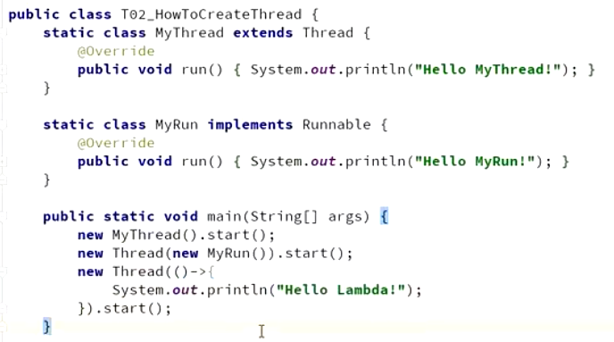
	- 线程的方法
		- sleep 睡眠，当前线程暂停一段时间让别人去运行。这段时间就不运行这个线程了，把cpu这个资源让给别的线程去执行。sleep完就去就绪状态
		- yield 主动去进入到等待队列里，让操作系统重新调度，可能会让别的线程去，也可能就又把刚刚让出cpu的线程又回来。让自己进入到就绪状态中去
		- join t1的程序里调用 t2.join()。就会先跑到t2去运行，t1等着，等t2运行完了之后再回来继续运行t1
			- 有t1，t2，t3三个线程，怎么能保证必须 t1运行完再t2在t3
				- 主线程里依次 t1.join,t2.join,t3.join
				- 在t3里调用t2.join, t2里调用t1.join
	- 线程的状态
		- 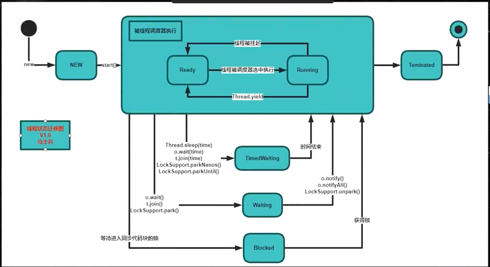
		- NEW 最新创建出来了，还没有start
		- 被线程调度器执行，变成了Rnnable，就绪状态，扔到cpu等待队列里去了，在等的话ready，真正运行的时候running
		- 结束了到terminated。不能再被start回来了
		- 阻塞了blocked 没有得到锁
		- 调用了wait，join，park就去了waiting
		- waiting有时间等待的话，就是timedWaiting
		- 线程和操作系统的线程不一定是一一对应的，看具体实现。一般java线程数量小于操作系统线程的
		- 不要关闭线程，只能让线程正常结束。stop不建议用，容易导致状态不一致。interrupt 之后 要catch之后做处理，很少用，不会用它来控制业务逻辑
		- sleep，wait，join，park的时候可能会被打断，catch exception来决定自己下一步要做什么
		- thread.getState() 能获取到状态
- synchronized关键字
	- 临界资源，就比如说我要给一个数字执行++操作，如果有10个线程都来了，1来了之后看到数字现在是0，获取到，回去自己的内存里加了1，来没有回写回来，2又来获取这个数字，还是0，也拿回去++，导致+了两次，最后的结果还是1。
	- 所以要对这个临界资源来做出限制，一次只能有一个线程来执行这段代码
	- 那锁的定义呢，其实并不是说把这个1的对象锁住，是错的。可以任意定义你锁的对象，只要最终能保证一次只有一个线程能获取到这个锁就行。
	- 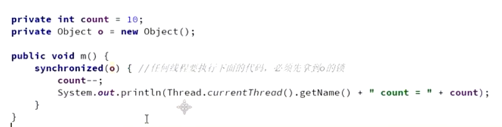
	- synchronized的使用方法 保证了原子性和可见性
		- 锁对象 synchronized(o)
		- 锁方法 在方法前面加个synchronized，就相当于把类的实例对象锁住了，synchronized(this)
		- 锁类，在方法上加个synchronized static，就相当于把class对象锁住了，synchronized(A.class())
		- 一个class类load到内存，是不是单例的。一般情况下是单例的，但是如果有多个classloader的空间，就不是。可以定义多个，每个都可以load，但是不能互相访问
		- 例子
			- 一个账户有名字和账户余额，允不允许写加锁，读不加锁。
			- 根据业务状态来定，可能会出现脏读，写的时候耗时较多，已经改了名字了但是账户余额没改，就会读到状态不一致的时候。
			- 解决方式，就是两边都加锁，写的时候就不让读
		- 可重入锁
			- m1 m2都是加锁的方法，那m1中是可以调用m2方法的，只要这个线程获取到了锁，能进入到m1就一定能进入到m2，不然就死锁了
		- 异常的锁
			- 程序中如果出现异常，默认情况下锁会释放。在并发处理过程中，有异常要多加小心，不然可能会发生不一致的情况。
		- 底层实现
			- jdk早期，重量级的实现， 找操作系统申请锁
			- 锁升级，在object markword 记录这个线程ID 偏向锁，默认不会有线程来执行，如果有线程争用，升级为自旋锁，等一会儿占用cpu，while循环，如果超过自旋锁设置的次数，默认10次，还得不到锁，升级重量级锁，争用的这个就去等待队列了，不占用cpu了，在操作系统里申请资源来获得锁。
			- 升级了之后，如果已经没有几个来争用了，但是hotspot不能锁降级，这个锁就一直是重量级了
			- 为啥自旋锁比较好，因为他不用访问操作系统，在用户态，不用经过内核态。执行时间特别短且线程不太多的时候用自旋锁比较好
		- 注意，锁的对象不能用string类型，基础的数据类型，常量等。因为常量放在常量池里，大家都一样，导致大家不是要运行同一段代码，但是也被锁住了。神奇的代码。
- volatile 可变的容易变的
	- 保证线程可见性
		- 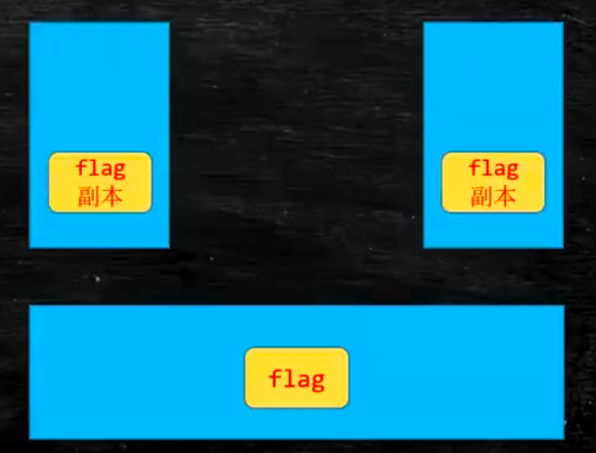
		- 在主内存里有个这个变量，如果这俩线程都要去使用的话，会分别开个副本，复制到工作内存中，写的时候会立马写回主内存，但是如果在这个线程中不进行更改，别的线程更改了，这个线程啥时候获取到这个flag的最新值，是不确定的。这个就叫做线程的不可见性
		- MESI CPU的缓存一致性协议
	- 禁止指令重排序
		- cpu执行指令的时候，为了提高效率，把指令并发的执行，在串行情况下，不影响结果的话，他就可能会给你重排序下。
		- loadFence 读屏障 前面读的指令必须执行完才能执行别的
		- storeFence 写屏障 写的指令必须执行完才能执行别的
		- double check lock 双重校验锁
			- new对象三步
				- 对象申请内存
				- 对象成员变量初始化
				- 对象分配给这个instance
			- 把2，3重排序了，instance已经不为空了，就会导致成员变量还没有初始化
	- 只能保证可见性，但是保证不了原子性。在上面那个例子中，count++时，如果只是对count进行了volatile的修饰，他只能保证能读到最新的值，但是如果并发执行，也是会存在相互覆盖的问题，因为count++里面包含的质量最少有三条。所以不能替代synchronized
- synchronized 细则
	- 锁优化
		- 锁细化。如果有三段操作，前后其实都不需要加锁，那就缩小锁的粒度，只在中间这一段加锁就行嘞
		- 锁粗化。如果有五段逻辑，四段都要加锁，不应该加四把锁，就合成一个锁就行了，这样可以避免锁的频繁获取和释放
	- 锁对象改变
		- 如果对象属性发生变化，不会影响锁的使用
		- 但是如果对象变成了另外一个对象，锁定的对象就会发生变化，应该尽可能的避免这种情况的发生。t.o = new object(); 最好是把锁的对象定义为final，避免被更改
- CAS 无锁优化 自旋
	- compare and set
	- atomicInteger concurrent.atomic 里面都是用cas实现的
	- aba问题，加个版本号，一起比较。如果基础类型无所谓，如果引用类型
		- 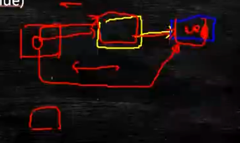
		- 红色指向黄色，黄色指向蓝色，后面把红色指向了蓝色，蓝色的值改了，后面又改成了黄色，就会导致问题
	- unsafe 除了反射不能直接操作。
- unsafe 基本上等同于c，c++的指针
	- 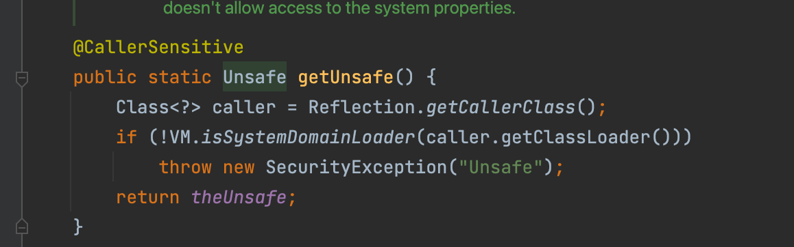
	- 直接操作内存
	- 直接生成类的实例
	- 直接从操作类或实例变量
	- cas相关操作
- LongAdder
	- 
	- 有1000个线程去做这个递增的操作时，会分成4个部分，每次250个线程就更新其中一个桶，加完了之后再来进行累加操作。这样在累加数量多且线程开的多的情况下会快（那也要有cpu吧如果只有一个cpu，感觉也不太行。
-
- ReentrantLock
	- Lock lock = new ReentrantLock();
	- 可以替代synchronized，在原来加synchronized的地方，手动加上锁lock.lock()，然后一定要在try catch finally的代码里加上lock.unlock() 不然可能永远也无法解锁‘
	- 和synchronized的区别
		- tryLock可以尝试锁定，可以获取锁定的结果，由自己的代码决定锁定不成功之后要怎么做。但是synchronized的话，锁定失败了就阻塞了。还可以尝试申请的时长。
		- lock.lockInterruptibly() 可以对中断interrupt()方法做出响应。synchronized一旦wait了，必须要让别人notify才行。如果m1长期sleep，那这样的话，m2方法一般是进不去的，但是如果m2使用的不是lock方法而是lockInterruptibly这个方法的话，如果thread.interrupt()了之后就能进m2这个方法了。
		- 如果new的时候传入了true，就说明是个公平锁，公平锁的概念是，只要新的线程过来了，如果有别人正在使用这个锁，就去等待队列里排队，获取这个锁的顺序遵循先进先获取。如果传入的是false，说明是非公平的，每个人一进来的时候，先去获取，获取到了就用它，获取不到就去队列里等。因为去队列里等待，涉及到用户态和内核态的转换，比较耗时，如果线程不多，冲突不多，建议使用非公平锁，所以他也是默认是非公平的
		- reentrantLock内部用的cas。
	- lock这个对象是不是就相当于synchronized里的那个锁住的对象啊，如果两边都用lock.lock()方法的话，就说明他们不能同时被访问
- CountDownLatch
	- 倒数的门栓
	- 定义 CountDownLatch latch = new CountDownLatch(100)
	- 设置一个门栓，latch.await()，只有当latch的计数=0了之后，才会执行await下面的代码。await是个阻塞的操作，效率不高。比join更加灵活
	- 计数 latch.countDown()。本身就是原子的，不需要加锁
	- 一个线程里可以执行很多次countDown，不限制
- CyclicBarrier 栅栏
	- 满了，就把栅栏推倒，可以出去了，然后栅栏再起来，循环的
	- 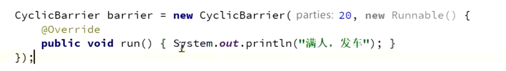
	- 满了之后调用指定的动作。await()什么时候20了，才执行下面的操作，20是线程的数量
	- 场景：复杂操作，需要操作数据库，网络，文件，顺序执行很低，异步来执行。三个线程全都到位了，才能执行输出完成的操作。
	- 有些线程，必须要等别人的1，2，3，4步全都执行完了，才能执行下一步
- Phaser 阶段 1.7开始有的
	- MarriagePhaser phaser = new MarriagePhaser()
	- 场景：遗传算法
	- 一个栅栏一个栅栏接着走
	- phaser.arriveAndAwaitAdvance() 到达，等待着继续往前走
	- phaser.arriveAndDeregister() 到达，但是不注册，不往前走，后面的线程就不参加了
	- phaser.register() 加一个，后续这个线程就继续参加了
	- phaser.bulkRegister(7) 定义了这个阶段，要有7个线程参加第一个阶段
	- 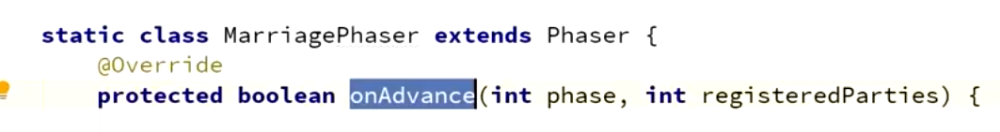
		- 定义了什么时候前进，return false就是整个流程还没有结束，return true才是结束了
		- 在栅栏推倒的时候会自己去调用
- ReadWriteLock 读写锁
	- 共享锁 读锁
	- 排他锁 写锁
	- 读多写少的场景，读的时候读锁可以进来，写锁的时候，读锁和写锁都不能进来
	- 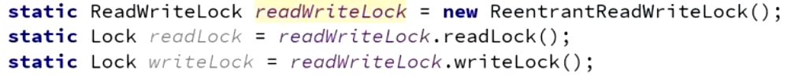
- Semaphore 信号灯
	- 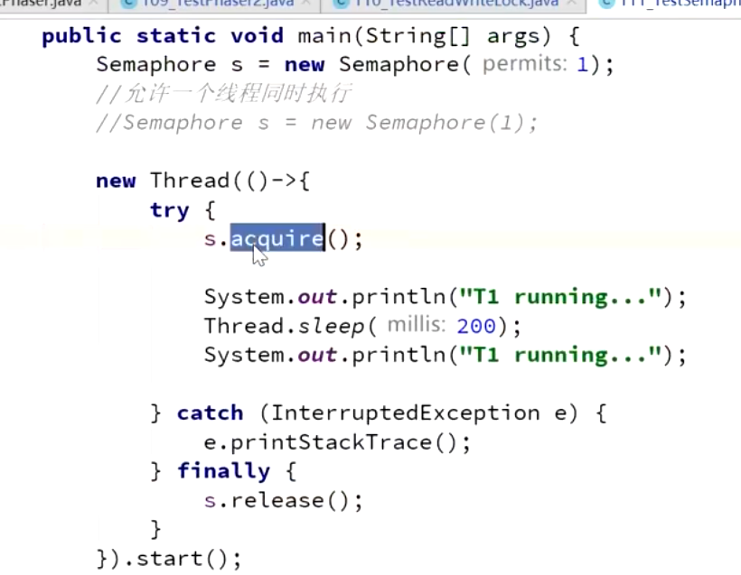
	- acquire 从1变成0， release 从0变成1。
	- 同时允许几个线程执行。
	- 使用场景，限流。车道和收费站类似
	- 默认是非公平，true的话是公平的，有一堆线程来排队，先来的先收费
- Exchanger交换器
	- 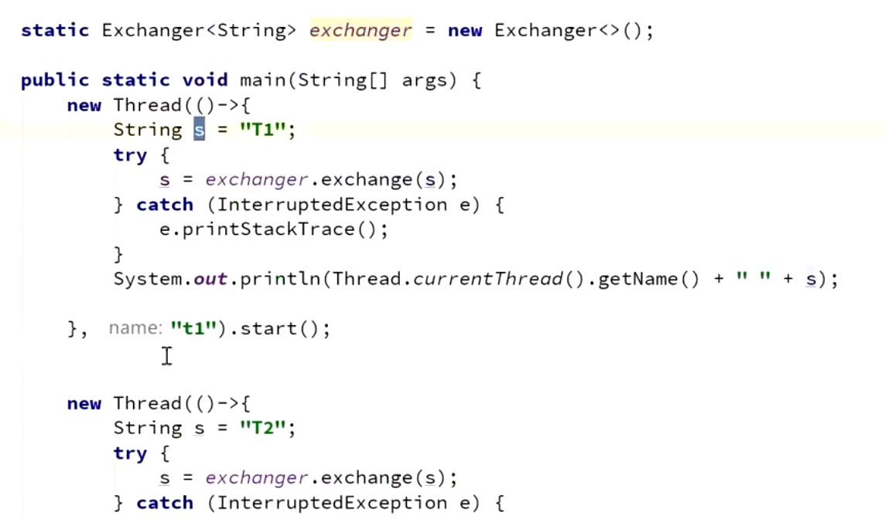
	- t1和t2里的数据交换了下，线程间交换数据用的。
	- 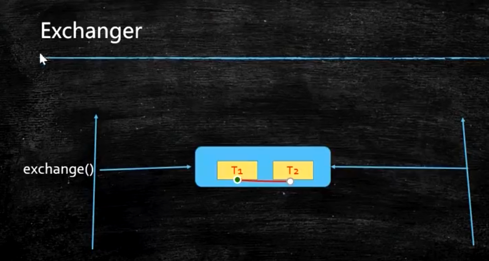
	- 只能两个线程之间，t1放进去了之后，t1阻塞了，t2再来，交换，然后都继续往下执行
- LockSupport
	- LockSupport.park() 当前的线程阻塞，不运行了
	- 在别的线程调用LockSupport.unpark(t) t就是刚刚阻塞的那个线程
	- 可以先执行unpark，在执行park，那就不会阻塞
	- unpark一次，但是park两次，会阻塞
	- 底层实现
		- unsafe的park方法
-
- 这些都是aqs来实现的
- 系统里可能只有4个cpu，但是可能有上千的线程，每个线程都是从一个任务创建出来的，放在队列里，cpu去队列里取个任务来执行，为了实现并发，让别人能同时做好多事情，就有时间片轮转的概念。
- 类加载的时候，jvm会帮忙把静态的方法，变量啥的去做初始化
- 限流：实际用guava ratelimiter
-
-
-
- 问题
- 一个线程可以获取到很多把锁吗，应该不行，没有这个概念
- 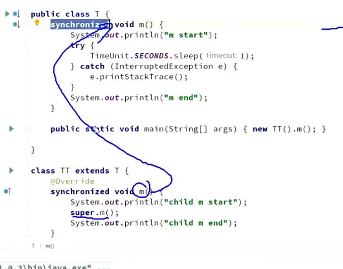
- 这个时候锁的这个this是个啥啊，是子类的实例对象还是父类的实例对象