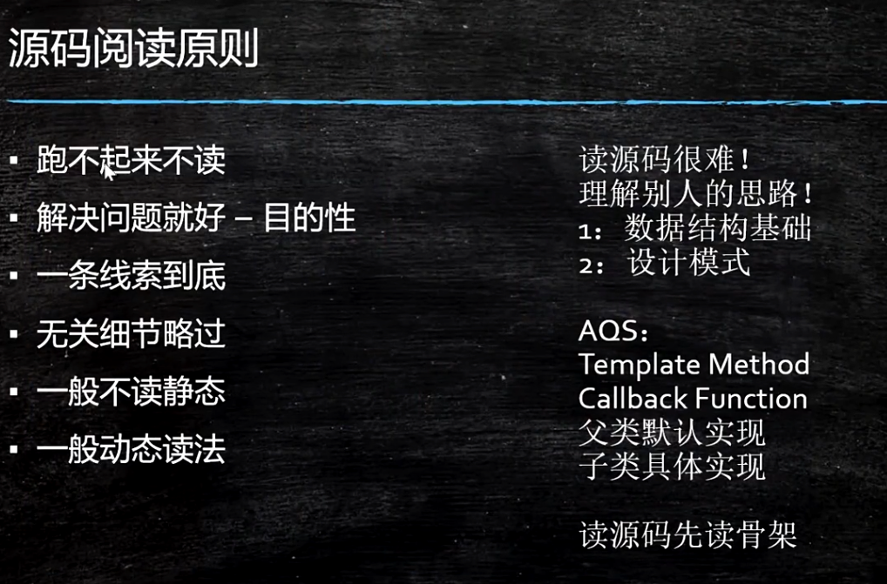
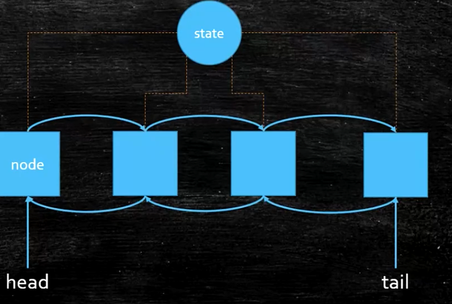
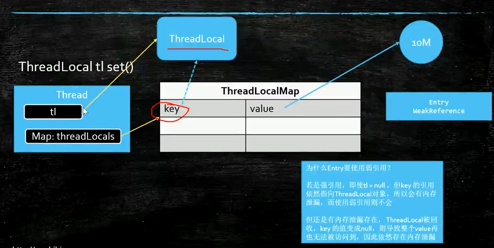
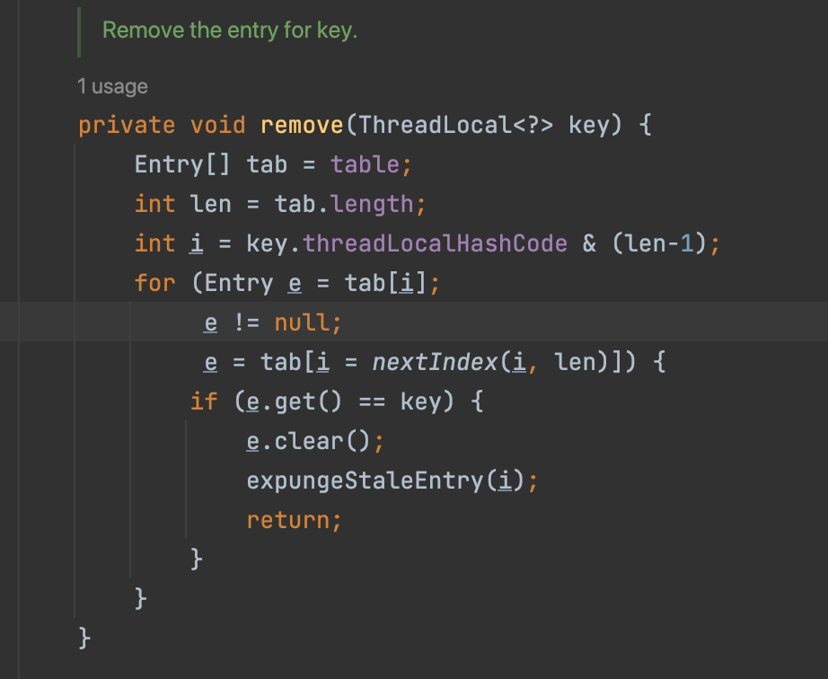
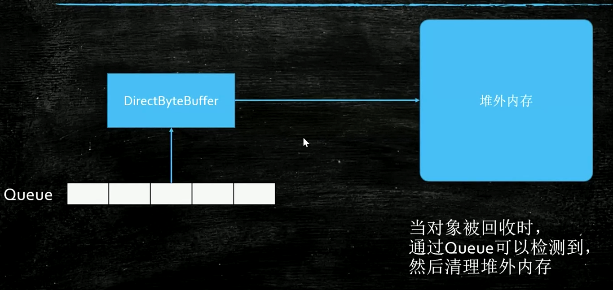
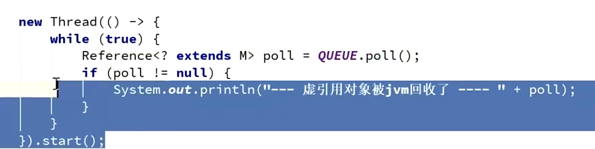

- 面试题
	- 模板方法，提供一系列方法让子类去具体实现
	- 执行具体方法的时候，会调用子类的方法，钩子函数，就叫callback
- 
- AQS（CLH）
	- varHandle 1. 普通属性的set可以是原子操作的。2. 比反射快，直接操纵二进制码
	- 
	- state是什么含义，由自己定
		- 在ReentrantLock 0 未获得锁，1获得锁
		- 在countDownLatch里 state代表要减的数量
	- Node定义
		- thread 线程
		- 双向链表
		- waitStatus 1
	- ThreadLocal
		- 在thread对象里有个成员变量是ThreadLocalMap，在这个线程里调用ThreadLocal.set方法，会在map里存放，key就是这个threadLocal变量this，value就是set的这个值
		- 每个线程都是自己的，不会互相影响
		- 使用的场景
			- 在声明式事务里，可能好几个方法都是要去获取一个链接，但是每次都去配置文件里去生成一个链接的话，是不可能放到一个事务里的，因为链接都不是一个，这个时候就放在threadLocal里，后续的方法要去拿这个链接的时候，就从这个thread里面来拿，就能保证是同一个链接了
- 引用
	- 强引用 就是new出来的都是强引用，一个对象o指向一个对象，只要有指向就永远不会被回收
	- 软引用 softReference
		- 内存空间不够了才会被回收
		- 适合做一些缓存用，比如说有那种大图片，加载要内存里，放在内存中，如果还需要使用就可以拿来用，但是如果内存不够了，也可以被回收，要用到的时候再去实际加载
	- 弱引用 weakReference
		- 只要发生了垃圾回收操作就会被回收
		- 这些都是一个对象o指向了一个弱引用，然后弱引用弱弱的引用到了一个对象。注意o到弱引用的这个引用还是个强引用的！！
		- WeakReference<M> m = new WeakReference<>()(new M());
		- 适合在容器里，如果有另外一个强引用引用到这个对象，只要这个强引用消失了，这个对象也可以消失了。
		- 应用场景
			- 在threadLocal里的map里的entry就是弱引用
			- 
			- 如果是个强引用的话，tl因为是个局部变量，方法结束的时候就消失了，tl指向ThreadLocal的这个引用就消失了，但是threadLocals还一直在，那他指向的key就还在，key指向了ThreadLocal就还在，那这个ThreadLocal，除非thread结束了，否则他会一直存在，造成了内存泄露
			- 在threalocal被回收了，但是map还在，key指向了null，value还是存在，所以在用threadlocal的时候，不用了之后，一定要调用threadlocal.remove()方法，这样才能把value也释放掉
			- 
			- remove里面会把map里key为这个threadLocal里对象，移出这个map里
		- 虚引用 PhantomReference
			- PhantomReference<M> phantomReference<>(new M(), QUEUE);
			- ReferenceQueue<M> QUEUE = new ReferenceQueue<>();
			- 
			- 在NIO里用到了直接内存，他不在堆里，所以当这个直接内存的值设为null的时候，你想回收你回收不了，就放队列里，给个通知，去回收堆外内存
			- unsafe.  freeMemory()
			- 在回收的时候，会放到queue这个队列里，并且给你个通知，这个虚引用被回收了哈
			- 
			- phantomReference.get()是拿不到里面的值的，都是空的。
			- 写jvm的人来用
			-
				-
-
-
- 作业
	- aqs的unlock方法源码
	- weakHashMap