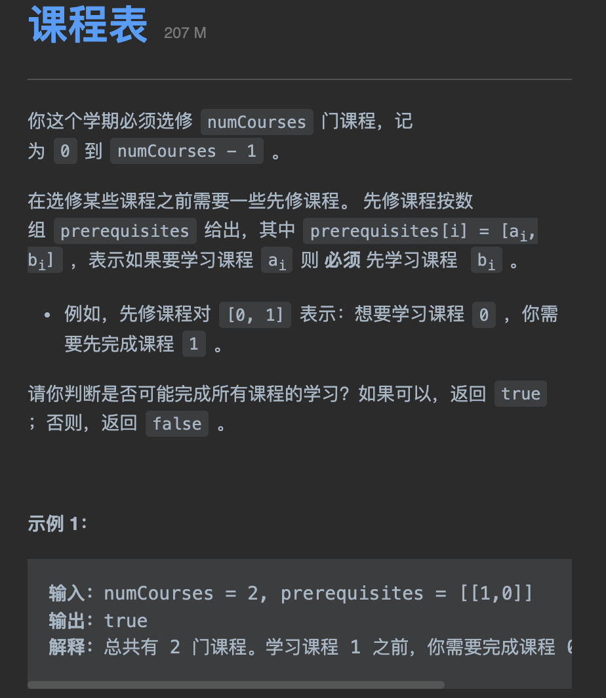
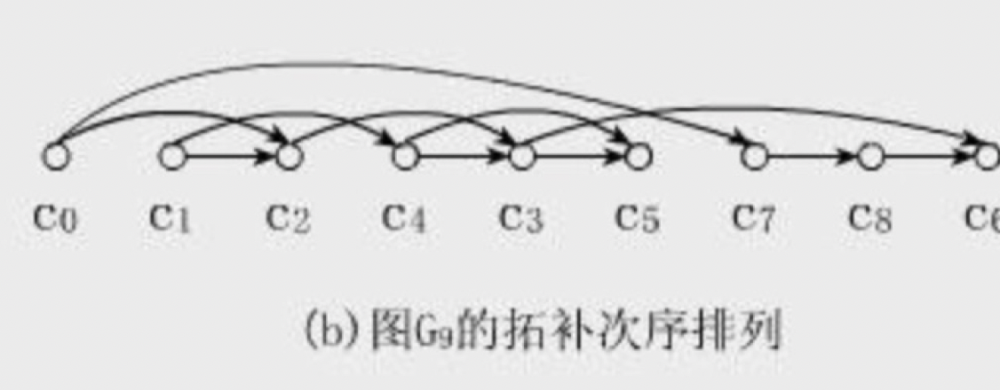
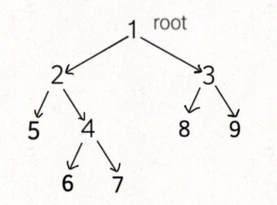

tags:: 拓扑排序，图

- 有向图的环检测
- 题目：
	- 
	- 什么时候会无法修完所有的课程，就是在存在循环依赖的时候
	- 首先，将题目中给的条件构造成一幅图
	- ```
	  class Solution {
	      // 1. 先构造图
	      boolean[] visited;
	      boolean[] onPath;
	      boolean hasCycle = false;
	      public boolean canFinish(int numCourses, int[][] prerequisites) {
	          LinkedList<Integer>[] graph = buildGraph(numCourses, prerequisites);
	          visited = new boolean[numCourses];
	          onPath = new boolean[numCourses];
	          for(int i = 0; i < numCourses; i++) {
	              traverse(graph, i);
	          }
	          return !hasCycle;
	      }
	  
	      void traverse(LinkedList<Integer>[] graph, int node){
	          if(onPath[node]) {
	              hasCycle = true;
	              return;
	          }
	          if(visited[node] || hasCycle) {
	              return;
	          }
	          visited[node] = true;
	          onPath[node] = true;
	          for(int t : graph[node]) {
	              traverse(graph, t);
	          }
	          onPath[node] = false;
	      }
	  
	      LinkedList<Integer>[] buildGraph(int numCourses, int[][] prerequisites) {
	          LinkedList<Integer>[] graph = new LinkedList[numCourses];
	          for(int i = 0; i < numCourses; i++) {
	              graph[i] = new LinkedList<>();
	          }
	          for(int[] edge : prerequisites) {
	              int from = edge[1];
	              int to = edge[0];
	              graph[from].addLast(to);
	          }
	          return graph;
	      }
	  }
	  ```
- 在课程表的基础上， 需要返回能够走完所有节点的路径
- 
- 将一幅图拉平，在拉平的图里面，所有箭头方向都是一致的。如果是有环图，那么是无法进行拓扑排序的，因为肯定做不到所有箭头方向一致
- ==将后序遍历的结果进行翻转，就是拓扑排序的结果。！！！==
- 因为拓扑排序是一个任务必须等到所有的依赖任务都完成之后才能开始执行
- 
- 这样的话，其实就是后续遍历，但是在这一题里，箭头是反过来的，所以要倒序一下
-