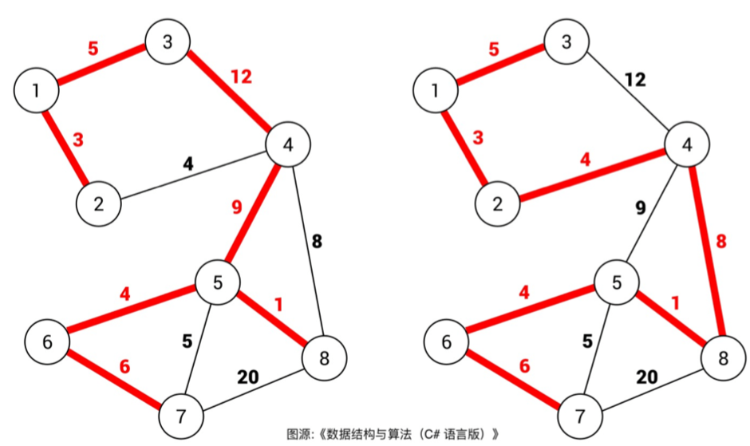
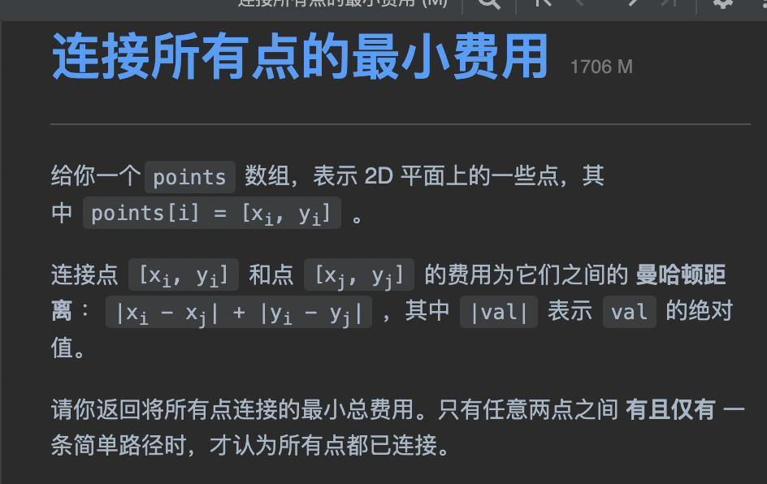
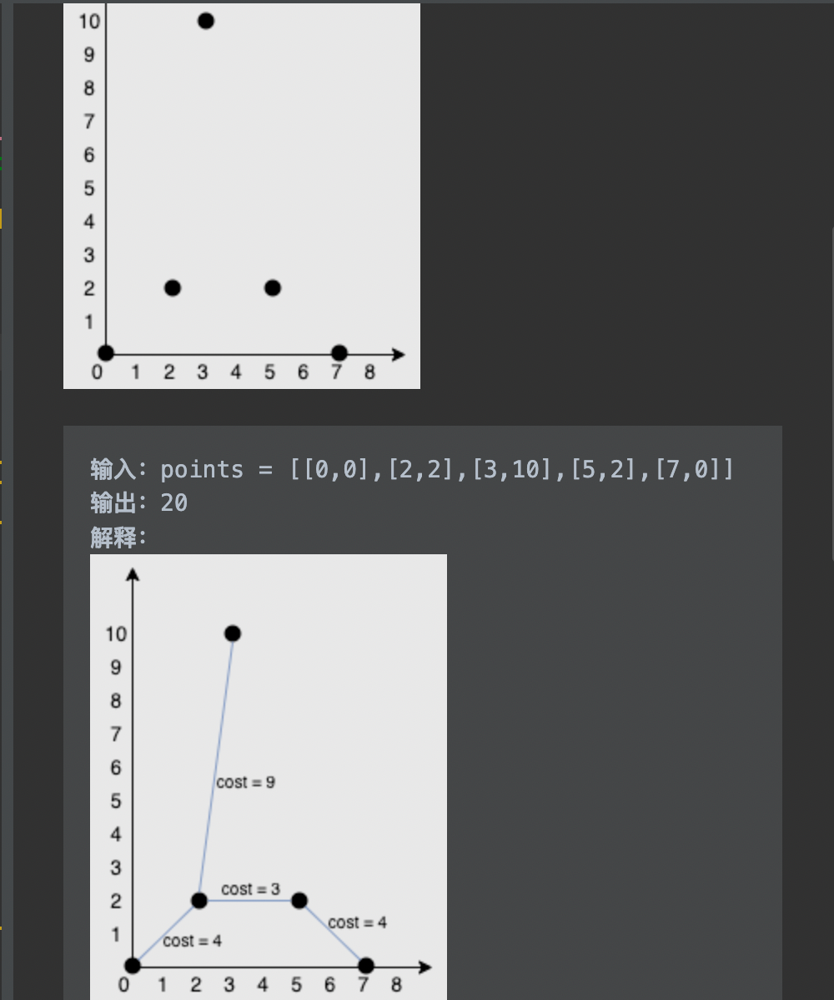

tags:: 树，最小生成树
title:: 最小生成树-KRUSKAL

- 最小生成树的定义
	- 树和图的区别
		- 树不会包含环，图可以包含环
	- 生成树
		- 在图中找一棵包含图中的所有节点的树。生成树是含有图中所有顶点的 无环联通子图
		- 生成树往往会有很多个
			- 
		- 在所有生成树种，权重和最小的那棵生成树就是最小生成树
- kruskal算法
	- 要求
		- 1. 包含图中所有的节点
		  2. 形成的结构是树结构
		  3. 权重和最小
		- 权重和最小：
			- 将所有的边按照权重从小到大排序，从最小的边开始遍历，如果这条边不会形成环，则是最小生成树的一部分，将它加入集合中。
- 题目：
	- 
	- 
	- 因为只给了点，所以需要我们自己构建图。将所有的点和点之间全都连上，并且计算出两个点之间的权重
	- points数组中的索引就代表坐标的点，就可以服用kruskal算法逻辑
	- ```
	  import java.util.Collections;
	  import java.util.LinkedList;
	  import java.util.List;
	  
	  class Solution {
	      public int minCostConnectPoints(int[][] points) {
	          int n = points.length;
	          List<int[]> edges = new LinkedList<>();
	          // 所有的点和点之间都连接上
	          for(int i = 0; i < n; i++) {
	              for(int j = i + 1; j < n; j++) {
	                  int xi = points[i][0], yi = points[i][1];
	                  int xj = points[j][0], yj = points[j][1];
	                  edges.add(new int[]{i, j, Math.abs(xi - xj) + Math.abs(yi - yj)});
	              }
	          }
	  
	          Collections.sort(edges, (a, b) -> {
	              return a[2] - b[2];
	          });
	          
	          int mst = 0;
	          UF uf = new UF(n);
	          for(int[] edge : edges) {
	              int u = edge[0];
	              int v = edge[1];
	              int weight = edge[2];
	              if(uf.connected(u, v)) {
	                  continue;
	              }
	              mst += weight;
	              uf.union(u,v);
	          }
	          return mst;
	      }
	  }
	  
	  class UF{
	      private int count;
	      private int[] size;
	      private int[] parent;
	      
	      public UF(int count) {
	          count = count;
	          size = new int[count];
	          parent = new int[count];
	          for(int i = 0; i < count; i++) {
	              parent[i] = i;
	              size[i] = 1;
	          }
	      }
	      
	      void union(int p, int q) {
	          int rootP = find(p);
	          int rootQ = find(q);
	          if(rootP == rootQ) {
	              return;
	          }
	          if(size[rootP] > size[rootQ]) {
	              parent[rootQ] = rootP; 
	          }else {
	              parent[rootP] = rootQ;
	          }
	          count--;
	      }
	      
	      int find(int x) {
	          while (parent[x] != x) {
	              parent[x] = parent[parent[x]];
	              x = parent[x];
	          }
	          return x;
	      }
	      
	      boolean connected(int p, int q) {
	          int rootP = find(p);
	          int rootQ = find(q);
	          return rootP == rootQ;
	      }
	      
	      int count() {
	          return count;
	      }
	  }
	  ```
	- 复杂度分析
		- 假设节点个数为V，边的条数为E，首先需要O(E)的空间装所有边，而且union-find算法需要O(v)的空间，所以空间复杂度为O(V + E)
		- 时间复杂度主要耗费在排序，需要O(ElogE)的时间，union-find算法操作复杂度是O(1)。套用for魂环是O(E)。总的时间复杂度是O(ElogE)
		-