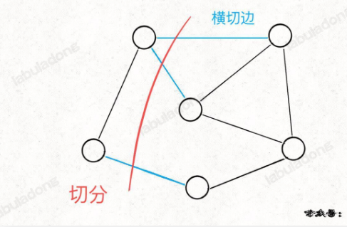

tags:: 最小生成树，prim，图

- prim算法也使用贪心思想来让生成树的权重尽可能小，用的是切分定理
- prim算法使用bfs算法思想和visited布尔数组来避免成环。
- 不需要事先对所有边排序，而是用优先级队列动态实现排序的效果，prim类似kruskal的动态过程
- 切分定理
	- 切分 是将两个不重叠且非空的节点集合
	- 
	- 红色将图中的节点分成了两个集合，这就是一种切分
	- 被红线切中的边叫做横切边
	- 对于任意一种切分，其中权重最小的那条横切边一定是构成最小生成树的一条边
- prim算法实现
	- 开始的时候，随便选一个点，开始切分，这个时候横切边就是A这个节点的边
	- 这时候根据权重最小的边，这条边就是最小生成树的第一条边。
	- 按照A和B这两个点做切分。找到第二条边
	- 按照A和B和C这三个点做切分
	- 总体的逻辑就是，每次切分都能找到最小生成树的一条边，然后又能进行新一轮的切分，直到找到最小生成树的所有边
	- prim算法的时间复杂度是O(ElogE)
- 代码实现
	- ```
	  class Prim {
	      private PriorityQueue<int[]> pq;
	      
	      private boolean[] inMST;
	      
	      private int weightSum = 0;
	      
	      private List<int[]>[] graph;
	      
	      public Prim(List<int[]>[] graph) {
	          this.graph = graph;
	          this.pq = new PriorityQueue<>((a, b) -> {
	              return a[2] - b[2];
	          });
	          int n = graph.length;
	          this.inMST = new boolean[n];
	          inMST[0] = true;
	          cut(0);
	          
	          while (!pq.isEmpty()) {
	              int[] edge = pq.poll();
	              int to = edge[1];
	              int weight = edge[2];
	              if(inMST[to]) {
	                  continue;
	              }
	              weightSum += weight;
	              inMST[to] = true;
	              cut(to);
	          }
	      }  
	      
	      private void cut(int s) {
	          for(int[] edge : graph[s]) {
	              int to = edge[1];
	              if(inMST[to]) {
	                  continue;
	              }
	              pq.offer(edge);
	          }
	      }
	      
	      public int weightSum() {
	          return weightSum;
	      }
	      
	      public boolean allConnected() {
	          for(int i = 0; i < inMST.length;i++) {
	              if(!inMST[i]) {
	                  return false;
	              }
	          }
	          return true;
	      }
	  }
	  ```
-