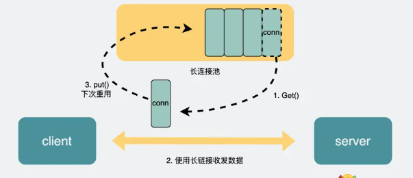
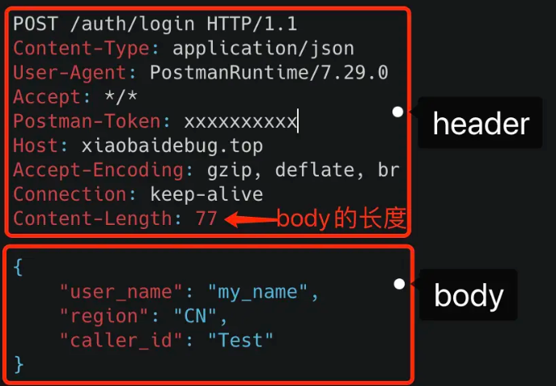
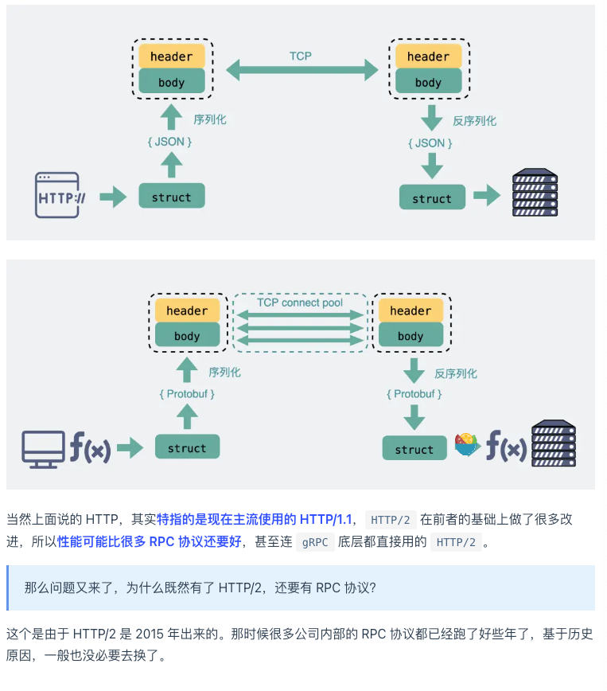
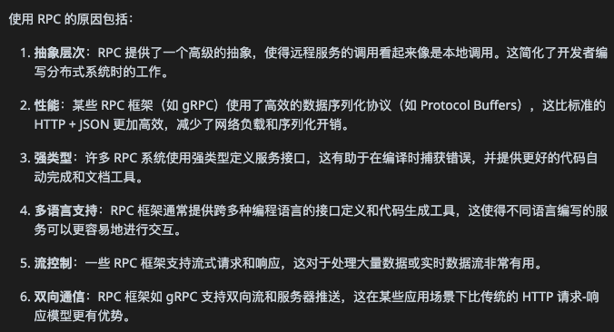

tags:: 小林网络

- 用tcp的话，定义socket，用bind绑定ip端口，connect发起连接，然后用send发送数据，recv接受数据
- 用纯TCP会有什么问题
	- tcp是基于字节流的
	- 数据就是二进制数据，没有边界，会有粘包问题，需要添加一些规则，来区分消息边界
	- 消息头里写清楚完整的包长度是多少，根据这个长度接受数据，截取出来是我们想要的消息体
	- http和rpc都是基于tcp衍生的协议
- http和rpc
	- http：在网页上调用
	- rpc：远程过程调用，屏蔽中间过程，让用户像调用本地方法一样调用远端方法
	- 大部分rpc协议底层用的tcp但也不一定要用tcp，用udp或者http也一样
	- **HTTP 主要用于 B/S 架构，而 RPC 更多用于 C/S 架构。**
- 区别
	- 服务发现
		- 要知道ip地址和端口
		- http的话就拿着域名，dns找ip地址
		- rpc，有专门中间服务去保存服务名和ip信息，要访问服务，去中间服务获取ip和端口信息
	- 底层连接形式
		- http1.1 长链接，后续请求复用这个连接
		- rpc
			- 建立tcp长链接
			- 有个连接池，有多条连接池放在池内，发数据的时候从池子里取出来，复用
			- 
	- 传输内容
		- http
			- body是用json来序列化的。
			- 
			- 头很冗余
		- rpc
			- 定制化程序更高，用protobuf或其他序列化协议保存结构体数据，也不需要像http考虑各种浏览器行为，性能会好一些
		- 
		- 
		  id:: 65db5196-1442-4a93-9ee5-63b67839b868
		-