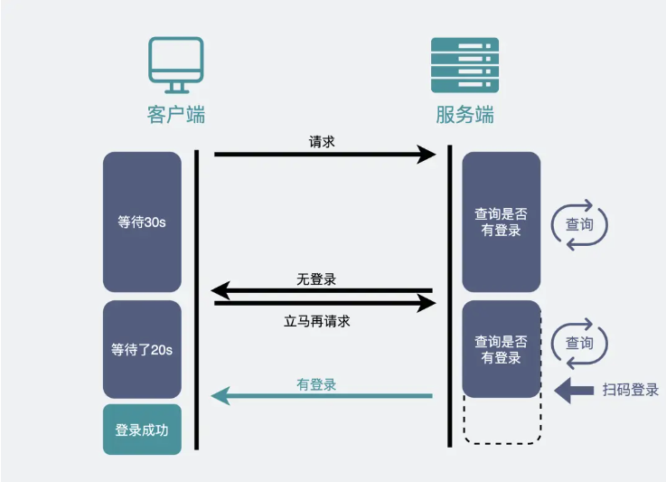
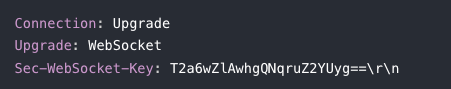
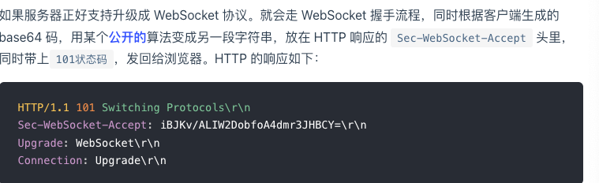
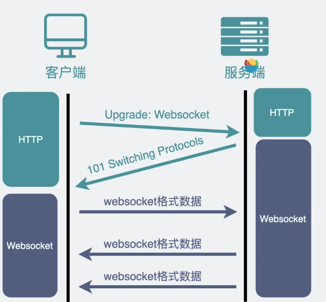
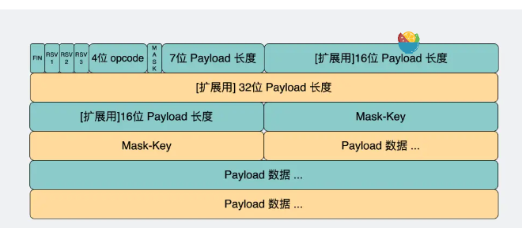

tags:: 小林网络

- 如何实现一个服务器主动发消息给客户端的场景
	- 使用http不断轮询
		- 前端代码里不断定时发送http请求到服务器，服务器收到请求后给客户端响应消息
		- 场景
			- 扫码登录
		- 问题
			- 满屏的http请求，消耗带宽，增加下游服务器负担
			- 中间有延迟，会感觉卡顿
	- 长轮询
		- HTTP 请求**将超时设置的很大**，比如 30 秒，**在这 30 秒内只要服务器收到了扫码请求，就立马返回给客户端网页。如果超时，那就立马发起下一次请求。**
		- 
	- 本质上还是客户端主动获取，扫码场景还能用用，网页游戏就不够用了
- websocket是啥
	- tcp虽然同一时间里，双方都可以主动给对方发消息，是全双工
	- 但是http1.1，是半双工，同一时间只能有一方给对方发消息
		- 因为一开始考虑的就是，客户端发请求服务器响应，没考虑到
		- 所以用websocket，是应用层的协议
- 怎么建立websocket连接
	- 浏览器在tcp三次握手后，用http协议先进行一次通信
		- 普通的http请求，就还是之前的
		- 如果想建立websocket连接，在http请求里带上特殊的header头
			- 
		- 
		- 浏览器也用同样的算法把base64转成字符串，和客户端传回来的一样，就建立了websocket连接
		- 
- websocket消息格式
	- 
	- opcode
		- 等于 1 ，是指text类型（`string`）的数据包
		- 等于 2 ，是二进制数据类型（`[]byte`）的数据包
		- 等于 8 ，是关闭连接的信号
	- payload字段，真正想传输数据的长度，单位是字节
		- 如果7为payload的值是0-125，你就取那7位的长度
		- 如果值是126，表示后面在读16niy
		- 如果是127，再读64位
	- payload数据里存的是真的数据
- 使用场景
	- 需要服务器和客户端频繁交互